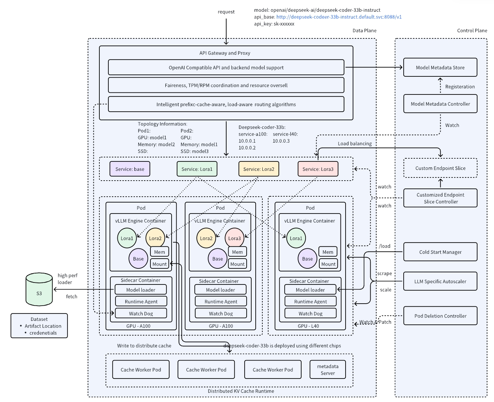

# AIBrix

Welcome to AIBrix, an open-source initiative designed to provide essential building blocks to construct scalable GenAI inference infrastructure. AIBrix delivers a cloud-native solution optimized for deploying, managing, and scaling large language model (LLM) inference, tailored specifically to enterprise needs.


<p align="center">
| <a href="https://aibrix.readthedocs.io/latest/"><b>Documentation</b></a> | <a href="https://aibrix.github.io/"><b>Blog</b></a> | <a href="https://arxiv.org/abs/2504.03648"><b>White Paper</b></a> | <a href="https://x.com/vllm_project"><b>Twitter/X</b></a> | <a href="https://vllm-dev.slack.com/archives/C08EQ883CSV"><b>Developer Slack</b></a> |
</p>

## Latest News

- **[2025-08-05]** AIBrix v0.4.0 is released. Check out the [release notes](https://github.com/vllm-project/aibrix/releases/tag/v0.4.0) and [Blog Post](https://aibrix.github.io/posts/2025-08-04-v0.4.0-release/) for more details
- **[2025-06-10]** The AIBrix team delivered a talk at KubeCon China 2025 titled [AIBrix: Cost-Effective and Scalable Kubernetes Control Plane for vLLM](https://kccncchn2025.sched.com/event/1x5im/introducing-aibrix-cost-effective-and-scalable-kubernetes-control-plane-for-vllm-jiaxin-shan-liguang-xie-bytedance), discussing how the framework optimizes vLLM deployment via Kubernetes for cost efficiency and scalability.
- **[2025-05-21]** AIBrix v0.3.0 is released. Check out the [release notes](https://github.com/vllm-project/aibrix/releases/tag/v0.3.0) and [Blog Post](https://aibrix.github.io/posts/2025-05-21-v0.3.0-release/) for more details
- **[2025-04-04]** AIBrix co-delivered a KubeCon EU 2025 keynote with Google on [LLM-Aware Load Balancing in Kubernetes: A New Era of Efficiency](https://kccnceu2025.sched.com/event/1txC7/keynote-llm-aware-load-balancing-in-kubernetes-a-new-era-of-efficiency-clayton-coleman-distinguished-engineer-google-jiaxin-shan-software-engineer-bytedance), focusing on LLM specific routing solutions.
- **[2025-03-30]** AIBrix was featured at the [ASPLOS'25](http://asplos-conference.org/asplos2025/) workshop with the presentation [AIBrix: An Open-Source, Large-Scale LLM Inference Infrastructure for System Research](https://docs.google.com/presentation/d/1YDVsPFTIgGXnROGaJ1VKuDDAB4T5fzpE/edit), showcasing its architecture for efficient LLM inference in system research scenarios.
- **[2025-03-09]** AIBrix v0.2.1 is released. DeepSeek-R1 full weights deployment is supported and gateway stability has been improved! Check [Blog Post](https://aibrix.github.io/posts/2025-03-10-deepseek-r1/) for more details.
- **[2025-02-19]** AIBrix v0.2.0 is released. Check out the [release notes](https://github.com/vllm-project/aibrix/releases/tag/v0.2.0) and [Blog Post](https://aibrix.github.io/posts/2025-02-05-v0.2.0-release/) for more details.
- **[2024-11-13]** AIBrix v0.1.0 is released. Check out the [release notes](https://github.com/vllm-project/aibrix/releases/tag/v0.1.0) and [Blog Post](https://aibrix.github.io/posts/2024-11-12-v0.1.0-release/) for more details.

## Key Features

The initial release includes the following key features:

- **High-Density LoRA Management**: Streamlined support for lightweight, low-rank adaptations of models.
- **LLM Gateway and Routing**: Efficiently manage and direct traffic across multiple models and replicas.
- **LLM App-Tailored Autoscaler**: Dynamically scale inference resources based on real-time demand.
- **Unified AI Runtime**: A versatile sidecar enabling metric standardization, model downloading, and management.
- **Distributed Inference**: Scalable architecture to handle large workloads across multiple nodes.
- **Distributed KV Cache**: Enables high-capacity, cross-engine KV reuse.
- **Cost-efficient Heterogeneous Serving**: Enables mixed GPU inference to reduce costs with SLO guarantees.
- **GPU Hardware Failure Detection**: Proactive detection of GPU hardware issues.

## Architecture




## Quick Start

To get started with AIBrix, clone this repository and follow the setup instructions in the documentation. Our comprehensive guide will help you configure and deploy your first LLM infrastructure seamlessly.

```shell
# Local Testing
git clone https://github.com/vllm-project/aibrix.git
cd aibrix

# Install nightly aibrix dependencies
kubectl apply -k config/dependency --server-side

# Install nightly aibrix components
kubectl apply -k config/default
```

Install stable distribution
```shell
# Install component dependencies
kubectl apply -f "https://github.com/vllm-project/aibrix/releases/download/v0.4.0/aibrix-dependency-v0.4.0.yaml" --server-side

# Install aibrix components
kubectl apply -f "https://github.com/vllm-project/aibrix/releases/download/v0.4.0/aibrix-core-v0.4.0.yaml"
```

## Documentation

For detailed documentation on installation, configuration, and usage, please visit our [documentation page](https://aibrix.readthedocs.io/latest/).

## Contributing

We welcome contributions from the community! Check out our [contributing guidelines](./CONTRIBUTING.md) to see how you can make a difference.

Slack Channel: [#aibrix](https://vllm-dev.slack.com/archives/C08EQ883CSV)

## License

AIBrix is licensed under the [Apache 2.0 License](LICENSE).

## Support

If you have any questions or encounter any issues, please submit an issue on our [GitHub issues page](https://github.com/vllm-project/aibrix/issues).

Thank you for choosing AIBrix for your GenAI infrastructure needs!
