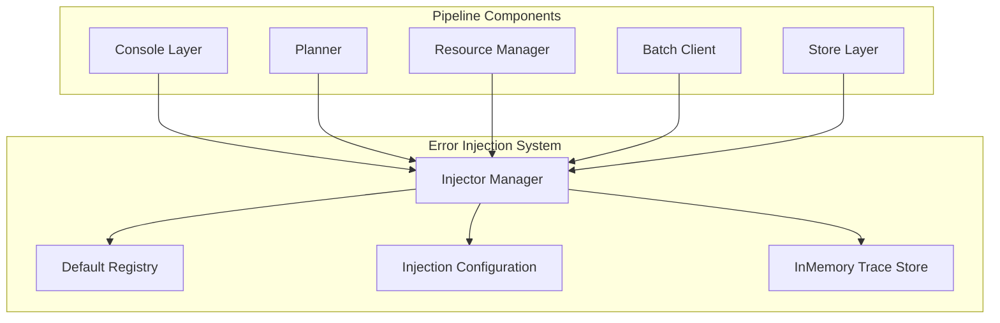
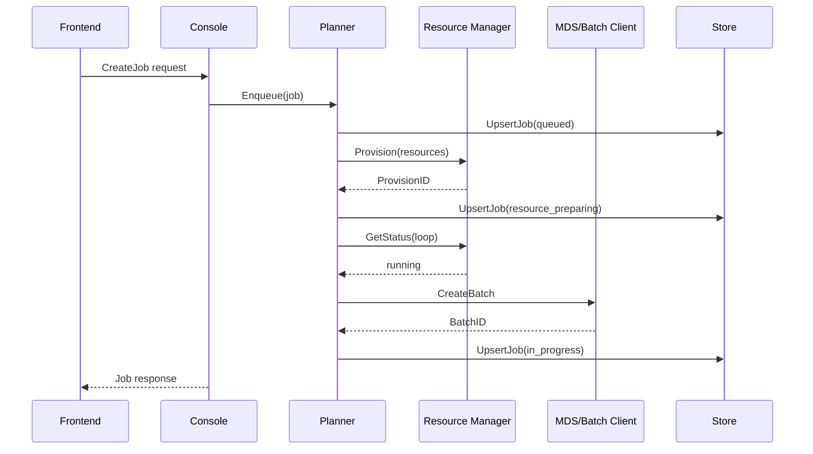
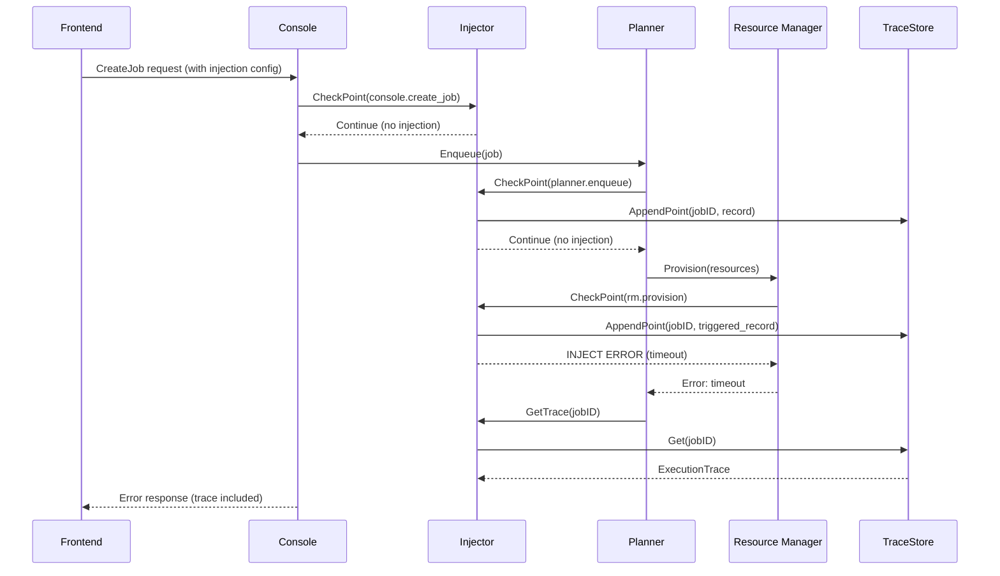

# Error Injection System Design

## Overview

This document describes the design of a per-job level error injection system for the AIBrix Console. The system enables controlled fault injection across the entire request processing pipeline, supporting testing, chaos engineering, and debugging scenarios.

## Goals

1. **Per-job granularity**: Each job can have its own injection configuration, enabling targeted testing
2. **Comprehensive coverage**: Injection points cover all critical components and actions in the pipeline
3. **Safe operation**: System requires explicit enabling; injection is disabled by default
4. **Observability**: Track all injection point traversals and triggered injections with timestamps
5. **Configurable errors**: Customize error messages, probabilities, and injection behaviors via templates

## Architecture

### System Components



### Core Data Structures

#### InjectionPoint

An `InjectionPoint` represents a registered location in the code where error injection may occur. Each point has pre-defined templates for different error types.

```go
type InjectionPoint struct {
    ID          string                              // Unique "component.action" identifier
    Component   string                              // Pipeline component name
    Action      string                              // Specific operation
    Description string                              // Human-readable explanation
    Templates   map[ErrorType]*InjectionTemplate    // Pre-defined error templates
}
```

#### InjectionTemplate

`InjectionTemplate` defines a pre-configured error template with message placeholders.

```go
type InjectionTemplate struct {
    Type            ErrorType          // Category of error this template produces
    Code            string             // gRPC/HTTP status code
    MessageTemplate string             // Go template with {{.variable}} syntax
    Placeholders    map[string]string  // Default values for template variables
    DetailsTemplate map[string]string  // Optional structured error details
}
```

#### InjectionRule

`InjectionRule` uses point reference with optional overrides, leveraging pre-defined templates.

```go
type InjectionRule struct {
    PointRef    string             // References injection point by ID
    ErrorType   ErrorType          // Selects which template to use
    Probability float64            // Trigger chance (0.0-1.0)
    Overrides   map[string]string  // Customizes template placeholders
}
```

#### InjectedError

An `InjectedError` is generated from a template by applying overrides.

```go
type InjectedError struct {
    Type    ErrorType          // Error category
    Code    string             // gRPC/HTTP status code
    Message string             // Rendered error description
    Details map[string]string  // Rendered structured details
}

// ErrorType constants
const (
    ErrorTypeTimeout          ErrorType = "timeout"
    ErrorTypeUnavailable      ErrorType = "unavailable"
    ErrorTypeInvalidArgument  ErrorType = "invalid_argument"
    ErrorTypeNotFound         ErrorType = "not_found"
    ErrorTypePermissionDenied ErrorType = "permission_denied"
    ErrorTypeResourceExhausted ErrorType = "resource_exhausted"
    ErrorTypeInternal         ErrorType = "internal"
    ErrorTypeCrash            ErrorType = "crash"
)
```

#### InjectionConfig (Per-Job)

`InjectionConfig` specifies injection behavior using simplified rule references.

```go
type InjectionConfig struct {
    JobID             string         // Job identifier
    Enabled           bool           // Toggles injection for this job
    Rules             []InjectionRule // Injection rules to apply
    GlobalProbability float64        // Default probability for rules
}
```

#### ExecutionTrace

`ExecutionTrace` records the ordered journey of a request through injection points.

```go
type ExecutionTrace struct {
    JobID     string        // Traced job identifier
    StartTime time.Time     // When execution began
    EndTime   time.Time     // When execution completed
    Points    []PointRecord // All injection points encountered (chronological)
}

type PointRecord struct {
    PointID          string            // Injection point identifier
    Timestamp        time.Time         // When point was evaluated
    Triggered        bool              // Whether error was injected
    ContextSnapshot  map[string]string // Context at evaluation time
    Error            *InjectedError    // Populated when Triggered=true
    TemplateUsed     ErrorType         // Template applied (when triggered)
    OverridesApplied map[string]string // Overrides used (when triggered)
    ProbabilityRoll  float64           // Random value determining injection
}
```

## Injection Points Registry

### Console

| Point ID | Templates | Default Placeholders |
|----------|-----------|---------------------|
| `console.create_job` | `invalid_argument`, `unavailable`, `permission_denied` | `reason="missing required field"` |
| `console.get_job` | `not_found`, `unavailable` | `job_id="test-job-123"` |
| `console.cancel_job` | `not_found`, `permission_denied`, `unavailable` | `job_id="test-job-123"` |
| `console.list_jobs` | `unavailable` | `service="job_handler"` |
| `console.upload_file` | `invalid_argument`, `unavailable` | `reason="file size exceeds limit"` |
| `console.download_file` | `not_found`, `unavailable` | `file_id="test-file-123"` |

### Planner

| Point ID | Templates | Default Placeholders |
|----------|-----------|---------------------|
| `planner.enqueue` | `invalid_argument`, `unavailable`, `crash` | `reason="missing job spec"` |
| `planner.plan` | `internal`, `resource_exhausted` | `reason="internal planning error"` |
| `planner.submit_batch` | `unavailable`, `invalid_argument` | `reason="invalid job spec"` |
| `planner.cancel` | `not_found`, `unavailable` | `job_id="test-job-123"` |
| `planner.persist` | `unavailable` | `store="job_store"` |
| `planner.recover` | `unavailable`, `internal`, `crash` | `reason="inconsistent state"` |

### Resource Manager

| Point ID | Templates | Default Placeholders |
|----------|-----------|---------------------|
| `rm.provision` | `unavailable`, `resource_exhausted`, `timeout`, `crash` | `resource_type="gpu"` |
| `rm.get_status` | `not_found`, `unavailable` | `provision_id="prov-123"` |
| `rm.release` | `unavailable`, `timeout`, `crash` | `duration="30s"` |
| `rm.catalog_lookup` | `not_found`, `unavailable` | `resource_name="gpu-a100"` |

### Batch Client

| Point ID | Templates | Default Placeholders |
|----------|-----------|---------------------|
| `batch_client.create_batch` | `unavailable`, `invalid_argument`, `timeout` | `reason="invalid spec"` |
| `batch_client.get_batch` | `not_found`, `unavailable` | `batch_id="batch-123"` |
| `batch_client.cancel_batch` | `not_found`, `unavailable` | `batch_id="batch-123"` |
| `batch_client.list_batches` | `unavailable` | `service="batch_api"` |

### Store Layer

| Point ID | Templates | Default Placeholders |
|----------|-----------|---------------------|
| `store.upsert_job` | `unavailable`, `internal`, `crash` | `reason="database error"` |
| `store.get_job` | `not_found`, `unavailable` | `job_id="test-job-123"` |
| `store.list_jobs` | `unavailable` | `store="job_store"` |
| `store.upsert_provision` | `unavailable`, `crash` | `store="provision_store"` |
| `store.get_provision` | `not_found`, `unavailable` | `provision_id="prov-123"` |

### Crash Injection

Crash injection simulates process/goroutine crashes to test recovery mechanisms. When triggered, it calls `panic()` instead of returning an error.

Crash is an error type that can be injected at specific injection points. The following injection points support the `crash` error type:

| Injection Point | Description | Recovery Test Scenario |
|-----------------|-------------|------------------------|
| `planner.enqueue` | Crash during job enqueue | Tests job state persistence and recovery replay |
| `planner.recover` | Crash during recovery | Tests recovery resilience and non-terminal job replay |
| `rm.provision` | Crash during provisioning | Tests provision state persistence and cleanup |
| `rm.release` | Crash during release | Tests cleanup recovery and orphaned provision handling |
| `store.upsert_job` | Crash during job persistence | Tests data durability and write atomicity |
| `store.upsert_provision` | Crash during provision persistence | Tests provision data durability |

To inject a crash, use the `crash` error type on one of the above injection points:

```json
{
  "point_ref": "planner.enqueue",
  "error_type": "crash",
  "probability": 1.0
}
```

## Request Processing Flow

### Normal Flow (Injection Disabled)



### Flow with Error Injection



## Context Propagation

Injection configuration flows through the request via context values.

```go
type InjectionContextKey string

const (
    InjectionKeyConfig InjectionContextKey = "injection-config"
)

// WithInjectionContext creates a context with injection config only
func WithInjectionContext(ctx context.Context, cfg *InjectionConfig) context.Context

// GetInjectionConfigFromContext retrieves per-job config from context
func GetInjectionConfigFromContext(ctx context.Context) *InjectionConfig
```

**Note**: Trace is NOT stored in context. It is retrieved via `GetTrace(ctx, jobID)` from the injector's traceStore.

## Injector Interface

```go
type Injector interface {
    // CheckPoint evaluates whether to inject at a point
    // Returns nil if no injection, error if injection triggered
    CheckPoint(ctx context.Context, pointID string) error

    // GetTrace retrieves execution trace for a job (from traceStore)
    GetTrace(ctx context.Context, jobID string) *ExecutionTrace

    // GetGlobalConfig returns current global configuration
    GetGlobalConfig() *GlobalInjectionConfig

    // SetGlobalConfig updates global configuration
    SetGlobalConfig(config *GlobalInjectionConfig) error

    // RenderTemplate generates error from template + overrides
    RenderTemplate(pointID string, errorType ErrorType, overrides map[string]string) (*InjectedError, error)
}
```

## Trace Storage

Traces are stored in-memory via `TraceStore` interface, not persisted to database.

```go
type TraceStore interface {
    AppendPoint(jobID string, point PointRecord) error
    Get(jobID string) (*ExecutionTrace, error)
    Delete(jobID string) error
    List(limit int) ([]*ExecutionTrace, error)
}

// InMemoryTraceStore implementation
type InMemoryTraceStore struct {
    traces    map[string]*ExecutionTrace
    mu        sync.RWMutex
    maxTraces int  // Optional limit for LRU eviction
}
```

**Note**: Traces are stored in-memory only and discarded after request completion.

## Template Rendering

Templates use Go text/template syntax with placeholder substitution.

```go
// RenderError generates InjectedError from template + overrides
func RenderError(template *InjectionTemplate, overrides map[string]string) (*InjectedError, error)

// RenderMessage renders a single template string with provided data
func RenderMessage(templateStr string, data map[string]string) (string, error)

// MergePlaceholders merges defaults with overrides (returns new map)
func MergePlaceholders(defaults, overrides map[string]string) map[string]string
```

## Injection Evaluation Priority

When evaluating injection at a point:

1. **Per-job config (from request context)**: If context carries `InjectionConfig`, use it exclusively
2. **Global config**: If no per-job config, evaluate against `GlobalInjectionConfig`
3. **No injection**: If neither is configured, no injection occurs

## API Integration

### Per-Job Injection Configuration

Injection config is passed via request structure.

```json
{
  "input_dataset": "file-abc123",
  "endpoint": "/v1/chat/completions",
  "name": "Test Batch",
  "injection_config": {
    "enabled": true,
    "rules": [
      {
        "point_ref": "rm.provision",
        "error_type": "timeout",
        "probability": 1.0,
        "overrides": {
          "duration": "120s"
        }
      }
    ]
  }
}
```

### Injection Trace in Response (Not Implemented)

Responses include injection trace with template details.

```json
{
  "id": "job_abc123",
  "status": "resource_failed",
  "injection_trace": {
    "job_id": "job_abc123",
    "start_time": "2026-06-11T10:00:00Z",
    "end_time": "2026-06-11T10:00:05Z",
    "points": [
      {
        "point_id": "planner.enqueue",
        "timestamp": "2026-06-11T10:00:00Z",
        "triggered": false,
        "probability_roll": 0.45
      },
      {
        "point_id": "rm.provision",
        "timestamp": "2026-06-11T10:00:02Z",
        "triggered": true,
        "error": {
          "type": "timeout",
          "code": "DEADLINE_EXCEEDED",
          "message": "provisioning timeout after 120s"
        },
        "template_used": "timeout",
        "overrides_applied": {"duration": "120s"},
        "probability_roll": 0.08
      }
    ]
  }
}
```

## Global Injection Management

Global injection applies to all jobs without per-job configuration.

### GlobalInjectionConfig

```go
type GlobalInjectionConfig struct {
    Enabled           bool                // Toggles global injection
    Rules             []InjectionRule     // Global injection rules
    ExcludedPoints    []string            // Points excluded from global injection
    GlobalProbability float64             // Default probability for chaos mode
    PointWeights      map[string]float64  // Per-point probability overrides
}
```

### Example: Setting Global Injection

```json
{
  "enabled": true,
  "rules": [
    {
      "point_ref": "rm.provision",
      "error_type": "timeout",
      "probability": 0.1,
      "overrides": {"duration": "300s"}
    },
    {
      "point_ref": "batch_client.create_batch",
      "error_type": "unavailable",
      "probability": 0.03
    }
  ],
  "excluded_points": ["store.upsert_job", "store.get_job"]
}
```

## Integration Example

### Planner Integration

```go
func (q *Planner) Enqueue(ctx context.Context, req *Request) (*Job, error) {
    // CheckPoint evaluates and records to trace
    if err := q.injector.CheckPoint(ctx, "planner.enqueue"); err != nil {
        return nil, err
    }

    // Normal enqueue logic...
}
```

### Resource Manager Integration

```go
func (p *Provisioner) Provision(ctx context.Context, spec *Spec) (*Result, error) {
    // CheckPoint evaluates and records in ordered trace
    if err := p.injector.CheckPoint(ctx, "rm.provision"); err != nil {
        return nil, err
    }

    // Normal provision logic...
}
```
