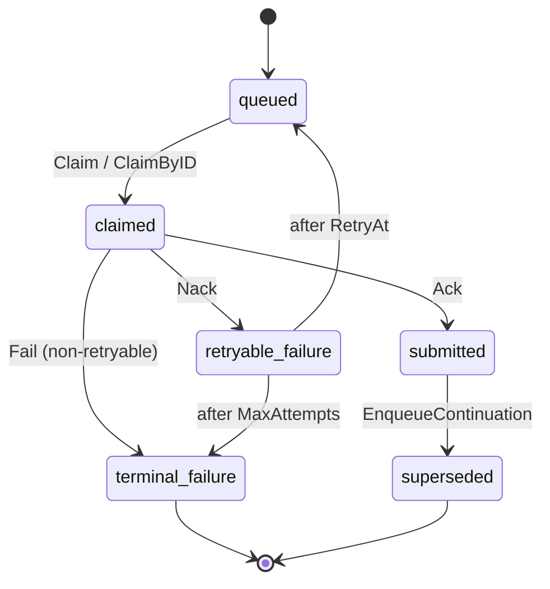

# apps/console/api/planner

Queue-based async batch scheduling between the AIBrix Console BFF, the
planner workers, and the metadata service (MDS).

## TL;DR

1. Console accepts `CreateJob` (HTTP / gRPC).
2. Console enqueues a `PlannerJob` via `Planner.Enqueue` and immediately
   returns a queued view to the UI.
3. A planner Worker (single process, dispatcher + N task goroutines)
   claims queued tasks from `TaskStore`, calls RM to provision capacity,
   and submits them to MDS via `BatchClient.CreateBatch`.
4. Console reads a merged planner + MDS view (`JobView`) via
   `Planner.GetJob` / `ListJobs`; the planner overlays a live
   `BatchClient.GetBatch` call at read time.

This package defines the boundaries; concrete implementations land in
follow-up PRs (see "Expected next PRs" below).

## Boundaries

The MVP surface is **three exported interfaces, one function type, and
one concrete struct**. The Worker is a struct (not an interface)
because it has only one production implementation; pre-submit dedup
and the PlannerTask -> MDS request translation are private methods on
the Worker, reaching MDS through `BatchClient`.

| Surface         | Kind            | Audience                          | What it does                                                              |
| --------------- | --------------- | --------------------------------- | ------------------------------------------------------------------------- |
| `Planner`       | interface       | Console BFF / ops dashboards      | `Enqueue` / `GetJob` / `ListJobs` + `GetQueueStats` / `GetCapacity` |
| `TaskStore`     | interface       | Planner / Worker                  | Durable state + claim coordination                                        |
| `BatchClient`   | interface       | Planner (read overlay) + Worker (create / dedup) | MDS `CreateBatch` / `GetBatch` / `ListBatches`                  |
| `SchedulerFunc` | function type   | Worker                            | Pluggable scheduling policy (FCFS by default; `nil` falls through to `TaskStore.Claim`) |
| `Worker`        | concrete struct | Planner process (`main`)          | Long-running orchestration loop (dispatcher + N task goroutines)          |
| RM              | (adjacent pkg)  | Worker                            | Reserve / release capacity for one task. Owned by an adjacent RM package; the planner does not declare it. |

`BatchClient` is the single mocking seam for MDS in tests: one fake
covers both the worker's submit/dedup path and the planner's read
overlay.

## State model

Two state families:

### `PlannerTaskState` — internal coordination



State transitions on a single `PlannerTask` are **forward-only**.
Retries that change `Attempt` always create new rows; the prior row
preserves its `BatchID` for audit and never re-enters `queued`. Each
`PlannerTask` is one attempt at running a job; reservation-expiry
retries insert a continuation `PlannerTask` (same `JobID`, fresh
`TaskID`, `Attempt+1`) and transition the prior row to `superseded`.

The planner does not drive cancellation: the OpenAI Batches API
exposes `/cancel` on MDS, and any user-facing cancel travels through
MDS directly. The planner observes the resulting MDS terminal state
on its read-time overlay (see `JobLifecycleState` below) but does
not transition any planner-internal state in response.

### `JobLifecycleState` — user-facing, derived

The typed enum the Console UI renders, computed at read time on
`JobView`. Pre-submit values come from `PlannerTaskState`; post-submit
values come from MDS `BatchStatus.Status`.

| `PlannerTaskState`  | `JobLifecycleState` |
| ------------------- | ------------------- |
| `queued`            | `queued`            |
| `claimed`           | `dispatching`       |
| `submitted`         | `submitted`         |
| `retryable_failure` | `queued`            |
| `terminal_failure`  | `failed`            |

When `BatchID` is set, the MDS status string maps 1:1 to
`JobLifecycleState` (`created` / `validating` / `in_progress` /
`finalizing` / `completed` / `failed` / `expired` / `cancelling` /
`cancelled`). The raw MDS string is preserved on `JobView.BatchStatus`
for forward compatibility.

## Concurrency model — single Worker, dispatcher + N goroutines

The MVP runs **one** Worker process. Internally the Worker fans work
across goroutines:

- **Dispatcher (1 goroutine)** loops, calling `TaskStore.Claim`
  (FCFS) or `ListCandidates` + `SchedulerFunc` + `ClaimByID`
  (custom). Each claimed task is handed to a task goroutine via a
  buffered channel. The dispatcher is the only thing that touches
  `TaskStore.Claim`.
- **N task goroutines**, each in a `for task := range workChan` loop.
  Per task: `RM.Provision` → `Worker.submit` (build
  `MDSBatchSubmission`, pre-submit dedup via `BatchClient.GetBatch`,
  call `BatchClient.CreateBatch`) → `Ack` / `Nack` / `Fail`.

The state machine itself is the coordination primitive: in-process
double-claim is structurally impossible because the dispatcher's
channel hands each task to exactly one goroutine. Crash recovery is
handled by `TaskStore.RecoverInProgress` on Worker startup, which
resets every task left in `claimed` back to `queued` so the next
dispatch cycle re-claims them.

## Crash safety and duplicate submit

The OpenAI Batches API does not accept idempotency keys, so the
planner must defend against duplicate submissions on its own. Two
failure modes can cause the same task to be submitted to MDS twice:

1. The Worker process dies after MDS returns 200 but before `Ack`.
   On restart, `RecoverInProgress` resets the task back to `queued`,
   the dispatcher re-claims it, and the worker submits again.
2. A network partition swallows the response; the worker times out
   and `Nack`s; the next retry creates a second batch.

MVP defenses, in priority order:

1. **Pre-submit dedup check.** Before calling `CreateBatch`, the
   Worker calls `BatchClient.GetBatch` (or `ListBatches` keyed on
   `extra_body.aibrix.job_id` once MDS indexes the field). If a
   batch already exists for this `job_id`, the Worker `Ack`s with
   the existing `BatchID`.
2. **MDS-side dedup (target state).** Once MDS treats
   `aibrix.job_id` as a uniqueness key on batch creation, retries
   become safely repeatable and (1) becomes a fast-path optimization
   rather than a correctness requirement.

## Resource Manager

The RM contract is owned by an **adjacent RM package**, not declared
here. The Worker calls into it directly and translates the RM-side
response into the in-memory `Reservation` shape this package defines
(`{ReservationID, JobID, Allocations, ExpiresAt}`).

### Two vocabularies, one adapter

Two distinct types describe "what capacity to reserve":

- `planner.ResourceRequirement` — the planner-internal
  hint/requirement persisted on `PlannerTask`.
- `rmtypes.ResourceProvisionSpec` — the cross-team RM contract
  owned by the RM package.

An internal **rmadapter** translates between them on every
`RM.Provision` call. It also enforces:

- `Provider` is checked against the underlying `Provisioner.Type()`;
  mismatches surface as `ErrInvalidJob`.
- `AllocationMode` is preserved on the planner side and projected
  into `ResourceDetail.ResourceType` for MDS audit / billing
  correlation, even though `ResourceProvisionSpec` does not yet
  carry a first-class slot for it on writes.

### Request shape — who fills what

`ResourceRequirement` carries a small Console-provided demand and a
larger planner-resolved shape.

**Console populates exactly two fields** on `resource_requirement`:

- `Accelerator.Type` — the SKU the user picked (e.g. `"H100-SXM"`).
- `Accelerator.Count` — total accelerators requested for the job.

**Everything else is planner-owned** and filled in during Enqueue:

- `Groups []ResourceGroup` — derived from `Accelerator` plus the
  ModelDeploymentTemplate registry (which knows the per-template
  replica/group topology). The planner divides
  `Accelerator.Count` across replica groups, sets each group's
  `GpusPerReplica`, and seeds `PreferredAcceleratorTypes` from
  `Accelerator.Type`.
- `AllocationMode` — typed enum (`onDemand` / `spot` / `scheduled`).
  Picked by planner policy.
- `Provider` — typed enum (`kubernetes` / `aws` / `lambdaCloud`).
  Picked by planner policy and the deployed provisioner registry.
- `TimeWindow` — optional reservation start/end pinning.
- Per-provider placement blocks (`Kubernetes` / `AWS` /
  `LambdaCloud`) — only the block matching `Provider` is honored.

The fully resolved `ResourceRequirement` is persisted on the
`PlannerTask` before any worker claims it; by the time the Worker
calls RM, all fields are populated.

This split matters for the Console contract: the wizard captures
"which model, which SKU, how many of them" and never has to know
about cluster placement / allocation mode / replica splits.

### Worker → RM lifecycle expectations

```
Claim(task)
  └─ RM.Provision(TaskID, ResourceRequirement)
        ErrInsufficientResources -> Nack with backoff
        (idempotent per TaskID; a re-claiming worker after a crash
         gets the same Reservation back rather than allocating a new
         slot.)

  Worker.submit(task, reservation)         (private method)
    ├─ build MDSBatchSubmission from task + reservation
    ├─ pre-submit dedup: BatchClient.GetBatch by aibrix.job_id
    └─ BatchClient.CreateBatch(MDSBatchSubmission) -> batchID
       (errors wrapped with ErrMDSSubmitFailed)

  TaskStore.Ack on success    -> persists ReservationID + ExpiresAt;
                                  reservation NOT released here
  TaskStore.Nack on retryable -> RM.Release
  TaskStore.Fail on terminal  -> RM.Release
```

The reservation-expiry sweeper does **not** call `Release`; it relies
on RM-side expiry to reclaim the slot.

The RM-side capacity-request path **MUST** treat `TaskID` as the
uniqueness key: duplicate calls with the same TaskID return the
existing Reservation. Each continuation task gets a fresh TaskID, so
a continuation always allocates new capacity rather than inheriting
the prior attempt's reservation.

### Reservation expiry handling

When a reservation expires before MDS finishes the batch, the planner
is purely reactive:

- The RM reclaims the underlying GPU pods at expiry.
- MDS observes its batch's pods are gone and marks the batch
  `failed` / `expired` on its own.
- The reservation-expiry sweeper inserts a continuation task:

```
for each PlannerTask where State = submitted
                      AND ReservationExpiresAt < now:
    TaskStore.EnqueueContinuation(prior.TaskID, newTask)
        // atomic: prior -> superseded; newTask inserted in queued
        // state with the same JobID and Attempt = prior.Attempt + 1.
```

When `prior.Attempt >= prior.MaxAttempts`, the sweeper omits
`EnqueueContinuation` and the prior attempt remains the latest (its
`submitted` row stays with an expired reservation; user-facing state
comes from MDS — typically `failed` / `expired`).

The cost is wasted work: a batch running for hours under one
reservation gets killed at expiry; the continuation starts from
scratch. Acceptable for batch jobs (idempotent, restartable,
latency-tolerant). BatchID linkage is preserved naturally — walking
`TaskStore.ListTasksByJobID(jobID)` returns the full chain, each row
keeping its own `BatchID`.

## Scheduling policy

Scheduling policies plug into the Worker as `SchedulerFunc` values:

```go
type SchedulerFunc func(ctx context.Context, store TaskStore, req *ScheduleRequest) ([]string, error)
```

The Worker accepts a `SchedulerFunc` at construction time; switching
policies is a one-line change in `main()`:

```go
worker := planner.NewWorker(planner.WorkerConfig{
    Store:     store,
    Batches:   batches,
    Scheduler: myPolicy,    // any SchedulerFunc; nil = FCFS
    // ...
})
```

A `nil` `SchedulerFunc` falls through to `TaskStore.Claim` (FCFS).
Concrete policies (FCFS, priority, fair-share, resource-aware) land
in follow-up PRs alongside their consumers.

`PlannerJob.Priority` and `PlannerTask.Priority` are reserved on the
types so adding priority-based ranking later does not require a
schema migration. FCFS ignores the field; priority-based policies
will consume it.

`SchedulerFunc` is the function-shaped equivalent of a future
`Scheduler` interface (the same `http.HandlerFunc` / `http.Handler`
pattern from the standard library); promote when a real plug-in
taxonomy emerges.

## Console wiring

```
Console
  └── Planner.Enqueue          (returns immediately; worker submits later)
      Planner.GetJob           (merged JobView)
      Planner.ListJobs         (paginated JobView list)
      Planner.GetQueueStats    (queue depth + activity telemetry)
      Planner.GetCapacity      (reserved / in-use / free capacity)

Worker (single process; dispatcher + N task goroutines)
  ├── on startup: TaskStore.RecoverInProgress  (reset claimed → queued)
  ├── dispatcher: TaskStore.Claim              (FCFS path)
  │           or  TaskStore.ListCandidates     (custom path)
  │             + SchedulerFunc(candidates)
  │             + TaskStore.ClaimByID          (atomic claim of selected IDs)
  └── per-task goroutines:
       ├── RM.Provision                        (idempotent per TaskID)
       ├── BatchClient.GetBatch                (pre-submit dedup)
       ├── BatchClient.CreateBatch             (POST /v1/batches)
       ├── TaskStore.Ack/Nack/Fail             (record outcome)
       └── RM.Release                          (on Fail / observed MDS-terminal; not on Ack)

Planner.GetJob / ListJobs
  ├── BatchClient.GetBatch      (live MDS overlay assembled into JobView)
  └── TaskStore.ListTasksByJobID (optional: surface attempt history)

Planner reservation-expiry sweeper (background)
  ├── TaskStore.ListSubmittedWithExpiringReservation
  └── TaskStore.EnqueueContinuation (atomic: prior → superseded;
                                     new task inserted Attempt+1, queued)
```

In MVP, `JobView` is assembled live: `Planner.GetJob` reads the
`PlannerTask` from `TaskStore` and (when `BatchID` is set) overlays a
fresh `BatchClient.GetBatch` call. A reconcile-cache layer that
mirrors `BatchStatus` into the store is intentionally not part of MVP;
it can be added later if `ListJobs` becomes a hot path.

### Worker loop reference outline

```text
// One-time on startup.
n, _ := store.RecoverInProgress(ctx)
log.Infow("recovered claimed tasks", "count", n)

// Dispatcher goroutine.
for ctx.Err() == nil {
    var claimed []*PlannerTask
    if w.scheduler == nil {
        claimed, _ = store.Claim(ctx, &ClaimRequest{
            WorkerID: workerID, Limit: batchSize,
        })
    } else {
        ids, _ := w.scheduler(ctx, store, &ScheduleRequest{
            WorkerID: workerID, Limit: batchSize, Now: time.Now(),
        })
        if len(ids) == 0 { time.Sleep(pollInterval); continue }
        claimed, _ = store.ClaimByID(ctx, &ClaimByIDRequest{
            WorkerID: workerID, TaskIDs: ids,
        })
    }
    if len(claimed) == 0 { time.Sleep(pollInterval); continue }
    for _, t := range claimed { workChan <- t }
}

// Task goroutine (one per parallelism slot).
for task := range workChan {
    reservation, err := acquireFromRM(ctx, task, workerID)
    if errors.Is(err, ErrInsufficientResources) {
        store.Nack(ctx, &NackRequest{
            TaskID: task.TaskID, RetryAt: backoff.Next(task.Attempts),
            LastError: err.Error(),
        })
        continue
    }

    batchID, err := w.submit(ctx, task, reservation)
    switch {
    case err == nil:
        // Reservation NOT released on Ack: held past submit so the
        // sweeper can detect expired reservations and create
        // continuations.
        store.Ack(ctx, &AckRequest{
            TaskID: task.TaskID, BatchID: batchID, SubmittedAt: time.Now(),
            ReservationID:        reservation.ReservationID,
            ReservationExpiresAt: reservation.ExpiresAt,
        })
    case errors.Is(err, ErrMDSSubmitFailed) && retryable(err):
        store.Nack(ctx, &NackRequest{
            TaskID: task.TaskID, RetryAt: backoff.Next(task.Attempts),
            LastError: err.Error(),
        })
        releaseFromRM(ctx, reservation.ReservationID)
    default:
        store.Fail(ctx, &FailRequest{
            TaskID: task.TaskID, LastError: err.Error(),
        })
        releaseFromRM(ctx, reservation.ReservationID)
    }
}
```

`Release` errors from the RM (e.g. "reservation already released or
expired") are treated as no-ops.

### Identity and correlation keys

| Key                       | Owner   | Used for                                              |
| ------------------------- | ------- | ----------------------------------------------------- |
| `JobID`                   | Console | User-facing identity, primary correlation key         |
| `TaskID`                  | Planner | Per-attempt identity; RM idempotency; retry chain     |
| `IdempotencyKey`          | Console | Duplicate-enqueue detection in the store              |
| `BatchID`                 | MDS     | MDS batch identity, file IDs                          |
| `extra_body.aibrix.job_id`| Planner | MDS round trip (planner ↔ MDS correlation)            |

### Error code translation (gRPC boundary)

| Planner sentinel       | gRPC code                | UI behavior                                  |
| ---------------------- | ------------------------ | -------------------------------------------- |
| `ErrInvalidJob`        | `InvalidArgument`        | Show validation message                      |
| `ErrJobNotFound`       | `NotFound`               | UI 404                                       |
| `ErrDuplicateEnqueue`  | `AlreadyExists`          | Treat as success on retry                    |
| `ErrStoreFull`         | `ResourceExhausted`      | "System busy, retry shortly"                 |
| `ErrStoreUnavailable`  | `Unavailable`            | Backend down banner                          |
| `ErrTaskAlreadyTerminal` | (worker-internal)      | Worker drops in-flight result; not user-facing |
| `ErrMDSSubmitFailed`   | (chain underlying status)| Reuse `mapSDKError` shape; wraps `BatchClient.CreateBatch` failures |

## File operations

The planner does not own file upload/download. File operations stay
on the Console BFF as a direct passthrough:

- `POST /api/v1/files/upload`            -> `POST {mds}/v1/files`
- `GET  /api/v1/files`                   -> `GET  {mds}/v1/files`
- `GET  /api/v1/files/{file_id}`         -> `GET  {mds}/v1/files/{file_id}`
- `GET  /api/v1/files/{file_id}/content` -> the same on MDS

The planner only consumes `input_file_id` strings and surfaces
`output_file_id` / `error_file_id` in `BatchStatus` and `JobView`.
Workers MUST NOT upload file content before submit.

## MDS correlation and dedup (hard external dependency)

The planner correlates MDS batches back to logical jobs via
`extra_body.aibrix.job_id`. For this to work in production, MDS must:

- accept `extra_body.aibrix.job_id` on `POST /v1/batches`
  (today's `AibrixExtension` is `extra: "forbid"` and rejects it);
- persist the value;
- echo it on `GET /v1/batches/{id}` and `GET /v1/batches`;
- ideally treat it as a uniqueness key so a duplicate submit returns
  the existing batch (Stripe-style idempotent `200`) rather than
  creating a second one.

This is a **hard dependency**, not an optional enhancement. Until it
ships, `BatchStatus.JobID` may come back empty and the Worker's
pre-submit dedup check (against `BatchClient.GetBatch`) is the only
defense against duplicate submissions.

## Wire-level contracts

JSON examples below use RFC3339 timestamps. In Go, the fields are
`time.Time` for required timestamps, `*time.Time` for
optional/nullable.

### Console -> Planner

#### `EnqueueRequest`

```json
{
  "job": {
    "job_id": "job_123",
    "source": "console",
    "submitted_by": "alice@example.com",
    "submitted_at": "2026-05-01T10:00:00Z",
    "idempotency_key": "console:create-job:job_123",
    "max_attempts": 3,
    "priority": 0,
    "resource_requirement": {
      "accelerator": { "type": "H100-SXM", "count": 4 }
    },
    "model_template": { "name": "llama3-batch", "version": "v1" },
    "profile":        { "name": "default",      "version": "v1" },
    "batch_payload": {
      "input_file_id": "file_abc",
      "endpoint": "/v1/chat/completions",
      "completion_window": "24h",
      "metadata": { "display_name": "my batch" }
    }
  }
}
```

Required: `job_id`, `model_template`,
`resource_requirement.accelerator.type`,
`resource_requirement.accelerator.count`,
`batch_payload.input_file_id`, `batch_payload.endpoint`.

Recommended: `source`, `submitted_by`, `submitted_at`,
`idempotency_key`, `max_attempts`, `profile`.

Console populates only `accelerator.{type,count}` on
`resource_requirement`; everything else (`groups`, `time_window`,
`allocation_mode`, `provider`, per-provider placement) is
planner-owned. See "Resource Manager → Request shape" above.

`EnqueueResult`:

```json
{
  "task_id": "task_456",
  "job_id": "job_123",
  "state": "queued",
  "enqueued_at": "2026-05-01T10:00:00Z"
}
```

Errors: `ErrInvalidJob`, `ErrDuplicateEnqueue`, `ErrStoreFull`,
`ErrStoreUnavailable`.

#### `GetJob` / `ListJobs`

`GetJob(ctx, jobID)` returns one `JobView`. Returns `ErrJobNotFound`
on unknown JobID.

`ListJobsRequest`:

```json
{ "limit": 20, "after": "task_prev", "submitted_by": "alice@example.com" }
```

`ListJobsResponse`:

```json
{ "data": [ /* JobView[] */ ], "has_more": false, "next_after": "" }
```

#### `GetQueueStats`

```json
// Request
{ "queue_name": "planner-default" }
// Response
{
  "queue_name": "planner-default",
  "bounded": true,
  "max_queued_tasks": 10000,
  "current_queued_tasks": 234,
  "current_claimed_tasks": 5,
  "current_retryable_tasks": 9,
  "oldest_queued_at": "2026-05-01T09:58:00Z",
  "sampled_at": "2026-05-01T10:00:00Z"
}
```

Counts mirror the `PlannerTaskState` values that are observable as
"in flight" from an ops perspective: `queued`, `claimed`,
`retryable_failure`. Terminal states (`submitted`, `terminal_failure`,
`superseded`) live in the per-job read model and are not counted here.

#### `GetCapacity`

```json
// Request — empty body returns the full view; all fields are optional filters.
{}
// Response
{
  "sampled_at": "2026-05-01T10:00:00Z",
  "total":   { "total": 256, "reserved": 16, "in_use": 180, "free": 60 },
  "clusters": [
    {
      "cluster": "cluster-a",
      "region":  "us-west-2",
      "total":   { "total": 128, "reserved": 8, "in_use": 100, "free": 20 },
      "accelerators": [
        { "type": "H100-SXM", "counts": { "total": 64, "reserved": 4, "in_use": 56, "free": 4 } },
        { "type": "H200",     "counts": { "total": 64, "reserved": 4, "in_use": 44, "free": 16 } }
      ]
    }
  ]
}
```

Filter behavior: any of `cluster`, `allocation_mode`, `accelerator_type`
narrows the response to the matching slice. For example sending
`{ "accelerator_type": "H100-SXM" }` returns only the H100-SXM rows
(the H200 entry above would be omitted), and the cluster/total counts
are recomputed against just that subset.

Counts at every level satisfy `Free == Total - Reserved - InUse`.
`Reserved` = held by an active RM reservation but the corresponding
job has not yet been confirmed running on MDS; `InUse` = currently
running. A first-cut RM that does not yet track the running-vs-reserved
split MAY report `InUse = 0` and put all held capacity under
`Reserved`; consumers SHOULD render the two separately so the UI does
not need to change later.

`allocation_mode` accepts the same values as
`ResourceRequirement.AllocationMode` (`onDemand` / `spot` /
`scheduled`).

### Worker -> TaskStore

Atomic state-transition methods. Ack/Nack/Fail validate that the task
is still in `claimed` and return `ErrTaskAlreadyTerminal` otherwise.

#### `ClaimRequest`

```json
{ "worker_id": "planner-worker-0", "limit": 10 }
```

Returns `[]*PlannerTask`, atomically transitioned from `queued` to
`claimed`. The store uses its default ordering (typically
`available_at` ascending). Custom policies use the
`ListCandidates` + `ClaimByID` pair instead.

#### `ListCandidatesRequest`

```json
{ "limit": 40, "now": "2026-05-01T10:00:00Z" }
```

Returns up to `limit` claimable tasks (`state IN
('queued','retryable_failure')`, `available_at <= now`) **without**
transitioning them. Used by `SchedulerFunc` implementations to rank
candidates before committing a selection via `ClaimByID`.

#### `ClaimByIDRequest`

```json
{ "worker_id": "planner-worker-0", "task_ids": ["task_456", "task_457"] }
```

Atomically transitions the listed task IDs from `queued` to
`claimed`. Tasks that are no longer claimable (already claimed,
became terminal, missing) are silently skipped; the response carries
the subset that was successfully claimed.

#### `Ack` / `Nack` / `Fail`

```json
// AckRequest
{
  "task_id": "task_456",
  "batch_id": "batch_xyz",
  "submitted_at": "2026-05-01T10:00:07Z",
  "reservation_id": "res_789",
  "reservation_expires_at": "2026-05-02T10:00:00Z"
}

// NackRequest
{
  "task_id": "task_456",
  "retry_at": "2026-05-01T10:01:07Z",
  "last_error": "mds timeout"
}

// FailRequest
{ "task_id": "task_456", "last_error": "invalid model_template" }
```

All return no body on success; all return `ErrTaskAlreadyTerminal` if
the task is no longer in `claimed` (a defensive check against
double-settle bugs). The Worker drops the in-flight result on that
error.

`Ack` does **not** release the RM reservation — `ReservationID` and
`ReservationExpiresAt` are persisted so the reservation-expiry sweeper
can find expired attempts. `Nack` and `Fail` are the points at which
the Worker calls `RM.Release`.

#### `RecoverInProgress`

Called once on Worker startup. Resets every `claimed` row back to
`queued` so any tasks the prior process was holding when it crashed
can be picked up again. Returns the count for telemetry.

### Planner -> TaskStore

#### `EnqueueContinuationRequest`

```json
{
  "superseded_task_id": "task_456",
  "new_task": {
    "task_id": "task_789",
    "job_id":  "job_123",
    "state": "queued",
    "...": "..."
  },
  "reason": "reservation_expired",
  "superseded_at": "2026-05-01T10:05:00Z"
}
```

Atomic effect: the prior task transitions `submitted -> superseded`
(BatchID preserved); `new_task` is inserted with `Attempt =
supersededTask.Attempt + 1` and the same `JobID`. Returns
`ErrJobNotFound` if `superseded_task_id` does not exist;
`ErrTaskAlreadyTerminal` if the prior task is not in `submitted`
(safe to treat as no-op).

#### `ListSubmittedWithExpiringReservation`

Returns submitted tasks whose `ReservationExpiresAt <= before`,
capped at `limit`. Used by the reservation-expiry sweeper.

#### Read methods

- `GetByJobID(jobID)` — latest attempt for a JobID
- `GetByTaskID(taskID)` — exact task by TaskID
- `ListTasksByJobID(jobID)` — full attempt chain ordered by
  `Attempt` ascending; used for audit/debug surfaces

### `SchedulerFunc` — scheduling policy

```go
type SchedulerFunc func(ctx context.Context, store TaskStore, req *ScheduleRequest) ([]string, error)
```

`ScheduleRequest`:

```json
{ "worker_id": "planner-worker-0", "limit": 10, "now": "2026-05-01T10:00:00Z" }
```

Returns `[]string` of TaskIDs in preferred claim order; `len ≤ limit`.
A `nil` `SchedulerFunc` falls through to `TaskStore.Claim` (FCFS).

### Worker submit path

The Worker is a concrete struct; the MDS submission step is a private
method (`Worker.submit`). It:

1. Builds an `MDSBatchSubmission` from the claimed `PlannerTask` and
   the in-memory `Reservation`.
2. Calls `BatchClient.GetBatch` (or `ListBatches`) keyed on
   `extra_body.aibrix.job_id` for pre-submit dedup. If a batch
   exists, short-circuit and Ack with the existing BatchID.
3. Calls `BatchClient.CreateBatch(*MDSBatchSubmission) ->
   *BatchStatus`.
4. Wraps any transport-level error with `ErrMDSSubmitFailed`.

`MDSBatchSubmission`:

```go
type MDSBatchSubmission struct {
    InputFileID      string
    Endpoint         string
    CompletionWindow string
    Metadata         map[string]string
    ExtraBody        MDSExtraBody  // {"aibrix": AIBrixExtraBody}
}
```

On the wire (POST to MDS `/v1/batches`):

```json
{
  "input_file_id": "file_abc",
  "endpoint": "/v1/chat/completions",
  "completion_window": "24h",
  "metadata": { "display_name": "my batch" },
  "extra_body": {
    "aibrix": {
      "job_id": "job_123",
      "planner_decision": {
        "reservation_id": "res_789",
        "reservation_resource_deadline": 1714550400
      },
      "resource_details": [
        { "resource_type": "spot", "endpoint_cluster": "cluster-a",
          "gpu_type": "H100-SXM", "worker_num": 4 }
      ],
      "model_template": { "name": "llama3-batch", "version": "v1" },
      "profile":        { "name": "default",      "version": "v1" }
    }
  }
}
```

`planner_decision` and `resource_details` are populated from
`Reservation.ReservationID` / `ExpiresAt` and `Reservation.Allocations`
respectively; absent only when the worker stack runs without an RM
(dev/test).

### Planner -> MDS (BatchClient)

```
CreateBatch(*MDSBatchSubmission) -> *BatchStatus    (Worker submit path)
GetBatch(batchID)                -> *BatchStatus    (read overlay + dedup)
ListBatches(*ListBatchesRequest) -> *ListBatchesResponse
```

`ListBatchesRequest` cursor semantics match MDS / OpenAI: pass the
last batch ID from the previous page as `after`.

`BatchStatus` is the normalized MDS read model (batch_id, job_id,
status, model, file IDs, timestamps, request_counts, errors, usage,
metadata). `JobID` may come back empty until MDS implements the
`aibrix.job_id` round-trip.

### `JobView` — merged read model

```json
{
  "task_id": "task_456",
  "job_id": "job_123",
  "planner_state": "submitted",
  "lifecycle_state": "validating",
  "batch_status": "validating",
  "batch_id": "batch_xyz",
  "model": "llama3-batch",
  "input_file_id": "file_abc",
  "output_file_id": "",
  "error_file_id": "",
  "attempts": 1,
  "max_attempts": 3,
  "last_error": "",
  "enqueued_at":   "2026-05-01T10:00:00Z",
  "submitted_at":  "2026-05-01T10:00:07Z",
  "in_progress_at": null,
  "finalizing_at": null,
  "completed_at":  null,
  "failed_at":     null,
  "cancelled_at":  null,
  "expires_at":    "2026-05-02T10:00:00Z",
  "request_counts": { "total": 100, "completed": 0, "failed": 0 },
  "errors": [],
  "usage": null
}
```

`LifecycleState` is **derived** at read time: pre-submit from
`PlannerTaskState`; post-submit from `BatchStatus.Status`. The raw
MDS string is preserved on `JobView.batch_status` for forward
compatibility.

## Errors

| Sentinel                   | When                                                                              |
| -------------------------- | --------------------------------------------------------------------------------- |
| `ErrInvalidJob`            | `Enqueue` rejected a malformed `PlannerJob`.                                      |
| `ErrJobNotFound`           | `GetJob` looked up an unknown JobID.                                              |
| `ErrStoreFull`             | A bounded store reached capacity.                                                 |
| `ErrStoreUnavailable`      | The store backend is degraded or unreachable.                                     |
| `ErrDuplicateEnqueue`      | `JobID` or `IdempotencyKey` already exists in the store.                          |
| `ErrMDSSubmitFailed`       | `BatchClient.CreateBatch` failed; wrapped by `Worker.submit`.                     |
| `ErrInsufficientResources` | RM cannot satisfy the request now; the worker `Nack`s with backoff. The RM's typed error is wrapped with this so the planner stays decoupled from the concrete RM error vocabulary. |
| `ErrTaskAlreadyTerminal`   | `EnqueueContinuation` against a task already in a terminal state (e.g. MDS finished the batch before the reservation-expiry sweeper saw it) — sweeper treats as no-op. Also returned by `Ack`/`Nack`/`Fail` if the task is no longer in `claimed`, as a defensive double-settle check. |

## Expected next PRs

This list is the canonical roadmap for follow-ups.

1. **In-memory `TaskStore`** for tests + dev.
2. **Concrete `BatchClient`** wrapping the openai-go SDK
   (`CreateBatch`, `GetBatch`, `ListBatches`).
3. **MDS-side schema work** — extend `AibrixExtension` to
   accept/persist/echo `aibrix.job_id` and treat it as a uniqueness
   key. Hard dependency for production go-live.
4. **Concrete `Worker` struct** — dispatcher loop + N task
   goroutines, pre-submit dedup, submit, Ack/Nack/Fail, RM
   Provision/Release, startup `RecoverInProgress`.
5. **Concrete `Planner` impl** — delegates to the store, exposes
   `JobView`, runs the reservation-expiry sweeper, and runs the
   MDS-terminal observer that calls RM-side `Release` when a
   submitted batch reaches terminal status.
6. **Production durable `TaskStore`** (Postgres or MySQL).
7. **`SchedulerFunc` implementations** as scheduling policies are
   needed (FCFS first; priority/fair-share/etc. as consumers ask).
8. **Console refactor** — switch
   `apps/console/api/handler/job.go` to call `Planner` instead of
   MDS directly.
