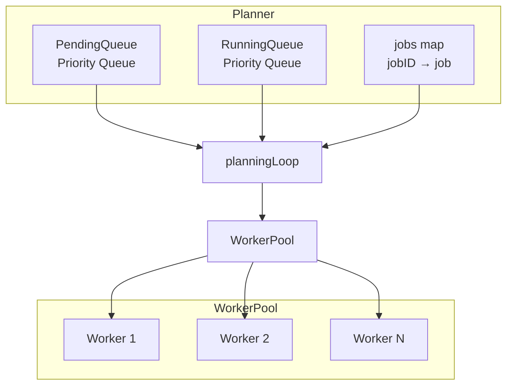
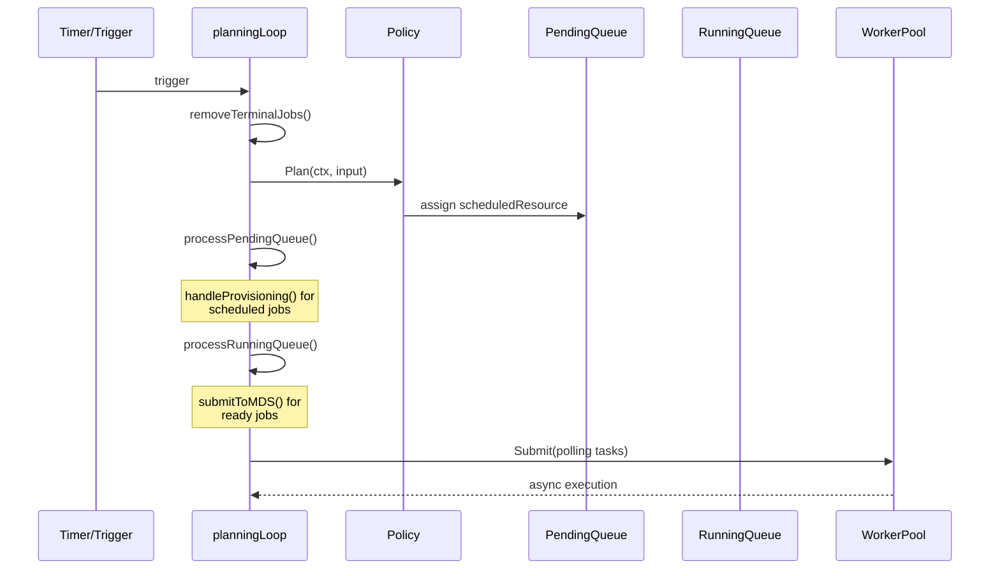
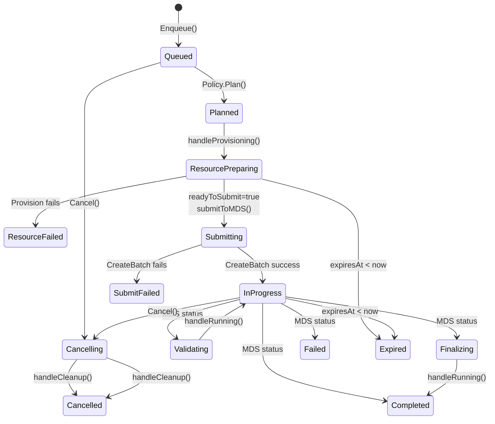

# Planner Architecture Design

## Overview

The Planner is an asynchronous job scheduling system that manages batch job lifecycle from enqueue to completion. It uses a **non-blocking architecture** with three key components:

1. **Planning Policy Plugin** - Pluggable scheduling decisions
2. **Planning Loop** - Periodic state machine execution
3. **Worker Pool** - Concurrent async polling for job status

---

## 1. Planning Policy Plugin Mechanism

### 1.1 Interface & Registry

The policy plugin uses a registry pattern that supports multiple resource provision types:

```go
type PlanningPolicy[T utils.PriorityQueueItem] interface {
    Type() PlanningPolicyType
    Plan(ctx context.Context, input PlanningInput[T]) error
}

type PlanningInput[T utils.PriorityQueueItem] struct {
    PlannerBackend plannerBackend           // Backend
    RunningQueue   utils.PriorityQueue[T]   // Active jobs
    PendingQueue   utils.PriorityQueue[T]   // Waiting jobs
}
```

Policies self-register via `RegisterPlanningPolicy()` and are looked up by `LookupPlanningPolicy()`.

### 1.2 Simple Policy

The default `SimplePolicy` enforces a concurrency limit on provisioning:

1. Count active provisioning jobs (Queued with scheduledResource, Planned, or ResourcePreparing)
2. If `activeCount >= MaxConcurrentProvisioning`, return early
3. For each pending job (up to remaining slots), call `backend.Schedule()` and set `job.scheduledResource`

---

## 2. Planning Loop Processing Mechanism

### 2.1 Architecture



### 2.2 Execution Flow



### 2.3 Plan Once Steps

| Step | Function | Purpose |
|------|----------|---------|
| 1 | `removeTerminalJobs()` | Remove terminal jobs from queues and map |
| 2 | `policy.Plan()` | Run scheduling policy, assign `scheduledResource` |
| 3 | `processPendingQueue()` | Execute provisioning, handle cancelling |
| 4 | `processRunningQueue()` | Submit ready jobs, dispatch async polling |

---

## 3. Worker Pool Async Polling Mechanism

### 3.1 Design

The worker pool manages a fixed number of goroutines that execute submitted functions:

- **parallelism**: Number of worker goroutines (default: 10)
- **taskCh**: Buffered channel for task functions
- **wg**: WaitGroup for completion tracking

### 3.2 Async Polling Tasks

| Task | Function | Purpose |
|------|----------|---------|
| Provision Polling | `handleResourcePreparing()` | Query provision status, mark `readyToSubmit` |
| Batch Polling | `handleRunning()` | Query MDS batch status, update job state |
| Cleanup | `handleCleanup()` | Release resources, cancel batches |
| Expiry | `handleCleanup()` | Handle expired jobs |

---

## 4. Job State Machine

### 4.1 State Categories

| Category | States |
|----------|--------|
| Pending | `queued`, `planned`, `resource_preparing`, `submitting` |
| Running | `validating`, `in_progress`, `finalizing`, `cancelling` |
| Terminal | `completed`, `failed`, `expired`, `cancelled`, `resource_failed`, `submit_failed` |

### 4.2 State Transition Diagram



### 4.3 Key Transitions

| From | To | Handler | Condition |
|------|-----|---------|-----------|
| Queued | Planned | `SimplePolicy.Plan()` | Under concurrency limit |
| Planned | ResourcePreparing | `handleProvisioning()` | Provision starts |
| ResourcePreparing | Submitting | `submitToMDS()` | `readyToSubmit == true` |
| Submitting | InProgress | `submitToMDS()` | CreateBatch returns |
| InProgress | Completed | `handleRunning()` | MDS reports completion |
| Any | Cancelling | `Cancel()` | User cancels |
| Cancelling | Cancelled | `handleCleanup()` | Cleanup completes |
| Any | Expired | `handleCleanup()` | `expiresAt < now()` |
