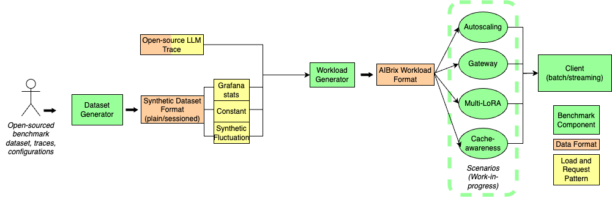

# AIBrix Benchmark

AIBrix Benchmark contains the following components:
- Dataset (Prompt) Generation
- Workload Generation
- Benchmark Client
- Benchmark Scenarios (Work-in-progress)

The diagram below shows the end-to-end steps of AIBrix benchmarks. Our components are highlighted as green rectangles in this diagram.


Currently, the benchmark scenarios are still under construction and the current benchmark script ```benchmark.py``` performs all steps up to the AIBrix workload format and triggers the benchmark client without extra steps for setting up the benchmark environment for different scenarios.
All default shared environment variables can be found in ```config```.

## Preliminary

Make sure you set these environment variables before you start.

```bash
export KUBECONFIG=${kube_config_path}
kubectl -n envoy-gateway-system port-forward ${service_name} 8888:80 &
export API_KEY="${your_api_key}"
```

## Run benchmark end-to-end
To run all steps using the default setting, try

```bash
python benchmark.py --stage all --config config.yaml
```

Each step can also be run separately. All configurations are stored in [config.yaml](config.yaml) file. To override any configuration parameter from the command line, do something like

```bash
python benchmark.py --stage all --config config.yaml --override endpoint="http://localhost:8000"
```

## Run dataset generator

As shown in the diagram above, the workload generator would expect to accept either time-series traces (e.g., Open-source LLM trace, Grafana exported time-series metrics, see this for more details) or a synthetic prompt file which could be hand-tuned by users (i.e., synthetic dataset format).
A synthetic dataset format needs to be in one of the two formats:

1. Plain format (no sessions)
```json
{"prompt": "XXXX"}
{"prompt": "YYYY"}
```
2. Session format
```json
{"session_id": 0, "prompts": ["XXX", "YYY"]}
{"session_id": 1, "prompts": ["AAA", "BBB", "CCC"]}
```
The dataset generator either generates a prompt dataset or converts an existing dataset which belongs to one of the two formats above.

To run dataset generation, do
```bash
python benchmark.py --stage dataset --config config.yaml
```

Currently, we support four types of datasets:

**1. Controlled Synthetic Sharing**
- This type allows users to generate a cache sharing *plain-format* dataset with *controlled prompt token length* and *controlled prefix sharing length*, as well as a controlled number of prefixes (i.e., sessions). To tune the prompt token length and shared length, set variables in [config.yaml](config.yaml).

**2. Multiturn Synthetic**
- Multiturn synthetic data generation produces a *sessioned-format* dataset. Each session id maps to a *controlled number of prompts* per session and *controlled prompt lengths*. These variables can be tuned via [config.yaml](config.yaml).

**3. ShareGPT**
- This generation type converts the ShareGPT dataset to a *sessioned-format* dataset that has session_id, prompts, and completions. Configure via [config.yaml](config.yaml).

**4. Client trace**
- This generation type converts client output into a *plain-format* dataset. Configure via [config.yaml](config.yaml).

The first two types generate synthetic prompts and the second two types convert external data sources/benchmark data.


For details of the dataset generator, check out [README](./generator/dataset-generator/README.md). All tunable parameters are set under ```config/dataset```.

## Run workload generator
The workload generator specifies the time and requests to be dispatched in a workload. A workload generator accepts either trace/metrics files (where either time and requests are specified, or QPS/input/output volume are specified) or a synthetic dataset format that contains prompts and possibly sessions. There are different ways to use the workload generator.


Below are the workload types that are currently being supported. The ```workload_type``` configuration within [config.yaml](config.yaml) specifies the types of workload type used. Configurations under different workload types are specified under ```workload_configs```.

**1. The "constant" and "synthetic" workload type**
- The workload generator can generate two types of *synthetic load patterns*. Multiple workload configurations can be hand-tuned (e.g., traffic/QPS distribution, input request token lengths distribution, output token lengths distribution, maximum concurrent sessions, etc.):
    - Constant load (**constant**): The mean load (QPS/input length/output length) stays constant with controllable fluctuation.
    - Synthetic fluctuation load (**synthetic**): The loads (QPS/input length/output length) fluctuate based on configurable parameters.

**2. The "stat" workload type**
- For *metrics files (e.g., .csv files exported from Grafana dashboard)*, the workload generator will generate the QPS/input length/output length distribution that follows the collected time-series metrics specified in the file. The actual prompts used in the workload will be based on one of the synthetic datasets generated by the [dataset generator](#run-dataset-generator).

**3. The "azure" workload type**
- For [Azure LLM trace](https://github.com/Azure/AzurePublicDataset/blob/master/data/AzureLLMInferenceTrace_conv.csv), both the requests and timestamps associated with the requests are provided, and the workload generator will generate a workload that simply replays requests based on the timestamp.

**4. The "mooncake" workload type**
- For a [Mooncake LLM trace](https://github.com/kvcache-ai/Mooncake/tree/main/FAST25-release/traces), the request input/output, the cache block ID along with timestamps associated with the requests are provided, and the workload generator will generate a workload that simulates requests following the same traffic pattern.

The workload generator can be run by:
```bash
python benchmark.py --stage workload --config config.yaml
```

The workload generator will produce a workload file that looks like the following. The logical timestamp is associated with a list of prompts that need to be dispatched at the same time.

```json
{
    "timestamp": 19, 
    "requests": 
    [
        {
            "prompt": "I need to understand data science for my startup idea. Can you help? Could you also explain how this relates to natural language processing? For context, I have experience with cybersecurity but I'm new to this specific area. I've been trying to understand this concept for months and would appreciate a clear explanation. I'm asking because I need to deploy a machine learning model for a project. For context, I have experience with cryptocurrency but I'm new to this specific area. Could you", 
            "prompt_length": 101, 
            "output_length": null,
            "session_id": 0
        },
        {
            "prompt": "...",
            "prompt_length": "...", 
            "output_length": "...",
            "session_id": "..."
        }
    ]
}
```

Details of the workload generator can be found [here](generator/workload-generator/README.md).

## Run workload using client
```bash
python benchmark.py --stage client --config config.yaml
```

The benchmark client supports both batch and streaming modes. Streaming mode supports intra-request metrics like TTFT/TPOT. Configure the endpoint and target model via [config.yaml](config.yaml).


## Run analysis

Run analysis on benchmark results using:
```bash
python benchmark.py --stage analysis --config config.yaml
```
Configure path and performance target via [config.yaml](config.yaml).


