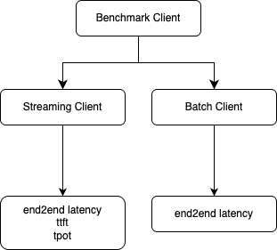

# AIBrix Benchmark 

This document explains the parameters in `config.yaml` for **AIBrix benchmarks**, including their purpose, types, usage, and interactions. The config controls **dataset generation**, **workload scheduling**, **benchmark client**, and **analysis**.

---

## Table of Contents

1. [Benchmark Overview](#benchmark-overview)  
1. [Preliminary](#preliminary)  
1. [Using This Benchmark](#using-this-benchmark)  
1. [Dataset Generation](#dataset-generation)  
1. [Workload Generation](#workload-generation)  
1. [Dispatch Workload Using Client](#dispatch-workload-using-client)  
1. [Benchmark Analysis](#benchmark-analysis)  


---

## Benchmark Overview

AIBrix Benchmark contains the following components:
- Dataset (Prompt) Generation
- Workload Generation
- Benchmark Client
- Benchmark Scenarios (Work-in-progress)

The diagram below shows the end-to-end steps of AIBrix benchmarks. Our components are highlighted as green rectangles in this diagram.


Currently, the benchmark scenarios are still under construction and the current benchmark script ```benchmark.py``` performs all steps up to the AIBrix workload format and triggers the benchmark client without extra steps for setting up the benchmark environment for different scenarios.
All default shared environment variables can be found in ```config```.

## Preliminary

Make sure you install the following dependencies:
```bash
pip install -r requirements.txt
```

Make sure you set these environment variables before you start.

```bash
export KUBECONFIG=${kube_config_path}
kubectl -n envoy-gateway-system port-forward ${service_name} 8888:80 &
export API_KEY="${your_api_key}"
```

## Using This Benchmark

All benchmark usage depends on a configuration file. A sample configuration file could be found [here](config.yaml).

**Run benchmark end-to-end**: To run all steps using the default setting, try

```bash
python benchmark.py --stage all --config config.yaml
```

**Run benchmark by step**: Each step can also be run separately. This ensures files from the generation phase (dataset or workload) could be re-used across runs. 
 
```bash
python benchmark.py --stage client --config config.yaml
```

**Overriding Parameters Using Runtime Parameters**: To override any configuration parameter from the command line, do something like

```bash
python benchmark.py --stage client --config config.yaml --override endpoint="http://localhost:8000"
```

## Dataset Generation

As shown in the diagram above, the workload generator would expect to accept either time-series traces (e.g., Open-source LLM trace, Grafana exported time-series metrics, see this for more details) or a synthetic prompt file which could be hand-tuned by users (i.e., synthetic dataset format).
A synthetic dataset format needs to be in one of the two formats:

1. Plain format (no sessions)
```json
{"prompt": "XXXX"}
{"prompt": "YYYY"}
```
2. Session format
```json
{"session_id": 0, "prompts": ["XXX", "YYY"]}
{"session_id": 1, "prompts": ["AAA", "BBB", "CCC"]}
```
The dataset generator either generates a prompt dataset or converts an existing dataset which belongs to one of the two formats above.

To run dataset generation, do
```bash
python benchmark.py --stage dataset --config config.yaml
```

Currently, we support four types of datasets:

**1. Controlled Synthetic Sharing**
- This type allows users to generate a cache sharing *plain-format* dataset with *controlled prompt token length* and *controlled prefix sharing length*, as well as a controlled number of prefixes (i.e., sessions). To tune the prompt token length and shared length, set variables in [config.yaml](config.yaml).

**2. Multiturn Synthetic**
- Multiturn synthetic data generation produces a *sessioned-format* dataset. Each session id maps to a *controlled number of prompts* per session and *controlled prompt lengths*. These variables can be tuned via [config.yaml](config.yaml).

**3. ShareGPT**
- This generation type converts the ShareGPT dataset to a *sessioned-format* dataset that has session_id, prompts, and completions. Configure via [config.yaml](config.yaml).

**4. Client trace**
- This generation type converts client output into a *plain-format* dataset. Configure via [config.yaml](config.yaml).

The first two types generate synthetic prompts and the second two types convert external data sources/benchmark data.


For details of the dataset generator, check out [README](./generator/dataset_generator/README.md). All tunable parameters are set under ```config/dataset```.


### Configuring Dataset Generation

Sections in the configuration file below control how dataset are generated.

```yaml
# ---------------
# STEP 1: DATASET GENERATION
# ---------------
# Dataset config
dataset_dir: ...
prompt_type: ...
```

#### `dataset_dir`

- **Type**: string    
- **Purpose**: Selects dataset generation path.  
- **Usage**: Specify the output directory where the dataset file is stored.

#### `prompt_type`

- **Type**: string  
- **Values**: `"synthetic_multiturn"`, `"synthetic_shared"`, `"sharegpt"`, `"client_trace"`  
- **Purpose**: Select the dataset type.  
- **Usage**:  Specifies dataset type described above.    

#### `dataset_configs.synthetic_multiturn`

Used when `prompt_type: "synthetic_multiturn"`  

- **dataset_configs.synthetic_multiturn.shared_prefix_length**: `int` — Length of the shared prefix (simulating shared system prompt). Default: `0`.
- **dataset_configs.synthetic_multiturn.prompt_length**: `int` — Length of the prompt (mean). Default: `80`.
- **dataset_configs.synthetic_multiturn.prompt_std**: `int` — Length of the prompt (std). Default: `472`.
- **dataset_configs.synthetic_multiturn.num_turns**: `float` — Number of turns (mean). Default: `3.55`.
- **dataset_configs.synthetic_multiturn.num_turns_std**: `float` — Number of turns (std). Default: `2.89`.
- **dataset_configs.synthetic_multiturn.num_sessions**: `int` — Number of sessions (mean). Default: `1000`.
- **dataset_configs.synthetic_multiturn.num_sessions_std**: `int` — Number of sessions (std). Default: `1`.


#### `dataset_configs.synthetic_shared`

Used when `prompt_type: "synthetic_shared"`. Default parameters selected based on general workload impression.   

- **dataset_configs.synthetic_shared.num_dataset_configs**: `int` — Number of configurations. Default: `3`.
- **dataset_configs.synthetic_shared.prompt_length**: `str` — Lengths of the prompt. Use `','` to separate multiple configurations. Default: `"3997,5868,2617"`.
- **dataset_configs.synthetic_shared.prompt_std**: `str` — Standard deviations of the prompt length. Use `','` to separate multiple configurations. Default: `"17,28,1338"`.
- **dataset_configs.synthetic_shared.shared_prop**: `str` — Proportions of shared content. Use `','` to separate multiple configurations. Default: `"0.95,0.97,0.03"`.
- **dataset_configs.synthetic_shared.shared_prop_std**: `str` — Standard deviations of shared proportion. Use `','` to separate multiple configurations. Default: `"0.00001,0.00001,0.00001"`.
- **dataset_configs.synthetic_shared.num_samples**: `str` — Number of samples per prefix. Use `','` to separate multiple configurations. Default: `"12,8,79"`.
- **dataset_configs.synthetic_shared.num_prefix**: `str` — Number of prefixes. Use `','` to separate multiple configurations. Default: `"1,1,1"`.


#### `dataset_configs.sharegpt`

Used when `prompt_type: "sharegpt"`  

- **dataset_configs.sharegpt.target_dataset**: `str` — Path to the [shareGPT dataset](https://huggingface.co/datasets/anon8231489123/ShareGPT_Vicuna_unfiltered). Default: `/tmp/ShareGPT_V3_unfiltered_cleaned_split.json`.


#### `dataset_configs.client_trace`

Used when `generator: "client_trace"`  

- **dataset_configs.client_trace.trace**: `string` — Path to a trace file for replaying real request patterns. This path points to a trace file produced by AIBrix client in order to generate/infer workload pattern that has previously been run on the target model. Example format:
```
{
  "request_id": 0,
  "status": "success",
  "input": [
    {
      "role": "user",
      "content": "..."
    }
  ],
  "output": "...",
  "prompt_tokens": 179,
  "output_tokens": 128,
  "total_tokens": 307,
  "latency": 3.0292908750016068,
  "throughput": 42.254113349195,
  "start_time": 23289.748661208,
  "end_time": 23292.777952083,
  "ttft": 0.8818467500022962,
  "tpot": 0.016776907226557114,
  "target_pod": null,
  "target_request_id": null,
  "session_id": 1
}

```

---

## Workload Generation

The workload generator specifies the time and requests to be dispatched in a workload. A workload generator accepts either trace/metrics files (where either time and requests are specified, or QPS/input/output volume are specified) or a synthetic dataset format that contains prompts and possibly sessions. There are different ways to use the workload generator.


Below are the workload types that are currently being supported. The ```workload_type``` configuration within [config.yaml](config.yaml) specifies the types of workload type used. Configurations under different workload types are specified under ```workload_configs```.

**1. The "constant" and "synthetic" workload type**
- The workload generator can generate two types of *synthetic load patterns*. Multiple workload configurations can be hand-tuned (e.g., traffic/QPS distribution, input request token lengths distribution, output token lengths distribution, maximum concurrent sessions, etc.):
    - Constant load (**constant**): The mean load (QPS/input length/output length) stays constant with sampled exponential distribution interval fluctuation.
    - Synthetic fluctuation load (**synthetic**): The loads (QPS/input length/output length) fluctuate based on configurable parameters.

**2. The "stat" workload type**
- For *metrics files (e.g., .csv files exported from Grafana dashboard)*, the workload generator will generate the QPS/input length/output length distribution that follows the collected time-series metrics specified in the file. The actual prompts used in the workload will be based on one of the synthetic datasets generated by the [dataset generator](#dataset-generation). We currently support two types of input file format, refer to [`maas`](https://github.com/vllm-project/aibrix/tree/main/benchmarks/generator/workload_generator#maas-trace-type) and [`cloudide`](https://github.com/vllm-project/aibrix/tree/main/benchmarks/generator/workload_generator#cloudide-trace-type) respectively to see the schema of input data. 

**3. The "azure" workload type**
- For [Azure LLM trace](https://github.com/Azure/AzurePublicDataset/blob/master/data/AzureLLMInferenceTrace_conv.csv), both the requests and timestamps associated with the requests are provided, and the workload generator will generate a workload that simply replays requests based on the timestamp.

**4. The "mooncake" workload type**
- For a [Mooncake LLM trace](https://github.com/kvcache-ai/Mooncake/tree/main/FAST25-release/traces), the request input/output, the cache block ID along with timestamps associated with the requests are provided, and the workload generator will generate a workload that simulates requests following the same traffic pattern.

The workload generator can be run by:
```bash
python benchmark.py --stage workload --config config.yaml
```

The workload generator will produce a workload file that looks like the following. The logical timestamp is associated with a list of prompts that need to be dispatched at the same time.

```json
{
    "timestamp": 19, 
    "requests": 
    [
        {
            "prompt": "I need to understand data science for my startup idea. Can you help? Could you also explain how this relates to natural language processing? For context, I have experience with cybersecurity but I'm new to this specific area. I've been trying to understand this concept for months and would appreciate a clear explanation. I'm asking because I need to deploy a machine learning model for a project. For context, I have experience with cryptocurrency but I'm new to this specific area. Could you", 
            "prompt_length": 101, 
            "output_length": null,
            "session_id": 0
        },
        {
            "prompt": "...",
            "prompt_length": "...", 
            "output_length": "...",
            "session_id": "..."
        }
    ]
}
```

Details of the workload generator can be found [here](generator/workload_generator/README.md).

### Configuring Workload Generation

The following section within the configuration file controls workload generation process including request arrival patterns, input/output distributions, and traffic simulation.

```yaml
# ---------------
# STEP 2: WORKLOAD GENERATION
# ---------------
# Workload config
dataset_file: ...
workload_type: ...
interval_ms: ...
duration_ms: ...
```

#### `dataset_file`

- **Type**: string  
- **Default Values**: `"${dataset_dir}/${prompt_type}.jsonl"`  
- **Purpose**: Path to the dataset file used for workload generation.

#### `workload_type`

- **Type**: string  
- **Values**: `"constant"`, `"synthetic"`, `"stat"`, `"azure"`, `"mooncake"`  
- **Purpose**: Selects request scheduling / workload generation strategy.

#### `interval_ms`

- **Type**: int  
- **Default Values**: `1000`  
- **Purpose**: Default sampling period in ms.

#### `duration_ms`

- **Type**: int  
- **Default Values**: `10000`  
- **Purpose**: Default length of the workload in ms.

#### `workload_configs.synthetic`

Used when `workload_type: "synthetic"`  

- **workload_configs.synthetic.use_preset_pattern**: `boolean` — Whether to use preset traffic and length patterns. Default: `true`.
- **workload_configs.synthetic.max_concurrent_sessions**: `int` — Maximum number of concurrent sessions within the workload.

Used when `workload_configs.synthetic.use_preset_pattern: true` 
- **workload_configs.synthetic.preset_patterns.traffic_pattern**: `str` — Traffic pattern used for synthetic workload. Choices: `quick_rising`, `slow_rising`, `slight_fluctuation`, `severe_fluctuation`. Default: `None`.
- **workload_configs.synthetic.preset_patterns.prompt_len_pattern**: `str` — Prompt length pattern for synthetic workload. Choices: `quick_rising`, `slow_rising`, `slight_fluctuation`, `severe_fluctuation`. Default: `None`.
- **workload_configs.synthetic.preset_patterns.completion_len_pattern**: `str` — Completion length pattern for synthetic workload. Choices: `quick_rising`, `slow_rising`, `slight_fluctuation`, `severe_fluctuation`. Default: `None`.

Used when `workload_configs.synthetic.use_preset_pattern: false` 
- **workload_configs.synthetic.pattern_files.traffic_file**: `str` — Traffic configuration file for synthetic workload. Default: `None`.
- **workload_configs.synthetic.pattern_files.prompt_len_file**: `str` — Prompt length configuration file for synthetic workload. Default: `None`.
- **workload_configs.synthetic.pattern_files.completion_len_file**: `str` — Completion length configuration file for synthetic workload. Default: `None`.


#### `workload_configs.constant`

Used when `workload_type: "constant"`  

- **target_qps**: `int` — Target QPS for the workload. Default: `1`.
- **target_prompt_len**: `int` — Target prompt length for the workload. Default: `None`.
- **target_completion_len**: `int` — Target completion length for the workload. Default: `None`.
- **max_concurrent_sessions**: `int` — Maximum number of concurrent sessions within the workload.


#### `workload_configs.stat`

Used when `workload_type: "stat"`

- **traffic_file**: `str` — Traffic file containing times of arrival, used for stat and azure trace types. Default: `None`.
- **prompt_len_file**: `str` — File containing input lengths over time, used for stat trace type. Default: `None`.
- **completion_len_file**: `str` — File containing output lengths over time, used for stat trace type. Default: `None`.
- **stat_trace_type**: `str` — File format for stat trace type. Choices: `cloudide`, `azure`. Default: `cloudide`.
- **qps_scale**: `float` — QPS scaling factor. Default: `1.0`.
- **input_scale**: `float` — Input length scaling factor. Default: `1.0`.
- **output_scale**: `float` — Output length scaling factor. Default: `1.0`.


#### `workload_configs.azure` 

Used when `workload_type: "azure"`

- **trace_path**: `str` — Traffic file containing [Azure trace events](https://github.com/Azure/AzurePublicDataset/tree/master/data). Default: `/tmp/AzureLLMInferenceTrace_conv.csv`.
- **trace_type**: `str` — Azure [trace type](https://github.com/Azure/AzurePublicDataset/tree/master/data). Choices: `conv` and `code`. Default: `conv`.

#### `workload_configs.mooncake`

Used when `workload_type: "mooncake"`

- **trace_path**: `str` — Traffic file containing [mooncake trace](https://github.com/kvcache-ai/Mooncake/tree/main/FAST25-release/traces). Default: `/tmp/Mooncake_trace.jsonl`.
- **trace_type**: `str` — Mooncake [trace type](https://github.com/kvcache-ai/Mooncake/tree/main/FAST25-release/traces). Choices: `conversation`, `synthetic`, `toolagent`. Default: `conversation`.

---

## Dispatch Workload Using Client

```bash
python benchmark.py --stage client --config config.yaml
```

The benchmark client supports both batch and streaming modes. Streaming mode supports intra-request metrics like TTFT/TPOT. Configure the endpoint and target model via [config.yaml](config.yaml).



### Configuring Client

The following section in the configuration file defines how requests are sent to the inference service.

```yaml
# ---------------
# STEP 3: CLIENT DISPATCH
# ---------------
# Client and trace analysis output directories
workload_file: ...
client_output: ...
endpoint: ...
```

- **workload_file**: `str` — File path to the workload file. Default: `None`. Default: `./output/workload/${workload_type}/workload.jsonl`.
- **client_output**: `str` - Path to the output log file produced by client. Default: `./output/client_output`.
- **endpoint**: `str` — Endpoint URL for the target service. Default: `"http://localhost:8888"`.
- **api_key**: `str` — API key to the service. Set through environment variable: `${API_KEY}`.
- **target_model**: `str` — Default target model (used if workload does not contain a target model). Default: `None`.
- **time_scale**: `float` — Scaling factor for workload’s logical time. Default: `1.0`. The timestamp associated with requests will be multiplied by the scaling factor for quick compressing/expanding the request intervals. 
- **routing_strategy**: `str` — Routing strategy to use. Find out [latest policies supported by AIBrix](https://aibrix.readthedocs.io/latest/designs/aibrix-router.html). Default: `"random"`.
- **streaming_enabled**: `bool` — Use streaming client if flag is set. Default: `true`.
- **output_token_limit**: `int` — Limit the maximum number of output tokens. Default: `128`.
- **timeout_second**: `float` — Timeout for each request in seconds. Default: `60.0`.
- **max_retries**: `int` — Maximum number of retries per request. Default: `0`.


---

## Benchmark Analysis

Run analysis on benchmark results using:
```bash
python benchmark.py --stage analysis --config config.yaml
```
Configure path and performance target via [config.yaml](config.yaml).

### Configuring Analyzer
The section below controls metrics, thresholds, and output locations of analyzer.

```yaml
# ---------------
# STEP 4: ANALYSIS
# ---------------
trace_output: ...
goodput_target: ...
```

- **trace_output**: `str` — Directory that stores the analysis output. Default: `./output/trace_analysis`. You will see files including results analyzed based on result collected in **workload_file**.
- **goodput_target**: `str` — Goodput target with metrics and threshold separated by `":"`. Goodput target should be in the format of `latency_metrics:threshold_in_seconds`, choose latency metrics from one of the e2e, ttft, tpot. Default: `tpot:0.5`. Only streaming client supports ttft and tpot as metrics. 


