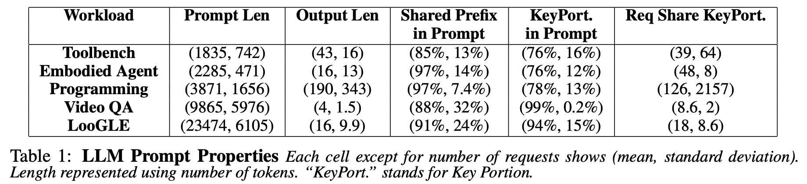

# Using Workload Generator


## Generate Synthetic Dataset 
### Generate Synthetic Prefix-sharing Dataset

We support generating synthetic prefix-sharing dataset with controlled prompt length (mean and standard deviation) and shared prompt percentages (mean and standard deviation). For example:

```shell
python synthetic-prompt-generator/synthetic-prefix-sharing-dataset.py --app-name programming --prompt-length 3871 --prompt-length-std 1656 --shared-proportion 0.97 --shared-proportion-std 0.074 --num-samples-per-prefix 200 --num-prefix 10 --randomize-order
```
This will generate a .jsonl file that contains collection of prompt to serve as input to the workload generator. 

The command above simulate a cache sharing scheme for programming workload described in [Preble](https://arxiv.org/pdf/2407.00023), as shown below:


You can also modify the argument to simulate a dataset that has a similar prompt sharing pattern as examples like Toolbench and Embodied Agent as described. 


### Generate Synthetic Multi-turn Conversation Dataset
We also support generating synthetic multi-turn conversation. Here you can control the prompt length (mean and standard deviation), number of turns (mean and standard deviation) and prompt length (mean and standard deviation). For example:

```shell
python synthetic-prompt-generator/multiturn-prefix-sharing-dataset.py --prompt-length-mean 100 --prompt-length-std 10 --num-turns-mean 10 --num-turns-std 1 --num-sessions-mean 10 --num-sessions-std 1
```
This will generate a .jsonl file that contains collection of sessioned prompts. to serve as input to the workload generator. The prompts within the same session will be played at the same order as appeared in the dataset. 


## Convert an existing dataset

We can also convert existing dataset to a sessioned prompt output like the following. For example, download ShareGPT dataset:

```shell
wget https://huggingface.co/datasets/anon8231489123/ShareGPT_Vicuna_unfiltered/resolve/main/ShareGPT_V3_unfiltered_cleaned_split.json -O /tmp/ShareGPT_V3_unfiltered_cleaned_split.json
```

... convert dataset like 

```shell
python sharegpt-converter.py --path /tmp/ShareGPT_V3_unfiltered_cleaned_split.json --tokenizer deepseek-ai/deepseek-llm-7b-chat

```
We will extend the converter to other dataset beyond ShareGPT. Stay tuned!