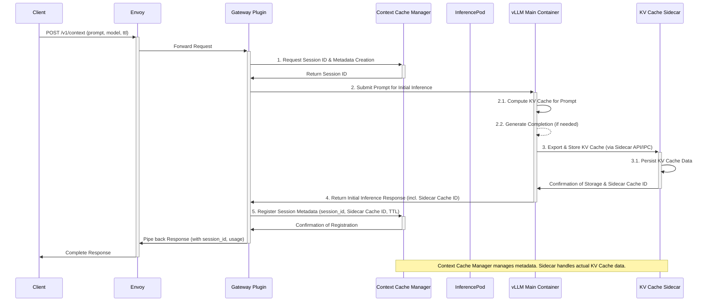
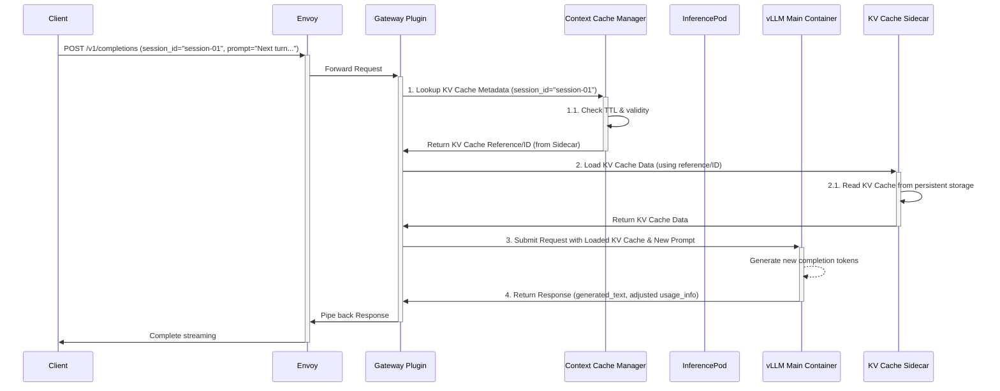

# EP: Support Context Cache for Improved Conversation Efficiency

## Background

In multi-turn or session-based Large Language Model (LLM) inference scenarios, the current practice involves sending the entire conversation history with each new query. This leads to redundant computation of past prompts' Key-Value (KV) Caches, resulting in significant performance bottlenecks and increased computational costs (especially for longer contexts). To address this, efficiently reusing and managing the KV Cache for conversational history becomes critical. Many leading LLM providers have already adopted context caching functionalities to mitigate these challenges.

## Goal

Based on the capabilities of the already implemented KV Cache Sidecar, this proposal aims to build and integrate an **optional** context caching feature for the Aibrix system. This feature will allow users to efficiently reuse the model inference's KV Cache via a session ID, thereby significantly reducing redundant computation overhead and optimizing overall performance and resource consumption in multi-turn or conversational LLM interactions.

## Implementation

### Request Flow

We will introduce a new endpoint: `/v1/context` to manage context caches. The following fields will be used:

  - `session_id`: A unique identifier for each context cache, created upon the first request and used in subsequent requests.
  - `ttl`: The time-to-live for the cache, after which it will be automatically cleared.

#### Creating a Cache for a Session



Before using context caching, users first need to create it. Here, we create a context cache with a `ttl` of one hour.

```shell
curl -X POST http://localhost:8000/v1/context \
  -H "Content-Type: application/json" \
  -H "Authorization: Bearer test-key-1234567890" \
  -d '{
     "model": "facebook-opt-125m",
     "prompt": "Say this is a test",
     "ttl": 3600,
   }'
```

In the response, we can obtain the unique identifier for the created session, `session_id`.

```json
{
  "id": "cmpl-de1f99972bd34149968489cb100b2c88",
  "object": "text_completion",
  "created": 1752594611,
  "model": "facebook-opt-125m",
  "session_id": "session-01"
  ...
  "usage": {
    "prompt_tokens": 6,
    "total_tokens": 93,
    "completion_tokens": 87,
    "prompt_tokens_details": null
  }
}
```

#### Using Context Cache with `session_id`

We can use the context cache by populating the obtained `session_id` into the request body.



```shell
curl -X POST http://localhost:8000/v1/completions \
  -H "Content-Type: application/json" \
  -H "Authorization: Bearer test-key-1234567890" \
  -d '{
     "session_id": "session-01"
     "model": "facebook-opt-125m",
     "prompt": "Say this is a test",
   }'
```

The expected effect is that when we use context caching, token consumption in multi-turn conversations will be reduced.

```json
{
  ...
  "usage": {
    "prompt_tokens": 1,
    "total_tokens": 50,
    "completion_tokens": 49,
    "prompt_tokens_details": null
  }
  ...
}
```

#### Clearing Context Cache

When the TTL expires, the cache will be cleared. Manual early clearing is also provided.

```shell
curl -X DELETE http://localhost:8000/v1/context/$session_id \
  -H "Content-Type: application/json" \
  -H "Authorization: Bearer test-key-1234567890" \
```

### Runtime Container Changes

In our context caching solution, the Runtime Container hosts the core **Context Cache Manager**. It is an independent logical unit whose primary responsibility is to act as the **registration center and lifecycle manager for context cache session metadata** within the entire system. Unlike the `KV Cache Sidecar` which directly handles KV Cache data, the `Context Cache Manager` is not responsible for the physical storage, serialization, or injection of KV Cache, but focuses solely on **logical-level management**.

#### Core Responsibilities:

##### Session Metadata Management:

  - **Registration and Mapping:** When a client first creates a context cache, the Context Cache Manager generates a unique `session_id` and associates it with a **unique reference (`kv_cache_sidecar_ref`)** returned by the KV Cache Sidecar, pointing to the actual KV Cache data. This mapping, along with model ID, TTL, and other information, is stored as session metadata.

  - **Query and Validation:** In subsequent requests, the Gateway Plugin queries the Context Cache Manager to obtain the `kv_cache_sidecar_ref` corresponding to a given `session_id`. The Manager will also validate the session's validity, including checking for expiration (TTL).

  - **Deregistration and Deletion:** When a user manually requests cache deletion, or when a cache needs to be cleared due to TTL expiration, the Context Cache Manager is responsible for removing the corresponding session metadata from its storage.

##### Lifecycle Management (TTL):

The Context Cache Manager stores the expiration time (`expires_at`) for each session. It will provide mechanisms (e.g., internal background tasks or external calls) to periodically check and clean up expired session metadata, ensuring timely release of cached resources.

##### System Coordination Layer:

The Context Cache Manager provides clear API interfaces (e.g., `register_session_cache`, `get_session_metadata`, `unregister_session_cache`) to the Gateway Plugin, enabling it to smoothly complete the creation, usage, and deletion processes for context caches. It **does not directly interact with the `vLLM Main Container` or the `KV Cache Sidecar` for data transfer**, but rather, through the passing of metadata, it guides the Gateway Plugin to coordinate with the KV Cache Sidecar for the loading and storage of KV Cache data.

```python
from typing import Union, Optional
from pydantic import BaseModel # Assuming pydantic for request/response models

class CreateContextCacheRequest(BaseModel):
    model: str
    prompt: str
    ttl: int = 3600 # seconds

class CreateCacheResponse(BaseModel):
    id: str # ID of the initial inference
    session_id: str
    model: str
    created: int
    usage: dict # Contains prompt_tokens, total_tokens, etc.

class DeleteCacheRequest(BaseModel):
    session_id: str

class DeleteCacheResponse(BaseModel):
    session_id: str
    status: str = "success"

class ErrorResponse(BaseModel):
    detail: str
```

```python
class CacheSessionMetadata(BaseModel):
    """Session metadata stored in the ContextCacheManager"""
    session_id: str
    model_id: str # The model this cache is for
    kv_cache_sidecar_ref: str # Reference/ID used by the KV Cache Sidecar to identify the actual KV cache data
    expires_at: int # Unix timestamp for TTL expiry

class ContextCacheManager:
    """
    Context Cache Manager, running in the Runtime Container.
    Main responsibilities:
    1. Manage context cache session metadata (session_id, TTL, KV Cache Sidecar reference).
    2. Provide API for Gateway Plugin to register, query, and delete session metadata.
    3. Handle TTL expiration checks and cleanup of sessions (potentially via background tasks).
    """

    def __init__(self):
        # In a production environment, Redis, a distributed key-value store, or a database would typically be used for metadata storage.
        self.session_metadata_store: dict[str, CacheSessionMetadata] = {}
        # Note: ContextCacheManager does not directly interact with KV Cache Sidecar for data.
        # It only stores the reference provided by the Sidecar. Actual data interaction with the Sidecar is coordinated by the Gateway Plugin.
        pass

    async def register_session_cache(
        self,
        request: CreateContextCacheRequest, # Metadata from the original create request
        initial_inference_response: CreateCacheResponse, # Response obtained from initial vLLM inference
        kv_cache_sidecar_ref: str # Unique reference to the internal KV Cache returned by the KV Cache Sidecar
    ) -> Union[ErrorResponse, CreateCacheResponse]:
        # Implementation details will go here.
        pass

    async def unregister_session_cache(
        self,
        session_id: str,
    ) -> Union[ErrorResponse, DeleteCacheResponse]:
        """
        Deletes the metadata for the specified context cache session.
        Note: This method only deletes metadata and **does not directly trigger** the KV Cache Sidecar to delete actual data.
        **Actual KV Cache data deletion should be coordinated by the Gateway Plugin, or handled by the Sidecar itself based on TTL periodic cleanup.**
        """
        # Implementation details will go here.
        pass

    async def get_session_metadata(
        self,
        session_id: str,
    ) -> Optional[CacheSessionMetadata]:
        """
        Retrieves cache metadata for the specified session.
        To be used by the Gateway Plugin in subsequent requests.
        Also performs TTL check.
        """
        # Implementation details will go here.
        pass
```
