# EP: Support Context Cache for Improved Conversation Efficiency

## Background

Many LLM providers (OpenAI, Anthropic) offer Prompt caching functionality, which reduces first token inference latency by caching prompts. We want to introduce similar functionality in our current system: Context Cache.
Context Cache will be integrated with existing KV Cache. From a higher level perspective, it can be viewed as a KV Cache Manager that operates during the prefill stage. When Context Cache is enabled, if the prompt received by the inference engine already exists in the current KV Cache, we can skip the computation phase and instead load them from cache (disk, remote storage) into GPU memory.

## Goal

Provide Prompt Caching-like functionality for the current system. This is optional for users, and the usage is as follows:

1. Users pass TTL (time-to-live) and the initial prompt to a specific endpoint to initialize the cache, and receive the corresponding response along with a unique identifier for the current session (session-id)
2. Users send OpenAI-compatible requests (chat/completion, response) with the unique identifier (session-id). When cache hits occur, the corresponding response time will be shorter than without using it.
3. The cache will be automatically deleted after the user-specified TTL, or users can proactively send requests to the endpoint to delete them early.

## Implementation

### Request Flow

We will introduce a new endpoint: `/v1/context` to manage context caches. The following fields will be used:

- `x-session-id`: A unique identifier for each context cache, created upon the first request and used in subsequent requests.
- `x-session-ttl`: The time-to-live for the cache, after which it will be automatically cleared.

Placing these two fields in the HTTP header ensures that all requests remain compatible with the OpenAI API

#### Creating a Cache for a Session


Before using context caching, users first need to create it. Here, we create a context cache with a `x-session-ttl` of one hour.

```shell
curl -X POST http://localhost:8000/v1/context \
  -H "Content-Type: application/json" \
  -H "Authorization: Bearer test-key-1234567890" \
  -H "x-session-ttl: 3600" \
  -d '{
     "model": "facebook-opt-125m",
     "prompt": "Say this is a test",
   }'
```

In the response, we can obtain the unique identifier for the created session `x-session-id` in HTTP header.

```
x-session-id: "session-01"
```

```json
{
  "id": "cmpl-de1f99972bd34149968489cb100b2c88",
  "object": "text_completion",
  "created": 1752594611,
  "model": "facebook-opt-125m",
  ...
  "usage": {
    "prompt_tokens": 6,
    "total_tokens": 93,
    "completion_tokens": 87,
    "prompt_tokens_details": null
  }
}
```

#### Using Context Cache with `x-session-id`

```mermaid
sequenceDiagram
    participant C as Client
    participant E as Envoy
    participant G as Gateway Plugin
    participant R as Context Cache Manager
    participant T as Router
    participant V as vLLM Engine
    participant S as Persistent KV Cache Store

    Note over C,S: Using existing session-id for inference request
    
    C->>+E: 1. POST /v1/completions<br/>(x-session-id, prompt, model...)
    E->>+G: 2. Forward Request
    G->>+R: 3. Look up cache corresponding to x-session-id
    R->>+T: 4. Make routing decision (based on routing algorithm)
    
    alt
        Note over R,S: ✅ Cache hit path: Use existing cache
        T->>R: 5a. Return inference engine pod metadata
        R->>+S: 6a. Load prompt caching from persistent cache<br/>to inference engine (pod)
        S-->>-V: 7a. Return prompt caching
        T->>+V: 8a. Inference request<br/>(inference engine will use prompt caching during prefill)
    else
        Note over T,V: ⚠️ Cache miss path: Execute full inference
        T->>+V: 5b. Inference request<br/>(inference engine will use entire prompt during prefill)
        Note over V,S: Generate new cache for subsequent use
        V->>S: 6b. Offload newly generated cache to KV Cache storage
    end
    
    Note over V: 🔄 Execute inference (Prefill + Decode)
    V-->>-T: 7. Return Output Tokens
    T->>-R: 8. Update mapping between session-id and prompt cache
    R-->>-G: 9. Return response
    G-->>-E: 10. Pipe back response<br/>(with x-session-id)
    E-->>-C: 11. Complete Response
```



```shell
curl -X POST http://localhost:8000/v1/completions \
  -H "Content-Type: application/json" \
  -H "Authorization: Bearer test-key-1234567890" \
  -H "x-session-id: session-01" \
  -d '{
      "model": "facebook-opt-125m",
      "prompt": "Say this is a test"
    }'
```

#### Clearing Context Cache

When the TTL expires, the cache will be cleared. Manual early clearing is also provided.

```shell
curl -X DELETE http://localhost:8000/v1/context/$session_id \
  -H "Content-Type: application/json" \
  -H "Authorization: Bearer test-key-1234567890" \
```

### Data Plane Change

#### Introduce new plugin: Context Cache Manager

We need to add a new plugin Context Cache Manager at the gateway layer, which is used to manage prompt caching across sessions. Traditional KV Cache in single inference sessions initializes attention states during prefill and applies them during the decode phase, then removes them from memory through eviction policies after inference completion. Context Cache Manager breaks through this limitation by pre-computing frequently reused prompt segments (such as system messages, document context, etc.) as prompt cache and persistently storing them within the specified TTL. When cache hits occur, the prefill phase transforms from recomputing attention states to loading pre-computed attention states from storage, achieving a conversion from compute-intensive to data-intensive operations, and reducing time-to-first-token latency.

#### Interaction between Context Cache Manager and existing components

Context Cache Manager (CCM) serves as the core coordination component, primarily interacting with the following components:

1. **Bidirectional interaction with Router**:
   - CCM sends routing decision requests to Router
   - Router selects target inference engine based on routing algorithm and returns pod metadata to CCM
   - When cache hits occur, CCM loads prompt caching into the GPU memory of the pod selected by Router

2. **Interaction with Persistent KV Cache Store**:
   - CCM manages cache lifecycle
   - Coordinates loading and offloading of cache between persistent storage and GPU memory
   - Maintains mapping relationships between session-id and cache data
