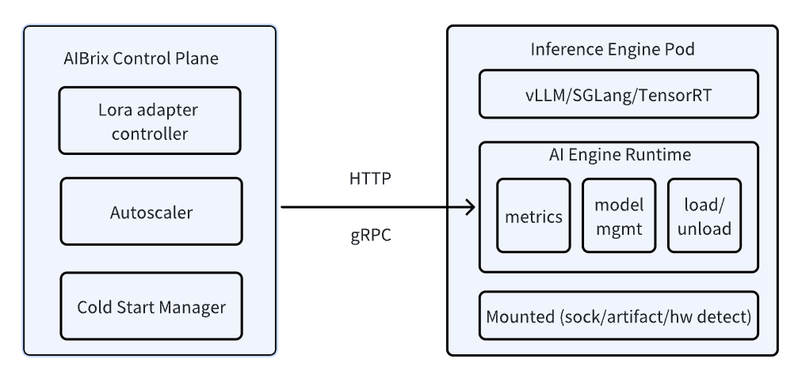

.. _aibrix_engine_runtime:

=====================
AIBrix Engine Runtime
=====================

AI Engine Runtime is a Unified Management Layer for Inference Containers. It is a versatile sidecar enabling metric standardization, model downloading, and local model management.
The AI Runtime hides various implementation details on the inference engine side, providing a universal method to guide model download and management, as well as expose inference monitoring metrics.

Currently, this component is mainly designed for the lora model deployment and multi-engine support. You do not necessarily need to install the runtime for most of the cases.
As we expand the support for more inference engines and enrich the features for cold start management etc, the runtime will be more useful.

Introduction
------------

AI Engine Runtime serves as an essential bridge between the AIBrix Control Plane and inference engine pods, enabling model management, engine configuration, observability, and vendor-agnostic engine support.

- **API for Control Plane Integration**: It ensures seamless communication between the control plane and inference pods. This allows components like the LoRA adapter controller, autoscaler, and cold start manager to interact dynamically with inference containers, managing resources in a cloud-native way.
- **Abstracting Vendor-Specific Inference Engines**: AI Engine Runtime is designed to work with diverse inference engines, including most popular ones. However, the engine api are all different. Instead of tightly coupling with any specific engine, AIRuntime abstracts key operations like model loading/unloading, adapter configuration, and performance monitoring, allowing new inference backends to be integrated with minimal friction.
- **Observability**: It provides a unified interface for monitoring across different inference engines, allowing for consistent performance tracking and troubleshooting.

.. attention::
    This runtime is different from Istio sidecar. Data plane traffic won't go through this runtime, it just provide some management capabilities for control plane interaction.

