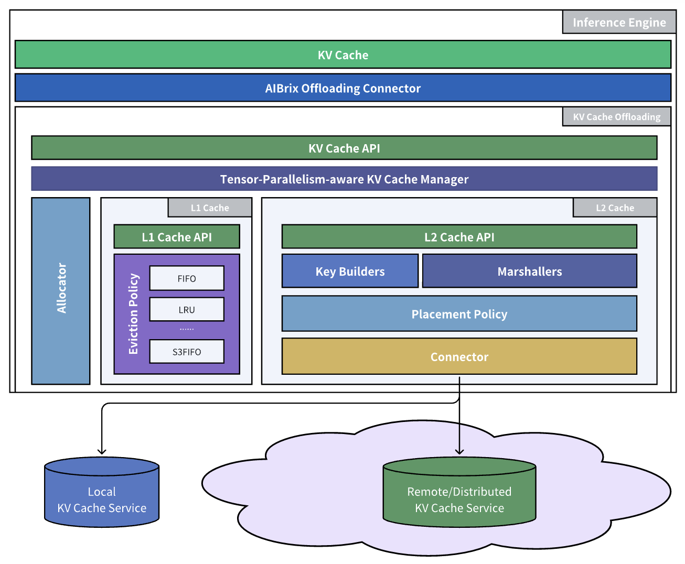
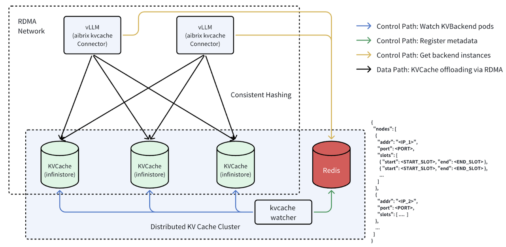

.. _aibrix_kvcache-offloading-framework:

===================================
AIBrix KVCache Offloading Framework
===================================

The rising demand for large language models has intensified the need for efficient memory management and caching to optimize inference performance and reduce costs. In multi-round use cases like chatbots and agent-based systems, overlapping token sequences lead to redundant computations during the prefill phase, wasting resources and limiting throughput.

Many inference engines, such as `vLLM <https://github.com/vllm-project/vllm>`_, use built-in KV caching to mitigate this issue, leveraging idle HBM and DRAM. However, single-node KV caches face key limitations: constrained memory capacity, engine-specific storage that prevents sharing across instances, and difficulty supporting scenarios like KV migration and prefill-decode disaggregation.

With AIBrix v0.3.0, we introduce a **production-ready KVCache Offloading Framework**, which enables efficient memory tiering and low-overhead cross-engine reuse. By default, the framework leverages **L1 DRAM-based caching**, which already provides significant performance improvements by offloading GPU memory pressure without incurring high latency. For scenarios requiring **multi-node sharing or larger-scale reuse**, AIBrix allows users to optionally enable **L2 remote caching**, unlocking the benefits of a distributed KV cache layer.

**Figure 1. AIBrix KVCache Offloading Framework**

As shown in Figure 1, on the data plane, it integrates tightly with inference engines (e.g., vLLM) via *AIBrix Offloading Connector*, which employs optimized CUDA kernels to significantly accelerate data movement between GPU and CPU. For memory scalability, its multi-tiered cache manager dynamically balances workloads across storage layers, alleviating GPU memory capacity limits while minimizing latency penalties. The framework supports pluggable eviction policies (e.g., LRU, `S3FIFO <https://blog.jasony.me/system/cache/2023/08/01/s3fifo>`_) and diverse backend storage options (e.g., `InfiniStore <https://github.com/bytedance/InfiniStore>`_), enabling selective KV cache offloading to reduce network and PCIe contention. Crucially, its cache placement module can coordinate with the centralized distributed KV cache cluster manager to maximize global KV cache utilization. This enables cross-engine KV reuse and ensures cluster-wide resource efficiency, transforming isolated KV cache instances into a scalable, shared KV cache infrastructure.

L1 Engine DRAM Cache Management
-------------------------------

The growing demands of modern models and increasing context lengths in LLM inference have led to KV caches consuming progressively more GPU memory, pushing against the hardware limits of even the most advanced GPUs. Recent systems like `Dynamo <https://github.com/ai-dynamo/dynamo>`_, `LMCache <https://github.com/LMCache/LMCache>`_, and `MoonCake <https://github.com/kvcache-ai/Mooncake>`_ have developed solutions that offload KV cache to external memory hierarchies, spanning from CPU memory to SSDs. :ref:`kvcache-offloading` supports the offloading of KV cache to CPU memory as well by only enabling its DRAM-backed ``L1Cache``. While this approach does not enable KV cache sharing across multiple engines, it eliminates the complexity of distributed KV cache setup and configuration. More importantly, by leveraging the significantly larger capacity of CPU memory, this method delivers substantial performance gains —- making it an ideal solution for use cases that prioritize scalable KV cache capacity over cross-engine KV reuse.

L2 Distributed KVCache and Cross-Engine KV Reuse
------------------------------------------------

The growing demand for large language models has significantly increased the need for expansive KV cache capacity. While CPU memory offloading effectively addresses moderate scaling needs, production environments handling massive-scale, dynamic workloads require even greater scalability -- particularly when memory needs exceed single-node capacities. To address this, AIBrix enables distributed KV cache services as its ``L2Cache`` backends, which can scale horizontally across multiple nodes to meet capacity demands.

In the meantime, as LLM deployments scale across multiple engines in the cluster, the redundancy of KV caches across engines introduces substantial inefficiencies. Repeated computations of common prompt prefixes waste GPU cycles and HBM bandwidth. AIBrix solves this challenge by enabling efficient **cross-engine KV reuse** through a high-performance, shared distributed KV cache, optimizing resource utilization at scale.

Adding New KVCache Backends
---------------------------

New KVCache backends can be easily added by implementing the ``Connector`` interface:

.. code-block:: python
  :linenos:

  @dataclass
  class ConnectorFeature:
      """The features of the kv cache connector.
      Args:
          mput_mget: Whether the kv cache connector supports mput/mget
          prefetch: Whether the kv cache connector supports prefetch.
          rdma: Whether the kv cache connector supports RDMA.
          gdr_put: Whether the kv cache connector supports GDR put.
          gdr_get: Whether the kv cache connector supports GDR get.
      """
 
      mput_mget: bool = False
      prefetch: bool = False
      rdma: bool = False
      gdr_put: bool = False
      gdr_get: bool = False

  @dataclass
  class ConnectorConfig:
      """The config of the kv cache connector."""
 
      backend_name: str
      namespace: str
      partition_id: str
      executor: Executor
      block_spec_signature: str = ""
      key_builder_signature: str = ""
      layout_signature: str = ""
  
  
  @dataclass
  class ConnectorRegisterDescriptor:
      """The register descriptor"""
  
      pass
  
  
  class Connector(Generic[K, V]):
      """Connector interface."""
  
      @classmethod
      @abstractmethod
      def from_envs(cls, conn_id: str, executor: Executor, **kwargs):
          """Create a connector from environment variables."""
          raise NotImplementedError

      @property
      @abstractmethod
      def name(self) -> str:
          raise NotImplementedError

      @property
      @abstractmethod
      def feature(self) -> ConnectorFeature:
          """Get the feature of the connector.
          Returns:
              The feature of the kv cache service.
          """
          raise NotImplementedError

      @abstractmethod
      def open(self) -> Status:
          """Open a connection."""
          raise NotImplementedError

      @abstractmethod
      def close(self) -> Status:
          """Close a connection."""
          raise NotImplementedError

      async def prefetch(self, keys: Sequence[K]) -> None:
          """Prefetch a list of keys.
          Args:
              keys: The keys of the kv tensors.
          """
          pass

      @abstractmethod
      async def exists(self, key: K) -> Status:
          """Check if key is in the store."""
          raise NotImplementedError

      @abstractmethod
      async def get(
          self, key: K, mr: MemoryRegion | Sequence[MemoryRegion]
      ) -> Status:
          """Get a value.
          Args:
              key: The key of the kv tensor.
              mr: The memory region or MR list to place the fetched kv
                  tensor. It is an MR list only if using GDR.
          Returns:
              The status of the get operation.
          """
          raise NotImplementedError

      @abstractmethod
      async def put(
          self, key: K, mr: MemoryRegion | Sequence[MemoryRegion]
      ) -> Status:
          """Put a key value pair.
          Args:
              key: The key of the kv cache.
              mr: The memory region or MR list holding the kv tensors. It is an
                  MR list only if using GDR.
          Returns:
              The status of the put operation.
          """
          raise NotImplementedError

      def register_slabs(self, slabs: List[torch.Tensor]) -> Status:
          """Register slabs with backend-specific register function.
          Args:
              slabs: slabs to be registered.
          Returns:
              Status of the register operation.
          """
          raise NotImplementedError

      def get_batches(
          self,
          keys: Sequence[Any],
          mrs: Sequence[MemoryRegion | Sequence[MemoryRegion]],
          batch_size: int,
      ) -> Sequence[Sequence[Tuple[K, MemoryRegion | Sequence[MemoryRegion]]]]:
          """Get a list of key MR batches that is used for mput and mget
          operations.

          Args:
              keys: The keys of the kv tensors.
              mrs: Memory regions or lists of MRs holding the kv tensors.
              batch_size: The maximum number of key MR pairs in a batch.
          Returns:
              List of key MR/MR List batches.
          """
          raise NotImplementedError

      async def mget(
          self,
          keys: Sequence[K],
          mrs: Sequence[MemoryRegion | Sequence[MemoryRegion]],
      ) -> Sequence[Status]:
          """MGet a list of values. This function is optional and only connectors
          have mput_mget feature enabled can implement this function.
          Args:
              keys: The keys of the kv tensors.
              mrs: Memory regions or lists of MRs to hold the fetched kv
                   tensors. It is an MR list only if using GDR.
          Returns:
              List of statuses.
          """
          raise NotImplementedError

      async def mput(
          self,
          keys: Sequence[K],
          mrs: Sequence[MemoryRegion | Sequence[MemoryRegion]],
      ) -> Sequence[Status]:
          """MPut a list of key value pairs. This function is optional and only
          connectors have mput_mget feature enabled can implement this function.
          Args:
              keys: The keys of the kv tensors.
              mrs: Memory regions or lists of MRs holding the kv tensors. It is
                   an MR list only if using GDR.
          Returns:
              List of statuses.
          """
          raise NotImplementedError

      @abstractmethod
      async def delete(self, key: K) -> Status:
          """Delete a key.
          Args:
              key: The key of the kv cache.
          Returns:
              The status of the delete operation.
          """
          raise NotImplementedError

Please refer to the `existing connectors <https://github.com/vllm-project/aibrix/tree/main/python/aibrix_kvcache/aibrix_kvcache/l2/connectors>`_ for more details.

Environment Variables Reference
-------------------------------

This section describes all available environment variables for AIBrix KVCache Offloading Framework.

Core Configuration
^^^^^^^^^^^^^^^^^^

.. list-table::
   :header-rows: 1
   :widths: 30 10 60

   * - Variable
     - Default
     - Description
   * - AIBRIX_KV_CACHE_OL_CHUNK_SIZE
     - "512"
     - Chunk size for operations.
   * - AIBRIX_KV_CACHE_OL_BLOCK_SIZE
     - "-1"
     - Number of tokens in a kvcache block (the finest IO granularity). Defaults to -1, which means to use engine's block size.
   * - AIBRIX_KV_CACHE_OL_MAX_SEQ_LEN
     - "-1"
     - Maximum sequence length. Defaults to -1, which means no limit. If set, tokens beyond this length will be ignored.
   * - AIBRIX_KV_CACHE_OL_TIME_MEASUREMENT_ENABLED
     - "1"
     - Enable time measurement.
   * - AIBRIX_KV_CACHE_OL_BREAKDOWN_MEASUREMENT_ENABLED
     - "1"
     - Enable breakdown measurement.
   * - AIBRIX_KV_CACHE_OL_DOUBLE_GET_THRESHOLD
     - "4,0.1"
     - Controls when to issue a second get request to L2 cache. First value is minimum missing blocks, second is ratio threshold.
   * - AIBRIX_KV_CACHE_OL_TOKEN_VALIDATION_ENABLED
     - "0"
     - Whether to validate tokens in L2 cache. Disabling uses tighter memory layout.
   * - AIBRIX_KV_CACHE_OL_TRANSPORT_RDMA_ADDR_RANGE
     - "::/0"
     - Valid GID range (CIDR format). Similar to NVSHMEM_IB_ADDR_RANGE for NVSHMEM.
   * - AIBRIX_KV_CACHE_OL_PROFILING_ENABLED
     - "0"
     - Enable profiling.
   * - AIBRIX_KV_CACHE_OL_PROFILING_SERVER_ADDRESS
     - "http://0.0.0.0:4040"
     - Profiling server address. Profiling server is responsible for collecting profiling data and displaying it in a web UI.

L1 Cache Configuration
^^^^^^^^^^^^^^^^^^^^^^

.. list-table::
   :header-rows: 1
   :widths: 30 10 60

   * - Variable
     - Default
     - Description
   * - AIBRIX_KV_CACHE_OL_L1_CACHE_ENABLED
     - "1"
     - Enable L1 cache.
   * - AIBRIX_KV_CACHE_OL_L1_CACHE_EVICTION_POLICY
     - "S3FIFO"
     - Eviction policy for L1 cache ("S3FIFO", "LRU", or "FIFO")
   * - AIBRIX_KV_CACHE_OL_L1_CACHE_CAPACITY_GB
     - "10"
     - L1 cache capacity in GB.
   * - AIBRIX_KV_CACHE_OL_DEVICE
     - "cpu"
     - Device to use for cache operations ("cpu" or "cuda")
   * - AIBRIX_KV_CACHE_OL_S3FIFO_SMALL_TO_MAIN_PROMO_THRESHOLD
     - "1"
     - S3FIFO eviction policy: promotion threshold from small to main queue.
   * - AIBRIX_KV_CACHE_OL_S3FIFO_SMALL_FIFO_CAPACITY_RATIO
     - 0.3
     - S3FIFO eviction policy: capacity ratio for small FIFO.

L2 Cache Configuration
^^^^^^^^^^^^^^^^^^^^^^

.. list-table::
   :header-rows: 1
   :widths: 30 10 60

   * - Variable
     - Default
     - Description
   * - AIBRIX_KV_CACHE_OL_L2_CACHE_BACKEND
     - ""
     - Backend for L2 cache.
   * - AIBRIX_KV_CACHE_OL_L2_CACHE_NAMESPACE
     - "aibrix"
     - Namespace for L2 cache.
   * - AIBRIX_KV_CACHE_OL_L2_CACHE_OP_BATCH
     - "32"
     - Operation batch size.
   * - AIBRIX_KV_CACHE_OL_L2_CACHE_PER_TOKEN_TIMEOUT_MS
     - "20"
     - Per-token timeout in milliseconds.
   * - AIBRIX_KV_CACHE_OL_L2_CACHE_KEY_BUILDER
     - "ROLLING_HASH"
     - Key builder for L2 cache ("RAW", "ROLLING_HASH", or "SIMPLE_HASH")
   * - AIBRIX_KV_CACHE_OL_L2_CACHE_INGESTION_TYPE
     - "HOT"
     - Ingestion type ("ALL", "HOT", or "EVICTED").
   * - AIBRIX_KV_CACHE_OL_L2_CACHE_INGESTION_MAX_INFLIGHT_TOKENS
     - "0"
     - Max inflight writes (0 for synchronous).
   * - AIBRIX_KV_CACHE_OL_L2_CACHE_NUM_ASYNC_WORKERS
     - "8"
     - Number of async workers.
   * - AIBRIX_KV_CACHE_OL_L2_CACHE_PLACEMENT_POLICY
     - "SIMPLE"
     - Placement policy (only applicable if using meta service).

Meta Service Configuration
^^^^^^^^^^^^^^^^^^^^^^^^^^

.. list-table::
   :header-rows: 1
   :widths: 30 10 60

   * - Variable
     - Default
     - Description
   * - AIBRIX_KV_CACHE_OL_META_SERVICE_BACKEND
     - ""
     - Backend for meta service. If meta service backend is not set, L2 cache backend will use direct mode to access the given cache server. Otherwise, we will get membership information from meta service and construct the L2 cache cluster.
   * - AIBRIX_KV_CACHE_OL_META_SERVICE_REFRESH_INTERVAL_S
     - "30"
     - Refresh interval in seconds.
   * - AIBRIX_KV_CACHE_OL_META_SERVICE_URL
     - ""
     - URL for meta service.
   * - AIBRIX_KV_CACHE_OL_META_SERVICE_CLUSTER_META_KEY
     - ""
     - Cluster meta key.

Connector Configurations
^^^^^^^^^^^^^^^^^^^^^^^^

InfiniStore Connector Configuration
"""""""""""""""""""""""""""""""""""

.. list-table::
   :header-rows: 1
   :widths: 30 10 60

   * - Variable
     - Default
     - Description
   * - AIBRIX_KV_CACHE_OL_INFINISTORE_HOST_ADDR
     - "127.0.0.1"
     - Host address.
   * - AIBRIX_KV_CACHE_OL_INFINISTORE_SERVICE_PORT
     - "12345"
     - Service port.
   * - AIBRIX_KV_CACHE_OL_INFINISTORE_CONNECTION_TYPE
     - "RDMA"
     - Connection type.
   * - AIBRIX_KV_CACHE_OL_INFINISTORE_IB_PORT
     - "1"
     - IB port.
   * - AIBRIX_KV_CACHE_OL_INFINISTORE_LINK_TYPE
     - "Ethernet"
     - Link type.
   * - AIBRIX_KV_CACHE_OL_INFINISTORE_VISIBLE_DEV_LIST
     - ""
     - Visible device list. Since 0.2.42, InfiniStore supports RDMA GID index in client config, users can specify the GID index of each device in this format: "mlx5_0:gid0,mlx5_1:gid1,mlx5_2:gid2"

HPKV Connector Configuration
""""""""""""""""""""""""""""

.. list-table::
   :header-rows: 1
   :widths: 30 10 60

   * - Variable
     - Default
     - Description
   * - AIBRIX_KV_CACHE_OL_HPKV_REMOTE_ADDR
     - "127.0.0.1"
     - Remote address.
   * - AIBRIX_KV_CACHE_OL_HPKV_REMOTE_PORT
     - "12346"
     - Remote port.
   * - AIBRIX_KV_CACHE_OL_HPKV_LOCAL_ADDR
     - "127.0.0.1"
     - Local address.
   * - AIBRIX_KV_CACHE_OL_HPKV_LOCAL_PORT
     - "12345"
     - Local port.

Pris Connector Configuration
""""""""""""""""""""""""""""

.. list-table::
   :header-rows: 1
   :widths: 30 10 60

   * - Variable
     - Default
     - Description
   * - AIBRIX_KV_CACHE_OL_PRIS_REMOTE_ADDR
     - "127.0.0.1"
     - Remote address.
   * - AIBRIX_KV_CACHE_OL_PRIS_REMOTE_PORT
     - "6379"
     - Remote port.
   * - AIBRIX_KV_CACHE_OL_PRIS_USE_MPUT_MGET
     - "0"
     - Enable MPUT/MGET.
   * - AIBRIX_KV_CACHE_OL_PRIS_PASSWORD
     - ""
     - Password.

EIC Connector Configuration
""""""""""""""""""""""""""""

.. list-table::
   :header-rows: 1
   :widths: 30 10 60

   * - Variable
     - Default
     - Description
   * - AIBRIX_KV_CACHE_OL_EIC_CONFIG_FILE
     - ""
     - EIC config file.

Mock Connector Configuration
""""""""""""""""""""""""""""

Mock connector is used for testing and profiling purposes.

.. list-table::
   :header-rows: 1
   :widths: 30 10 60

   * - Variable
     - Default
     - Description
   * - AIBRIX_KV_CACHE_OL_MOCK_USE_RDMA
     - "0"
     - Use RDMA in mock connector.
   * - AIBRIX_KV_CACHE_OL_MOCK_USE_MPUT_MGET
     - "0"
     - Use MPUT/MGET in mock connector.
   * - AIBRIX_KV_CACHE_OL_MOCK_USE_NOOP
     - "0"
     - Use NOOP for all operations. Useful for profiling the framework overhead.

RocksDB Connector Configuration
"""""""""""""""""""""""""""""""

RocksDB connector is used for testing purposes.

.. list-table::
   :header-rows: 1
   :widths: 30 10 60

   * - Variable
     - Default
     - Description
   * - AIBRIX_KV_CACHE_OL_ROCKSDB_ROOT
     - "~/.kv_cache_ol/rocksdb"
     - Root directory for RocksDB.
   * - AIBRIX_KV_CACHE_OL_ROCKSDB_TTL_S
     - "600"
     - TTL in seconds.
   * - AIBRIX_KV_CACHE_OL_ROCKSDB_WRITE_BUFFER_SIZE
     - "67108864"
     - Write buffer size. Default 64MB.
   * - AIBRIX_KV_CACHE_OL_ROCKSDB_TARGET_FILE_SIZE_BASE
     - "67108864"
     - Target file size base. Default 64MB.
   * - AIBRIX_KV_CACHE_OL_ROCKSDB_MAX_WRITE_BUFFER_NUMBER
     - "3"
     - Max write buffers.
   * - AIBRIX_KV_CACHE_OL_ROCKSDB_MAX_TOTAL_WAL_SIZE
     - "134217728"
     - Max total WAL size. Default 128MB.
   * - AIBRIX_KV_CACHE_OL_ROCKSDB_MAX_BACKGROUND_JOBS
     - "8"
     - Max background jobs.
