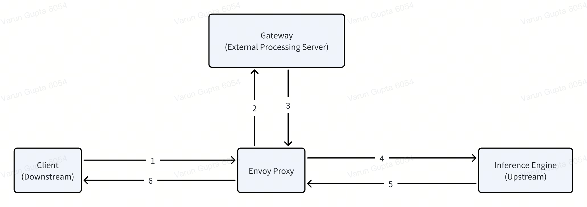

.. _aibrix_router:

=============
AIBrix Router
=============

The AIBrix Router is a pluggable, intelligent traffic management component embedded in the AIBrix LLM serving stack. It is designed as an Envoy Gateway extension via external processing hooks, serving as the single entry point for all LLM inference requests.

This gateway abstracts away the underlying complexity of managing multiple models, LoRA adapters, heterogeneous GPU backends, and diverse scaling strategies.

Detailed Sequence Flow
----------------------

.. mermaid::

    sequenceDiagram
        participant Client
        participant Envoy
        participant GatewayPlugin
        participant Router
        participant Cache
        participant InferencePod

        Client->>Envoy: POST /v1/chat/completions
        Envoy->>GatewayPlugin: External Processing Hook
        GatewayPlugin->>Router: Make routing decision
        Router->>Cache: Query pod metrics & KV state
        Cache-->>Router: Return latest metrics
        Router->>Router: Apply routing algorithm
        Router->>InferencePod: Forward request to selected pod
        InferencePod-->>Router: Return streamed tokens
        Router-->>GatewayPlugin: Return response
        GatewayPlugin-->>Envoy: Pipe back response
        Envoy-->>Client: Complete streaming

Supported Routing Strategies
----------------------------

AIBrix ships with a set of built-in algorithms, each optimized for different workload patterns:

* ``random``: routes request to a random pod.
* ``least-request``: routes request to a pod with the fewest ongoing requests.
* ``throughput``: routes request to a pod which has processed the lowest total weighted tokens.
* ``prefix-cache``: routes request to a pod which already has a KV cache matching the request's prompt prefix, includes load balancing and multiturn conversation.
* ``least-busy-time``: routes request to the pod with the least cumulative busy processing time.
* ``least-kv-cache``: routes request to the pod with the smallest current KV cache size (least VRAM used).
* ``least-latency``: routes request to the pod with the lowest average processing latency.
* ``prefix-cache-preble``: routes request considering both prefix cache hits and pod load, implementation is based of Preble: Efficient Distributed Prompt Scheduling for LLM Serving: https://arxiv.org/abs/2407.00023.
* ``vtc-basic``: routes request using a hybrid score balancing fairness (user token count) and pod utilization. It is a simple variant of Virtual Token Counter (VTC) algorithm.  See more details at https://github.com/Ying1123/VTC-artifact

Core Principle
--------------

By maintaining a high-frequency local cache of metrics (via periodic pulls and subscriptions), the router can apply sophisticated multi-objective routing logic without blocking on live queries to pods. This ensures low overhead on the hot path, allowing scaling to thousands of QPS.

How to extend routing algorithms
--------------------------------

The routing framework is designed to be highly pluggable, typically following this structure:

.. code-block:: golang

    type RoutingStrategy interface {
        // Compute scores for all candidate pods and select the best
        Route(request *RequestContext, pods []PodMetrics) (*SelectedPod, error)
    }

To add a new algorithm:

- Implement the `RoutingStrategy` interface (in Go, Python or WASM depending on plugin mode).
- Register the strategy name via the router’s registry.
- Specify it via HTTP header `routing-strategy: your-strategy` or through policy config.
