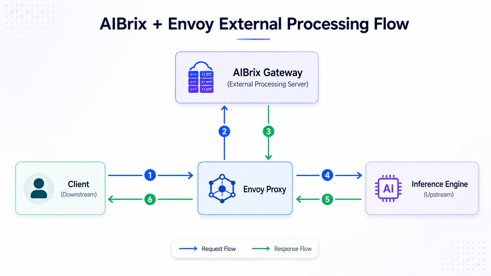

.. _aibrix_router:

=============
AIBrix Router
=============

Overview
--------

The AIBrix Router is a pluggable, intelligent traffic management component embedded in the AIBrix LLM serving stack. It is designed as an Envoy Gateway extension via external processing hooks, serving as the single entry point for all LLM inference requests.

This gateway abstracts away the underlying complexity of managing multiple models, LoRA adapters, heterogeneous GPU backends, and diverse scaling strategies.

Core Principle
--------------

The router maintains a high-frequency local cache of pod metrics via periodic pulls and subscriptions. This allows it to apply sophisticated multi-objective routing logic without blocking on live queries to pods, keeping latency low on the hot path and enabling scaling to thousands of QPS.

The active routing strategy can be set per-request via the ``routing-strategy`` HTTP header, or globally via the ``ROUTING_ALGORITHM`` environment variable, or through a model config profile annotation.

Detailed Sequence Flow
----------------------

.. code-block:: text

    Client
      │
      │  POST /v1/chat/completions
      ▼
    Envoy
      │
      │  External Processing Hook
      ▼
    GatewayPlugin
      │
      │  Make routing decision
      ▼
    Router ──────────────────▶ Cache
      │      Query pod metrics    │
      │      & KV state           │
      │ ◀─────────────────────────┘
      │      Return latest metrics
      │
      │  Apply routing algorithm
      │
      │  Forward request to selected pod
      ▼
    InferencePod
      │
      │  Return streamed tokens
      ▼
    GatewayPlugin ──▶ Envoy ──▶ Client

Supported Routing Strategies
----------------------------

AIBrix ships with a set of built-in algorithms, each optimized for different workload patterns.

**General load balancing**

* ``random``: routes to a randomly selected pod. Useful as a baseline or when pods are homogeneous and load is uniform.
* ``least-request``: routes to the pod with the fewest in-flight requests.
* ``least-busy-time``: routes to the pod with the least cumulative busy processing time.
* ``least-latency``: routes to the pod with the lowest average processing latency.
* ``least-kv-cache``: routes to the pod with the smallest current KV cache occupancy (least VRAM used).
* ``least-gpu-cache``: routes to the pod with the lowest GPU cache utilization.
* ``least-utilization``: routes to the pod with the lowest overall utilization score.
* ``throughput``: routes to the pod that has processed the fewest total weighted tokens, favoring underloaded pods.
* ``power-of-two``: applies the power-of-two choices algorithm — samples two pods and selects the better one.

**KV-cache aware**

* ``prefix-cache``: routes to a pod that already has a KV cache matching the request's prompt prefix, with integrated load balancing and multi-turn conversation support.
* ``prefix-cache-preble``: routes considering both prefix cache hits and pod load. Based on `Preble: Efficient Distributed Prompt Scheduling for LLM Serving <https://arxiv.org/abs/2407.00023>`_.

**Fairness**

* ``vtc-basic``: routes using a hybrid score that balances per-user token fairness and pod utilization. A simplified variant of the Virtual Token Counter (VTC) algorithm. See `VTC-artifact <https://github.com/Ying1123/VTC-artifact>`_ for background.

**SLO-aware**

* ``slo``: routes with awareness of per-request service-level objectives.
* ``slo-pack-load``: SLO-aware routing that packs load onto fewer pods to improve efficiency.
* ``slo-least-load``: SLO-aware routing that spreads load to the least loaded pod.
* ``slo-least-load-pulling``: variant of ``slo-least-load`` that pulls metrics directly rather than relying on the cached snapshot.

**Specialized**

* ``pd``: prefill-decode disaggregation routing. Splits processing between dedicated prefill pods and decode pods for optimized end-to-end latency.
* ``session-affinity``: sticky session routing. Encodes the target pod's address (``IP:Port``) as a base64 value in the ``x-session-id`` response header. Subsequent requests carrying that header are routed to the same pod. Falls back to a random ready pod and issues a new session ID if the original pod is unavailable.

How to Extend Routing Algorithms
---------------------------------

The routing framework is designed to be highly pluggable. All routing logic is expressed through the ``Router`` interface:

.. code-block:: golang

    // Router defines the interface for routing logic to select target pods.
    type Router interface {
        // Route selects a target pod from the provided list of pods.
        // The input pods is guaranteed to be non-empty and contain only routable pods.
        Route(ctx *RoutingContext, readyPodList PodList) (string, error)
    }

**Parameters**

- ``ctx *RoutingContext``: Per-request context carrying routing inputs. Key fields include:

  - ``Algorithm`` — the active routing strategy name.
  - ``Model`` — the model name extracted from the request body.
  - ``Message`` — the raw prompt text (available for token-level decisions).
  - ``User`` — the optional user identifier (used by fairness-based algorithms).
  - ``ReqHeaders`` — a copy of the incoming HTTP request headers.
  - ``ConfigProfile`` — resolved model config profile (strategy override, RPS limit, etc.), or ``nil`` if not set.

- ``readyPodList PodList``: Pre-filtered list of pods that are healthy and eligible for routing. Guaranteed non-empty.

**Return value**

The IP address of the selected pod (e.g. ``"10.0.0.5:8080"``), or a non-nil error if selection fails.

**Steps to add a new algorithm**

1. Implement the ``Router`` interface in a new ``*.go`` file under ``pkg/plugins/gateway/algorithms/``.
2. Declare a typed constant for the strategy name:

   .. code-block:: golang

       const RouterMyStrategy types.RoutingAlgorithm = "my-strategy"

3. Register the constructor in an ``init()`` function so it is picked up at startup:

   .. code-block:: golang

       func init() {
           Register(RouterMyStrategy, NewMyStrategyRouter)
       }

4. Specify it per-request via the ``routing-strategy`` HTTP header, or set ``ROUTING_ALGORITHM=my-strategy`` to use it as the default.

Additional router interfaces in ``pkg/types/router.go`` support optional capabilities:

- ``QueueRouter`` — for routers that maintain an internal queue and expose queue length.
- ``FallbackRouter`` — enables chaining by delegating to a secondary router when the primary cannot make a decision.
