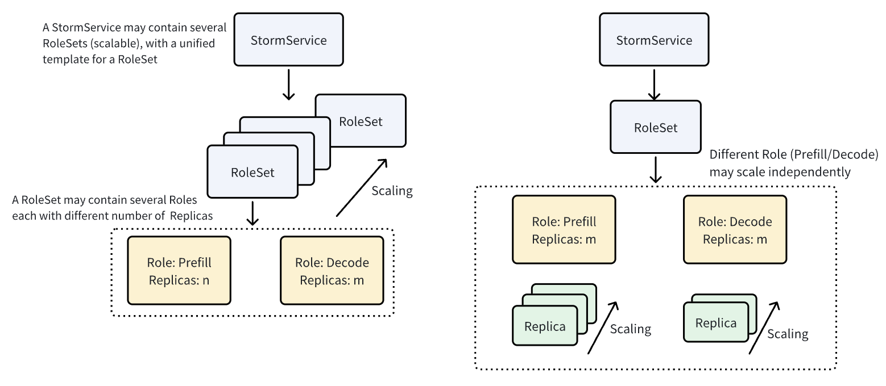

.. _aibrix-stormservice:

=====================
AIBrix StormService
=====================

**StormService** is a specialized component designed to manage and orchestrate the lifecycle of inference containers in Prefill/Decode disaggregated architectures.

Three-layer Architecture
------------------------

StormService is implemented using several Custom Resource Definitions (CRDs) following a three-layer architecture. An illustration of this architecture is shown below:

- **StormService**: This is the top-level CRD that wraps the entire service. It defines the specification of a service unit and tracks its status, including the number of replicas (i.e., RoleSet), a unified template for RoleSets, update strategy, and other configurations. Detailed definition could be found in `stormservice_types.go` file.

- **RoleSet**: A RoleSet represents a collection of roles, where each role can serve a specific function (e.g., Prefill or Decode). For more information, see the `roleset_types.go` file.

- **Pods**: Each role within a RoleSet contains multiple Pods, which are the actual containers executing the inference tasks.

.. note::
   Pooled mode (independent scaling of each role) is not yet supported. See Issue `#1260 <https://github.com/vllm-project/aibrix/issues/1260>`_.

Following this layered design, updates to the spec propagate from the StormService to its RoleSets, and then to the individual roles. The reconciler at the StormService level synchronizes the status of RoleSets with the StormService spec (primarily the `Replicas` field), while the reconciler at the RoleSet level synchronizes the status of individual roles with the RoleSet spec.

StormService supports two operational modes at its level: **Rolling Update** and **Inplace Update**. At the RoleSet level, three update modes are supported: **Parallel**, **Sequential**, and **Interleaved**. These are explained in detail below.

Update Strategy
----------------------
StormService supports multiple strategies to update the managed RoleSets:

- **Rolling Update**: Designed for replica mode. This type of update is triggered by intentionally breaking the condition `roleSet count == spec.Replicas`. The reconciler will first delete outdated RoleSets with the previous revision (limited by the `MaxUnavailable` setting), then create new RoleSets with the updated revision. See `StormServiceReconciler.rollingUpdate()`.

- **Inplace Update**: Designed for pooled mode. Instead of deleting and creating RoleSets, this strategy propagates changes from the StormService to all associated RoleSets directly, without deleting and creating new RoleSets. The reconciler at RoleSet level will then sync its status according to the updated spec.

Rolling Strategy
----------------------
- **Sequential**: Roles are updated one at a time, in sequence.

- **Parallel**: All roles are updated simultaneously.

- **Interleaved**: Roles are updated in an interleaved manner.  This strategy partitions the update process for every Role into distinct steps. Each update step is coordinated across all roles to progress synchronously. In each operational cycle, the controller determines a global progress state based on the least-advanced role. It instructs roles that have not reached the current step to proceed with their updates, while skipping those that have.

Stateful vs Stateless
----------------------

This is determined by the `Stateful` field in both StormService and RoleSet specs. It defines whether the RoleSet uses a `StatefulRoleSyncer` or a `StatelessRoleSyncer` and thus leading to different behaviours.

- **Stateful**: `StatefulRoleSyncer` treats each Pod as a unique, non-interchangeable entity, assigning a stable and unique index to each Pod. There are exactly *n* slots for *n* replicas, and updates are performed slot-by-slot in a controlled manner.

- **Stateless**: `StatelessRoleSyncer` treats all Pods as identical replicas. Any Pod can be replaced without affecting the overall application. Pods are managed as a collective pool, and scaling actions simply add or randomly remove Pods. Updates are performed at the pool level rather than targeting specific Pods.
