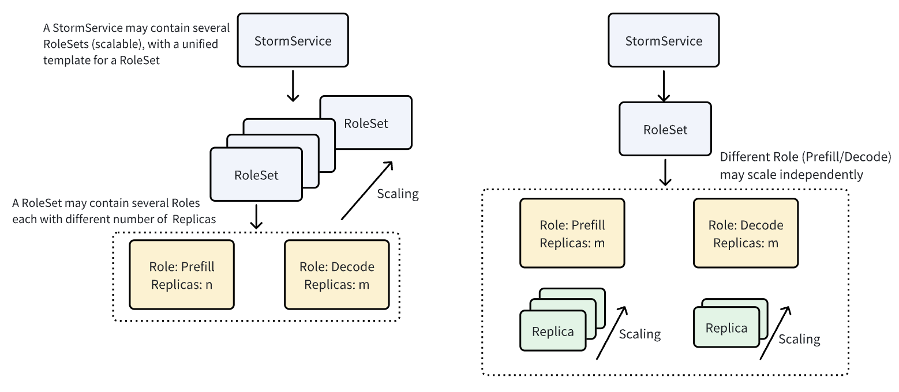

.. _aibrix-stormservice:

===================
AIBrix StormService
===================

**StormService** is a specialized component designed to manage and orchestrate the lifecycle of inference containers in Prefill/Decode disaggregated architectures. Additionally, it can be utilized to oversee various deployment modes, such as Tensor Parallelism (TP), Pipeline Parallelism (PP), and even single GPU model deployments.

Three-layer Architecture
------------------------

StormService is implemented using several Custom Resource Definitions (CRDs) following a three-layer architecture. An illustration of this architecture is shown below:

- **StormService**: This is the top-level CRD that wraps the entire service. It defines the specification of a service unit and tracks its status, including the number of replicas (i.e., RoleSet), a unified template for RoleSets, update strategy, and other configurations. For the detailed definition, see the `stormservice_types.go`_ file.

.. _stormservice_types.go: https://github.com/vllm-project/aibrix/tree/main/api/orchestration/v1alpha1/stormservice_types.go

- **RoleSet**: A RoleSet represents a collection of roles, where each role can serve a specific function (e.g., Prefill or Decode). For more information, see the `roleset_types.go`_ file.

.. _roleset_types.go: https://github.com/vllm-project/aibrix/tree/main/api/orchestration/v1alpha1/roleset_types.go

- **Pods**: Each role within a RoleSet contains multiple Pods, which are the actual containers executing the inference tasks.

Following this layered design, updates to the spec propagate from the StormService to its RoleSets, and then to the individual roles. The reconciler at the StormService level synchronizes the status of RoleSets with the StormService spec (primarily the `Replicas` field), while the reconciler at the RoleSet level synchronizes the status of individual roles with the RoleSet spec.

StormService supports two operational modes at its level: **Rolling Update** and **Inplace Update**. At the RoleSet level, three update modes are supported: **Parallel**, **Sequential**, and **Interleaved**. These are explained in detail below.

Deployment Mode
---------------

Stormservice supports two deployment modes: **Replica Mode** and **Pooled Mode**.

.. note::
    1. These two modes are mutually exclusive. There is no dedicated configuration item to explicitly specify the deployment mode; it is solely controlled by the `stormservice.spec.replicas` field.
    2. The deployment mode of StormService is automatically determined, replica mode is activated when `replicas > 1` and pooled mode is activated when `replicas = 1`.

Replica Mode
^^^^^^^^^^^^

**Replica Mode** treats each `RoleSet` as an independent replica of the service. If you already know P/D ratio, you can directly configure the RoleSet and replicate it.

**Characteristics**

- **Independent Replicas**: Each `RoleSet` operates independently, and changes to one `RoleSet` do not directly affect others.
- **Scaling at RoleSet Level**: Scaling operations are performed by adding or removing entire `RoleSet` instances.

Pooled Mode
^^^^^^^^^^^

**Pooled Mode** views each role within a `RoleSet` as part of a shared pool. In this mode, each role is supposed to be independently scalable. It is designed to handle scenarios where different roles have different scaling needs.

**Characteristics**

- **Resource Pool**: Prefill or Decode instance form a shared pool.
- **Independent Role Scaling**: Each role can be scaled independently based on its specific load and requirements.

Update Strategy
---------------

StormService supports multiple strategies to update the managed RoleSets. These strategies are designed to handle different operational modes and ensure service availability during the update process. Below is a detailed explanation of each strategy:

Rolling Update
^^^^^^^^^^^^^^

**Designed for replica mode**, the rolling update strategy gradually replaces old RoleSets with new ones. This approach ensures that the service remains available throughout the update process by respecting the `MaxUnavailable` and `MaxSurge` settings.

**How it Works**

1. **Initial State**: At the start, all RoleSets are running the old revision.
2. **Create New RoleSets**: The controller creates new RoleSets with the updated revision, ensuring that the total number of RoleSets (old + new) does not exceed the sum of the desired replicas and `MaxSurge`.
3. **Delete Old RoleSets**: Once the new RoleSets are ready, the controller starts deleting old RoleSets. It ensures that the number of unavailable RoleSets does not exceed `MaxUnavailable` at any time.
4. **Repeat**: Steps 2 and 3 are repeated until all old RoleSets are replaced by new ones.

**Configuration Parameters**

- **MaxUnavailable**: This parameter defines the maximum number of RoleSets that can be unavailable during the update process. It ensures that a minimum number of RoleSets are always available to serve requests.
- **MaxSurge**: This parameter defines the maximum number of RoleSets that can be created above the desired number of replicas during the update process. It allows the controller to create additional RoleSets temporarily to speed up the update.

**Example**

Suppose we have a `StormService` with 3 replicas, `MaxUnavailable` set to 1, and `MaxSurge` set to 1. The rolling update process might look like this:

.. mermaid::

    graph LR
    classDef old fill:#FFCCCC,stroke:#CC0000,stroke-width:2px;
    classDef new fill:#CCFFCC,stroke:#00CC00,stroke-width:2px;

        A(Initial: 3 old RoleSets):::old --> B(Create 1 new RoleSet):::new
        B --> C(Delete 1 old RoleSet):::old
        C --> D(Create 1 new RoleSet):::new
        D --> E(Delete 1 old RoleSet):::old
        E --> F(Create 1 new RoleSet):::new
        F --> G(Delete 1 old RoleSet):::old
        G --> H(Result: 3 new RoleSets):::new

InPlace Update
^^^^^^^^^^^^^^

**Designed for pooled mode**, the StormService ``InPlaceUpdate`` strategy updates
the existing RoleSets instead of deleting and recreating them. This is an outer
update layer: preserving a RoleSet does not, by itself, preserve the Pods owned
by that RoleSet.

**How it Works**

1. The StormService controller identifies RoleSets that do not use the latest
   StormService revision.
2. With ``StormService.spec.updateStrategy.type: InPlaceUpdate``, the controller
   updates those RoleSet objects in place.
3. Each RoleSet then updates its roles. The role-level strategy determines
   whether Pods are patched or replaced.

**Advantages**

- **Stable RoleSets**: No replacement RoleSets are created during the update.
- **Fast propagation**: The latest template is applied directly to the existing
  RoleSets.
- **No extra RoleSet capacity**: The outer update does not require surge
  RoleSets.

.. mermaid::

    graph LR
    classDef old fill:#FFCCCC,stroke:#CC0000,stroke-width:2px;
    classDef new fill:#CCFFCC,stroke:#00CC00,stroke-width:2px;

        A(Initial: 3 old RoleSets):::old --> B(Update 3 RoleSets in-place)
        B --> C(Result: 3 new RoleSets):::new

StormService and role update strategies
~~~~~~~~~~~~~~~~~~~~~~~~~~~~~~~~~~~~~~~

StormService and role in-place strategies operate at different layers. To
update a Pod image through a StormService while preserving the Pod name and
UID, configure both layers.

.. list-table:: Update strategy comparison
   :header-rows: 1
   :widths: 24 18 24 34

   * - Strategy
     - Target
     - Identity behavior
     - Configuration path
   * - StormService ``InPlaceUpdate``
     - RoleSet
     - Preserves RoleSet identity; does not guarantee Pod identity
     - ``StormService.spec.updateStrategy.type``
   * - Role ``InPlaceIfPossible``
     - Pod
     - Preserves Pod name and UID for eligible image-only updates
     - ``RoleSet.spec.roles[].updateStrategy.type``
   * - Role ``Recreate``
     - Pod
     - Replaces Pods during a role update; this is the default
     - ``RoleSet.spec.roles[].updateStrategy.type``

For a StormService-managed rollout, configure the outer strategy on the
StormService and the Pod strategy on each role:

.. code-block:: yaml

   spec:
     updateStrategy:
       type: InPlaceUpdate       # Update existing RoleSets.
     template:
       spec:
         roles:
           - name: server
             updateStrategy:
               type: InPlaceIfPossible  # Try to preserve this role's Pods.

When managing a RoleSet directly, only the role-level strategy is required:

.. code-block:: yaml

   spec:
     roles:
       - name: server
         updateStrategy:
           type: InPlaceIfPossible

See the complete `StormService sample`_ and `RoleSet sample`_ in the AIBrix
repository.

.. _StormService sample: https://github.com/vllm-project/aibrix/blob/main/samples/orchestration/stormservice-inplace-update.yaml
.. _RoleSet sample: https://github.com/vllm-project/aibrix/blob/main/samples/orchestration/roleset-inplace-update.yaml

Pod in-place update eligibility
~~~~~~~~~~~~~~~~~~~~~~~~~~~~~~~

``InPlaceIfPossible`` updates existing Pods only when container images are the
only fields changed in the Pod template. The controller patches the requested
images, waits for the runtime container image IDs and readiness to reflect the
new images, and then completes the role revision. ``maxUnavailable`` limits how
many role Pods can be unavailable while the images restart; ``maxSurge`` still
controls any replacement Pods required by a fallback.

Changes to commands, arguments, environment variables, resources, volumes, or
other Pod template fields are not eligible. The controller emits a normal
``InPlaceFallback`` event and recreates the affected Pods instead of blocking
the rollout. Roles with ``podGroupSize > 1`` are managed through PodSet and also
fall back to recreation. Omitting the role strategy selects the default
``Recreate`` behavior.

Trigger and observe an image update
~~~~~~~~~~~~~~~~~~~~~~~~~~~~~~~~~~~

Apply the StormService sample and record the original Pod UID:

.. code-block:: shell

   kubectl apply -f samples/orchestration/stormservice-inplace-update.yaml
   kubectl get pods -l storm-service-name=stormservice-inplace-update -w
   kubectl get pods -l storm-service-name=stormservice-inplace-update \
     -o jsonpath='{.items[0].metadata.uid}{"\n"}'

Patch only the image field to trigger an eligible in-place update:

.. code-block:: shell

   kubectl patch stormservice stormservice-inplace-update --type=json -p='[
     {"op":"replace","path":"/spec/template/spec/roles/0/template/spec/containers/0/image",
      "value":"registry.k8s.io/e2e-test-images/agnhost:2.54"}
   ]'

Watch the image and compare the UID with the value recorded before the update:

.. code-block:: shell

   kubectl get pods -l storm-service-name=stormservice-inplace-update \
     -o custom-columns='NAME:.metadata.name,UID:.metadata.uid,IMAGE:.spec.containers[*].image'

While an update is in progress, the controller can set the Pod readiness
condition ``stormservice.orchestration.aibrix.ai/in-place-update-ready`` and the
annotation
``stormservice.orchestration.aibrix.ai/in-place-update-pending-reason``. Inspect
them with ``kubectl describe pod <pod-name>``. If the controller falls back to
recreation, inspect the reason on the RoleSet event:

.. code-block:: shell

   kubectl get events --field-selector reason=InPlaceFallback \
     --sort-by=.lastTimestamp

Rolling Strategy
----------------

StormService supports multiple rolling strategies to update roles within RoleSets. These strategies offer different ways to manage updates while maintaining service stability.

- **Sequential**: Roles are updated one at a time, in sequence.

- **Parallel**: All roles are updated simultaneously.

- **Interleaved**: Roles are updated in an interleaved manner.  This strategy partitions the update process for every Role into distinct steps. Each update step is coordinated across all roles to progress synchronously. In each operational cycle, the controller determines a global progress state based on the least-advanced role. It instructs roles that have not reached the current step to proceed with their updates, while skipping those that have.

Stateful vs Stateless
---------------------

This is determined by the `Stateful` field in both StormService and RoleSet specs. It defines whether the RoleSet uses a `StatefulRoleSyncer` or a `StatelessRoleSyncer`, which leads to different behaviors.

- **Stateful**: `StatefulRoleSyncer` treats each Pod as a unique, non-interchangeable entity, assigning a stable and unique index to each Pod. There are exactly *n* slots for *n* replicas, and updates are performed slot-by-slot in a controlled manner.

- **Stateless**: `StatelessRoleSyncer` treats all Pods as identical replicas. Any Pod can be replaced without affecting the overall application. Pods are managed as a collective pool, and scaling actions simply add or randomly remove Pods. Updates are performed at the pool level rather than targeting specific Pods.

Autoscaling
-----------

- **Replica Mode**: StormService enables the `/scale` subresource on its CRD. The scale unit is `RoleSet`. It involves extending the StormService status with a dynamic label selector and implementing the controller logic to ensure this selector is correctly populated, thereby allowing external autoscalers to manage StormService replicas effectively.
- **Pooled Mode**: In pooled mode, each role in the RoleSet is supposed to be independently scalable.

.. warning::
   Pooled mode autoscaling (independent scaling of each role) is not yet supported. See Issue `#1260 <https://github.com/vllm-project/aibrix/issues/1260>`_ for more details.
   As an alternative, you can adjust replicas of each role in the RoleSet spec.

ControllerRevision
------------------

In the Kubernetes ecosystem, `ControllerRevision` is a crucial resource object used to record the version information of controllers (such as Deployments, StatefulSets, etc.). In the AIBrix project, the `ControllerRevision` mechanism is employed to track the version changes of `StormService`, providing strong support for version management, rollback operations, and system state traceability.

- **Version Recording**: `ControllerRevision` stores the configuration information of a specific version of `StormService`, primarily the `spec` section. Whenever the configuration of `StormService` changes, the system creates a new `ControllerRevision` object and stores the changed configuration in a serialized form within this object. In this way, the system can clearly record the configuration states of `StormService` at different time points.
- **Version Rollback**: When it is necessary to restore `StormService` to a previous configuration state, a rollback operation can be performed based on the historical configuration information saved in `ControllerRevision`. By specifying the version number of the target `ControllerRevision`, the system can restore the configuration of `StormService` to the state corresponding to that version.
- **Historical Traceability**: `ControllerRevision` provides system operation and development personnel with the ability to trace historical configurations. By viewing different versions of `ControllerRevision` objects, one can understand the change history of the `StormService` configuration, which is helpful for issue troubleshooting and system auditing.

.. code::

    kubectl get controllerrevisions
    NAME                  CONTROLLER                                      REVISION   AGE
    llm-xpyd-69df6b87d8   stormservice.orchestration.aibrix.ai/llm-xpyd   1          73s
    llm-xpyd-75ddc56d8c   stormservice.orchestration.aibrix.ai/llm-xpyd   2          3s
