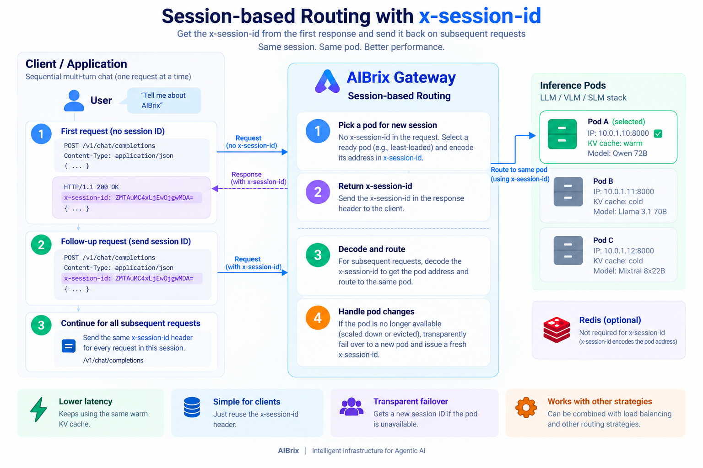
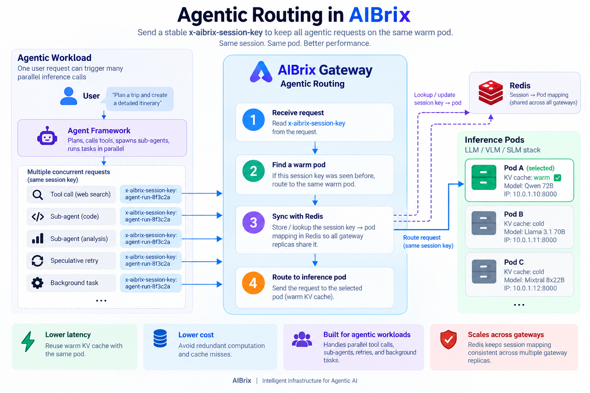

.. _agentic_routing:

================
Agentic Routing
================

Agentic applications often generate multiple inference requests as part of the same logical
session. These requests may come from multi-turn conversations, parallel tool calls, sub-agents,
retries, or background tasks.

AIBrix's session-affinity routing strategy keeps related requests on the same inference pod
whenever possible. This improves KV-cache reuse and avoids repeatedly rebuilding the same context
on different pods.

AIBrix supports two ways to maintain session affinity:

* ``x-session-id`` — gateway-issued affinity for sequential, multi-turn requests.
* ``x-aibrix-session-key`` — caller-provided affinity for concurrent and agentic requests.

.. contents:: On this page
   :local:
   :depth: 2

Choose a session affinity mechanism
--------------------------------------

The right mechanism depends on how your application sends requests.

.. list-table::
   :header-rows: 1
   :widths: 25 35 40

   * -
     - ``x-session-id``
     - ``x-aibrix-session-key``
   * - Managed by
     - AIBrix Gateway
     - Application
   * - Provided through
     - Response header, then request header
     - Request header
   * - Available from
     - Second request
     - First request
   * - Value
     - Encoded backend address
     - Opaque application identifier
   * - Best for
     - Sequential multi-turn conversations
     - Concurrent agentic requests

Both mechanisms are available with the ``session-affinity`` routing strategy.

.. note::
   Neither ``x-session-id`` nor ``x-aibrix-session-key`` is a security token. Do not use
   either header for authentication or authorization.

Sequential requests with ``x-session-id``
--------------------------------------------

For sequential workloads such as multi-turn chat, the application does not need to create or
manage a session identifier.

The first request is sent normally. AIBrix selects a ready inference pod and returns an
``x-session-id`` in the response header. The application then includes that value in subsequent
requests, allowing AIBrix to route them back to the same pod.

The flow is:

1. Send the first request without ``x-session-id``.
2. Read ``x-session-id`` from the response header.
3. Include the same ``x-session-id`` in subsequent requests.
4. AIBrix routes those requests to the same pod while it remains available.

If the selected pod is scaled down, evicted, or otherwise unavailable, AIBrix transparently
selects another ready pod and returns a new ``x-session-id``.

   Session-based routing with x-session-id: the gateway picks a pod on the
   first request, returns its address as x-session-id, and reuses it for
   follow-up requests.

.. note::
   ``x-session-id`` encodes the selected pod's network location (``IP:Port``) as a base64
   value. Applications should treat the value as opaque and simply return it unchanged.

Concurrent agentic requests with ``x-aibrix-session-key``
-------------------------------------------------------------

Agentic workloads are different from ordinary multi-turn chat. A single agent run may issue
several requests concurrently, for example:

* parallel tool calls,
* sub-agent execution,
* reasoning branches,
* speculative retries, or
* background tasks.

These requests may start before any previous request has completed. As a result, there may be
no gateway-issued ``x-session-id`` available yet.

For these workloads, provide a stable ``x-aibrix-session-key`` with every related request.

The value can be an identifier your application already has, such as a conversation ID, agent-run
ID, or workflow ID:

.. code-block:: text

   x-aibrix-session-key: agent-run-8f3c2a

Requests carrying the same session key are consistently mapped to the same ready pod whenever
possible. This allows parallel requests from the same agent run to benefit from the same warm
KV cache.

The flow is:

1. Choose a stable identifier for the agent run or conversation.
2. Send it as ``x-aibrix-session-key`` from the very first request.
3. Use the same value for every related request.
4. AIBrix consistently maps the key to the same ready inference pod.

   Agentic routing with x-aibrix-session-key: concurrent tool calls and
   sub-agent requests sharing one session key are routed to the same pod.

Unlike ``x-session-id``, ``x-aibrix-session-key`` does not expose the backend address and is not
returned in the response. It is entirely owned by the caller.

.. note::
   Keep ``x-aibrix-session-key`` short. Keys longer than 256 bytes are treated as unset and
   the request falls back to the normal session-affinity resolution behavior.

Quick start
-----------

Sequential multi-turn chat
^^^^^^^^^^^^^^^^^^^^^^^^^^^

Send the first request normally:

.. code-block:: bash

   curl -v http://${ENDPOINT}/v1/chat/completions \
   -H "routing-strategy: session-affinity" \
   -H "Content-Type: application/json" \
   -d '{
       "model": "your-model-name",
       "messages": [
           {"role": "user", "content": "Tell me about AIBrix"}
       ]
   }'

The response contains an ``x-session-id`` header:

.. code-block:: text

   HTTP/1.1 200 OK
   x-session-id: <session-id>

Include that value in the next request:

.. code-block:: bash

   curl -v http://${ENDPOINT}/v1/chat/completions \
   -H "routing-strategy: session-affinity" \
   -H "x-session-id: <session-id>" \
   -H "Content-Type: application/json" \
   -d '{
       "model": "your-model-name",
       "messages": [
           {"role": "user", "content": "Tell me more"}
       ]
   }'

Agentic and concurrent requests
^^^^^^^^^^^^^^^^^^^^^^^^^^^^^^^^

For agentic workloads, provide your own stable session key from the first request:

.. code-block:: bash

   curl -v http://${ENDPOINT}/v1/chat/completions \
   -H "routing-strategy: session-affinity" \
   -H "x-aibrix-session-key: agent-run-8f3c2a" \
   -H "Content-Type: application/json" \
   -d '{
       "model": "your-model-name",
       "messages": [
           {"role": "user", "content": "Analyze this task"}
       ]
   }'

Every tool call, sub-agent request, or other inference request belonging to the same agent run
should send:

.. code-block:: text

   x-aibrix-session-key: agent-run-8f3c2a

AIBrix then attempts to route all of those requests to the same ready pod.

Staying sticky across gateway plugin replicas
--------------------------------------------------

AIBrix Gateway typically runs multiple replicas for high availability and scalability. Because
requests from the same session may reach different gateway replicas, AIBrix uses Redis to share
session-to-pod mappings across gateways and keep the session consistently routed to the same pod.

When Redis is configured through ``REDIS_HOST``, session-key mappings are shared across gateway
replicas automatically, so every replica converges on the same pod for a given session key.

For example, an agent run may send its first request through replica A and its next request
through replica B. Both replicas can use the shared Redis mapping to resolve the same
``x-aibrix-session-key`` to the same inference pod.

Without Redis, ``x-aibrix-session-key`` still maps deterministically via rendezvous hashing over
the current ready pod set. Replicas do not keep a local pin, so they agree as long as they see
the same pods.

Session mappings stored in Redis use a 1-hour sliding idle expiration. Each use refreshes the
TTL, so active sessions remain available while abandoned sessions are eventually removed.

See :doc:`../production/gateway` for Redis configuration.

Reusing the session key with PD disaggregation
--------------------------------------------------

``x-aibrix-session-key`` can also be reused by AIBrix's :doc:`pd-disaggregation` routing.

The ``token_load`` and ``hybrid_cache_load`` prefill scoring policies use the session key to
recognize requests belonging to the same multi-turn conversation. This allows the policies to
account for newly added tokens instead of repeatedly charging the full accumulated prompt.

If your agent framework already provides ``x-aibrix-session-key`` for session affinity, no
additional session identifier is required for these PD routing policies.

.. seealso::

   :doc:`gateway-plugins`
       Full gateway routing strategy reference, including supported routing headers.

   :doc:`../production/gateway`
       Configure Redis for multi-replica AIBrix Gateway deployments.
