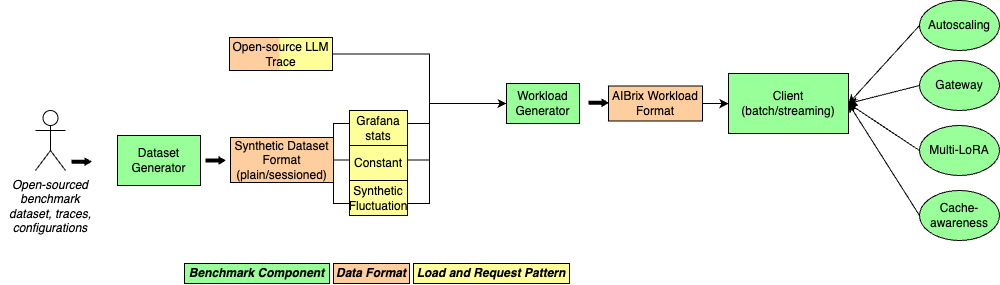
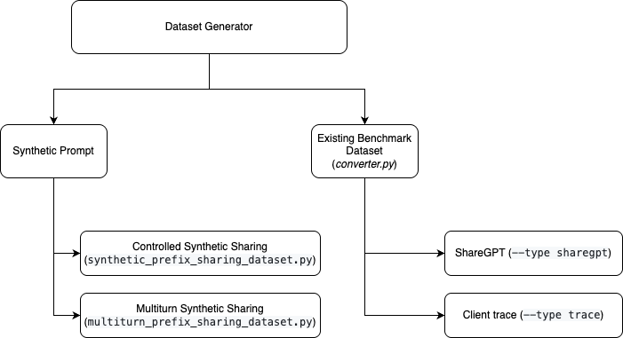
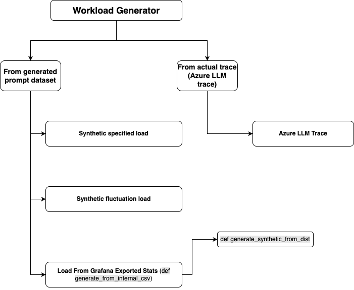
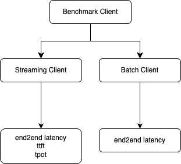

.. _benchmark:

=================================
Benchmark and Workload Generator
=================================
`AIBrix Benchmark <https://github.com/vllm-project/aibrix/tree/main/benchmarks>`_ contains the following components:

- Dataset (Prompt) Generation
- Workload Generation
- Benchmark Client
- Benchmark Scenarios (Work-in-progress)

The diagram below shows the end-to-end steps of AIBrix benchmarks. Our components are highlighted as green rectangles in this diagram.
  



At its core, the AIBrix benchmark framework is built around a cleanly decoupled architecture: dataset generation, workload shaping, and benchmark execution. Each component can be customized independently, making it easy to plug in your own prompt logs, traffic traces, or experimental workloads—whether you're working on a new model deployment, scaling policy, or runtime optimization.

Run AIBrix Benchmark End-to-End
-------------------------------

.. note::
    The benchmark script `benchmark.py <https://github.com/vllm-project/aibrix/blob/main/benchmarks/benchmark.py>`_ performs all steps up to the AIBrix workload format and trigger benchmark client without setting up benchmark environment for different scenarios. It assumes that AIBrix is already set up and expects a fully responsive endpoint.
 


First, make sure you have configured your API key as well as your endpoint like

.. code-block:: bash

    export API_KEY="<your_api_key>"
    kubectl -n envoy-gateway-system port-forward service/envoy-aibrix-system-aibrix-eg-903790dc 8888:80 &


To run all steps using the default setting, try

.. code-block:: bash

    python benchmark.py --stage all --config config.yaml


If the script completes successfully, you should see something similar to the following output:

.. code-block:: bash

    INFO:root:Running analysis with args: Namespace(trace='./output/client_output/output.jsonl', output='./output/trace_analysis', goodput_target='tpot:0.5')
    WARNING:root:End-to-End Latency (s) Statistics: Average = 2.9710, Median = 3.0138, 99th Percentile = 3.3668
    WARNING:root:Throughput (per request, toks/s) Statistics: Average = 43.2928, Median = 42.4732, 99th Percentile = 47.2407
    WARNING:root:Tokens per Second Statistics: Average = 169.2524, Median = 165.2006, 99th Percentile = 259.2597
    WARNING:root:Request Prompt Tokens Statistics: Average = 372.7500, Median = 371.0000, 99th Percentile = 670.6400
    WARNING:root:Request Output Tokens Statistics: Average = 128.0000, Median = 128.0000, 99th Percentile = 128.0000
    WARNING:root:Request Total Tokens Statistics: Average = 500.7500, Median = 499.0000, 99th Percentile = 798.6400
    WARNING:root:Time to First Token (TTFT) Statistics: Average = 0.3053, Median = 0.2678, 99th Percentile = 0.5994
    WARNING:root:Time per Output Token (TPOT) Statistics: Average = 0.0208, Median = 0.0216, 99th Percentile = 0.0217
    WARNING:root:Errors Statistics: Average = 0.0000, Median = 0.0000, 99th Percentile = 0.0000
    WARNING:root:Goodput (reqs/s) 1.0000
    WARNING:root:Total Duration (s): 23.778891624999233
    WARNING:root:Total tokens generated (toks): 4006
    WARNING:root:Throughput (end-to-end, toks/s): 168.46874375710644
    INFO:root:========== Benchmark Completed ==========
    
    
.. note::
    All configuration files should be specified in a .yaml file. You can find an example configuration file `here <https://github.com/vllm-project/aibrix/blob/main/benchmarks/config.yaml>`_.

    To override the default configuration, use the `--override` flag. For example, to override the target model and the number of sessions in the dataset generation phase, use:

    .. code-block:: bash

        python benchmark.py --stage all \
            --config config.yaml \
            --override target_model="deepseek-llm-7b-chat" \
            --override dataset_configs.synthetic_multiturn.num_sessions=10

Run Dataset Generator
---------------------



The goal of AIBrix's dataset generator is to generate a prompt dataset, or convert an existing dataset to a format that can be sampled from by the workload generator. The AIBrix dataset generator generates synthetic prompts that follow certain application patterns (i.e., cache sharing) or convert time-series traces (e.g., Open-source LLM trace like ShareGPT) to standard dataset format. 
A synthetic dataset needs to be in one of the two formats:

- Plain format (no sessions)

.. code-block:: bash
    
    {"prompt": "XXXX"}
    {"prompt": "YYYY"}
    

- Session format

.. code-block:: bash

    {"session_id": 0, "prompts": ["XXX", "YYY"]}
    {"session_id": 1, "prompts": ["AAA", "BBB", "CCC"]}

The dataset generator either generates a prompt dataset or converts an existing dataset which belongs to one of the two formats above. 


To run dataset generation, do


.. code-block:: bash

    python benchmark.py --stage dataset --config config.yaml


Currently, we support four types of dataset. 

**1. Controlled Synthetic Sharing**
- This type allows users to generate a cache sharing *plain-format* dataset with *controlled prompt token length* and *controlled prefix sharing length*, as well as controlled number of prefixes (i.e., sessions). To tune the prompt token length and shared length, set configuration variables under ```dataset_configs.synthetic_shared``` in the `configuration file <https://github.com/vllm-project/aibrix/blob/main/benchmarks/config.yaml>`_.

**2. Multiturn Synthetic**
- Multiturn synthetic data generation produces *sessioned-format* dataset. Each session ID maps to a *controlled number of prompts* per session and *controlled prompt lengths*. These variables are under the ```dataset_configs.synthetic_multiturn``` in the `configuration file <https://github.com/vllm-project/aibrix/blob/main/benchmarks/config.yaml>`_.

**3. ShareGPT**
- This generation type converts ShareGPT dataset to *sessioned-format* dataset that has session_id, prompts and completions. Configuration variables are under `dataset_configs.sharegpt` in the `configuration file <https://github.com/vllm-project/aibrix/blob/main/benchmarks/config.yaml>`_.

**4. Client trace**
- This generation type converts client output into a *plain-format* dataset. Configuration variables are under the `dataset_configs.client_trace` in the `configuration file <https://github.com/vllm-project/aibrix/blob/main/benchmarks/config.yaml>`_.

The first two types generate synthetic prompts, while the latter two convert external data sources or benchmark data.


To set the type of dataset to be generated, set the environment variable `prompt_type` in the configuration file to one of the following values: ```synthetic_multiturn```, ```synthetic_shared```, ```sharegpt```, ```client_trace```.

For details of dataset generator, check out `dataset_generator <https://github.com/vllm-project/aibrix/blob/main/benchmarks/generator/dataset_generator>`_ directory. 


Run Workload Generator
----------------------




The goal of AIBrix's workload generator is to perform workload shaping. The workload generator specifies the timing and requests to be dispatched in by the benchmark client. A workload generator accepts either a trace/metrics files (where either time and requests are specified, or QPS/input/output volume are specified) or user-specified static or dynamic load patterns. The workload generator will sample the workload based on a dataset in one of the two formats discussed in [dataset generator](#run-dataset-generator). There are three types of workload the generator currently supports. 

**1. The "constant" and "synthetic" workload type**

- The workload generator can produce two types of *synthetic load pattern*, with multiple workload configurations that can be manually tuned (e.g., traffic/QPS distribution, input request token length distribution, output token length distribution, maximum concurrent sessions, etc.):
    - Constant load (**constant**): The mean load (QPS/input length/output length) stays constant with controallable fluctuation. Configuration variables are under the `workload_configs.constant` in the `configuration file <https://github.com/vllm-project/aibrix/blob/main/benchmarks/config.yaml>`_.
    - Synthetic fluctuation load (**synthetic**): The loads (QPS/input length/output length) fluctuate based on configurable parameters. Configuration variables are under the `workload_configs.synthetic` in the `configuration file <https://github.com/vllm-project/aibrix/blob/main/benchmarks/config.yaml>`_.

**2. The "stat" workload type**

- For *metrics file (e.g., .csv file exported from Grafana dashboard)*, the workload generator will generate the QPS/input length/output length distribution that follows the collected time-series metrics specified in the file. The actual prompt used in the workload, will be based on one of the synthetic dataset generated by the previous section. Configuration variables are under the `workload_configs.stat` in the `configuration file <https://github.com/vllm-project/aibrix/blob/main/benchmarks/config.yaml>`_.


**3. The "azure" workload type**

- For a trace (e.g., Azure LLM trace), both the requests and timestamp associated with the requests are provided, and the workload generator will generate a workload that simply replay requests based on the timestamp. Configuration variables are under the `workload_configs.azure` in the `configuration file <https://github.com/vllm-project/aibrix/blob/main/benchmarks/config.yaml>`_.

Workload generator could be run by:

.. code-block:: bash

    python benchmark.py --stage workload --config config.yaml

The workload generator will generate a workload file in the `output/workload` directory. The file will be look like this:

.. code-block:: bash

    {
        "timestamp": 19, 
        "requests": 
        [
            {
                "prompt": "I need to understand data science ...", 
                "prompt_length": 101, 
                "output_length": null,
                "session_id": 0
            },
            {
                "prompt": "...",
                "prompt_length": "...", 
                "output_length": "...",
                "session_id": "..."
            }
        ]
    }


To choose different workload type, set the environment variable `workload_type` in the configuration file to one of the following values: ```constant```, ```synthetic```, ```stat```, ```azure```.


For details of workload generator, check out `workload_generator <https://github.com/vllm-project/aibrix/blob/main/benchmarks/generator/workload_generator>`_. 


Run Benchmark Client
--------------------



The benchmark client supports both batch and streaming mode. Streaming mode supports intra-request metrics like TTFT/TPOT. Configure endpoint and target model via `config.yaml <https://github.com/vllm-project/aibrix/blob/main/benchmarks/config.yaml>`_ or command line arguments.

The benchmark client can be run using:

.. code-block:: bash

    python benchmark.py --stage client --config config.yaml


Run Analysis
------------

Run analysis on the benchmark results using:

.. code-block:: bash

    python benchmark.py --stage analysis --config config.yaml

Configure path and performance target via `config.yaml <https://github.com/vllm-project/aibrix/blob/main/benchmarks/config.yaml>`_ or command line arguments.
