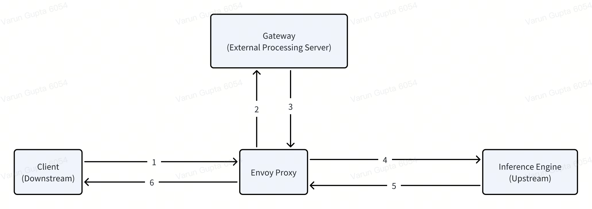

.. _gateway:

===============
Gateway Routing
===============

Gateway is developed as external processing service using envoy's gateway extension policy. Gateway is designed to serve LLM requests and provides features such as dynamic model & lora adapter discovery, user configuration for request count & token usage budgeting, streaming and advanced routing strategies such as prefix-cache aware, heterogeneous GPU hardware. 

Dynamic Routing
---------------

First, get the external ip and port for the envoy proxy to access gateway.

.. code-block:: bash

    kubectl -n envoy-gateway-system get service   
    NAME                                     TYPE           CLUSTER-IP       EXTERNAL-IP                                           PORT(S)                                   
    envoy-aibrix-system-aibrix-eg-903790dc   LoadBalancer   172.19.190.6     10.10.10.10,1000:1000:1000:1000:1000:1000:1000:1000   80:30904/TCP

On a model or lora adapter deployment, their respective controllers create a HTTPRoute object which gateway dynamically discovers to forward input user request. Make sure to verify that httproute status as Accepted. 

.. figure:: ../assets/images/httproute.png
  :alt: httproute
  :width: 70%
  :align: center 

Sample request, get external ip:port from first step and model-name from deployments label "model.aibrix.ai/name".

.. code-block:: bash

    curl -v http://<ip>:<port>/v1/chat/completions \
    -H "Content-Type: application/json" \
    -H "Authorization: Bearer any_key" \
    -d '{
        "model": "your-model-name",
        "messages": [{"role": "user", "content": "Say this is a test!"}],
        "temperature": 0.7
    }'

Routing Strategies
------------------

Below are routing strategies gateway supports

* random: routes request to a random pod.
* least-request: routes request to a pod with least ongoing request.
* throughput: routes request to a pod which has processed lowest tokens.
* prefix-cache: routes request to a pod which already has KV cache for prompt.

.. code-block:: bash

    curl -v http://<ip>:<port>/v1/chat/completions \
    -H "routing-strategy: least-request" \
    -H "Content-Type: application/json" \
    -H "Authorization: Bearer any_key" \
    -d '{
        "model": "your-model-name",
        "messages": [{"role": "user", "content": "Say this is a test!"}],
        "temperature": 0.7
    }'

Rate Limiting
-------------

The gateway supports rate limiting based on the `user` header. You can specify a unique identifier for each `user` to apply rate limits such as requests per minute (RPM) or tokens per minute (TPM).
This `user` header is essential for enabling rate limit support for each client.

To set up rate limiting, add the user header in the request, like this:

.. code-block:: bash

    curl -v http://<ip>:<port>/v1/chat/completions \
    -H "user: your-user-id" \
    -H "Content-Type: application/json" \
    -H "Authorization: Bearer any_key" \
    -d '{
        "model": "your-model-name",
        "messages": [{"role": "user", "content": "Say this is a test!"}],
        "temperature": 0.7
    }'

.. note::
    Replace "your-user-id" with a unique identifier for each user. This identifier allows the gateway to enforce rate limits on a per-user basis.
    If rate limit support is required, ensure this `user` header is always set in the request. if you do not need rate limit, you do not need to set this header.

Headers Explanation
--------------------

This sections describes various **custom headers** used in request processing for debugging and routing in the system.

Request & Target Headers
^^^^^^^^^^^^^^^^^^^^^^^^

.. list-table::
   :header-rows: 1
   :widths: 25 75

   * - Header Name
     - Description
   * - ``x-went-into-req-headers``
     - Indicates whether the request headers were processed correctly. Used for debugging header parsing issues.
   * - ``target-pod``
     - Specifies the destination pod selected by the routing algorithm. Useful for verifying routing decisions.
   * - ``routing-strategy``
     - Defines the routing strategy applied to this request. Ensures correct routing logic is followed.
   * - ``x-error-response-unmarshal``
     - Signals that the response body could not be parsed correctly, often due to an internal issue.
   * - ``x-error-response-unknown``
     - Generic error header when no specific issue is identified.
   * - ``x-request-body-processing-error``
     - Marks an issue with request body parsing, such as invalid JSON.

Routing & Error Debugging Headers
^^^^^^^^^^^^^^^^^^^^^^^^^^^^^^^^^

.. list-table::
   :header-rows: 1
   :widths: 25 75

   * - Header Name
     - Description
   * - ``x-user-error``
     - Identifies errors related to incorrect user input. Useful for client-side debugging.
   * - ``x-error-routing``
     - Indicates an issue in routing logic, such as failed to select target pod.
   * - ``x-streaming-error``
     - Signals an error during a streaming request, helping to diagnose streaming-related failures.
   * - ``x-no-model-in-request``
     - Specifies that no model option was given for the request. Useful for model parameter validation debugging.
   * - ``x-no-model-deployment``
     - Indicates that the requested model exists but has no active deployment(pods).

Streaming Headers
^^^^^^^^^^^^^^^^^

.. list-table::
   :header-rows: 1
   :widths: 25 75

   * - Header Name
     - Description
   * - ``x-stream-options``
     - Lists enabled streaming options for the request. Used to debug streaming feature behavior.
   * - ``x-stream-options-include-usage``
     - Indicates whether usage statistics were included in the streaming response.

Rate Limiting Headers
^^^^^^^^^^^^^^^^^^^^^

.. list-table::
   :header-rows: 1
   :widths: 25 75

   * - Header Name
     - Description
   * - ``x-error-update-tpm``
     - Error encountered while updating TPM (tokens per minute).
   * - ``x-update-rpm``
     - Indicates that the RPM (requests per minute) count was updated successfully.
   * - ``x-update-tpm``
     - Indicates that the TPM (tokens per minute) count was updated successfully.
   * - ``x-rpm-error``
     - Signals an issue while updating the RPM metric.
   * - ``x-error-incr-rpm``
     - Error encountered while increasing the RPM counter.
   * - ``x-tpm-exceeded``
     - Signals that the request exceeded the allowed TPM threshold.

Debugging Guidelines
^^^^^^^^^^^^^^^^^^^^

1. **Check ``x-error-*`` headers**
   - If an error occurs, check ``x-error-routing``, ``x-user-error``, and ``x-error-response-*`` headers.

2. **Verify model & routing headers**
   - Ensure that ``target-pod`` is set and ``routing-strategy`` is correct.
   - If ``x-no-model-in-request`` or ``x-no-model-deployment`` is set, investigate model deployment status.

3. **Analyze streaming issues**
   - Check ``x-stream-options`` and ``x-stream-options-include-usage`` if streaming behavior is unexpected.
   - If ``x-streaming-error`` is set, verify logs for additional details.

4. **Check rate limiting headers**
   - ``x-tpm-exceeded`` or ``x-error-incr-rpm`` indicates that rate limits were reached.
