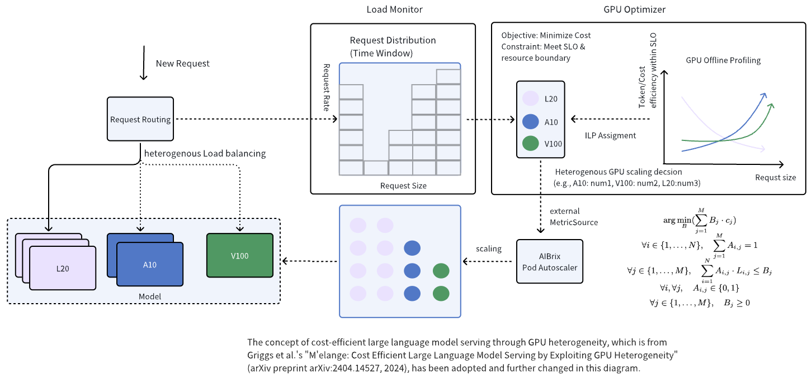

.. _heterogeneous-gpu:

============================
Heterogeneous GPU Inference
============================

Heterogeneous GPU Inference is a feature that enables users to utilize different types of GPUs for deploying the same model. This feature addresses two primary challenges associated with Large Language Model (LLM) inference: (1) As the demand for large-scale model inference increases, ensuring consistent GPU availability has become a challenge, particularly within regions where identical GPU types are often unavailable due to capacity constraints. (2) Users may seek to incorporate lower-cost, lower-performance GPUs to reduce overall expenses. 

Design Overview
---------------

There are three main components in Heterogeneous GPU Inference Feature: (1) LLM Request Monitoring, (2) Heterogeneous GPU Optimizer, (3) Request Routing. The following figure shows the overall architecture. First, LLM Request Monitoring component is responsible for monitoring the past inference requests and their request patterns. Second, Heterogeneous GPU Optimizer component is responsible for selecting the optimal GPU type and the corresponding GPU count. Third, Request Routing component is responsible for routing the request to the optimal GPU.

Example
-------------

First, set the project root environment variable:

.. code-block:: bash

    export AIBRIX_HOME="${PWD}"  

To deploy a mock workload, execute the following commands:

.. code-block:: bash

    cd $AIBRIX_HOME/development/app/
    make docker-build-simulator #build mock workload for a100
    make docker-build-simulator-a40 #build mock workload for a40
    make deploy-heterogeneous  #deploy heterogeneous workload

After deployment, you will see a llama2-7b inference service with two pods running on simulated A100 and A40 GPUs:

.. code-block:: bash

    kubectl get svc
    NAME         TYPE        CLUSTER-IP      EXTERNAL-IP   PORT(S)          AGE
    kubernetes   ClusterIP   10.96.0.1       <none>        443/TCP          14d
    llama2-7b    NodePort    10.107.122.88   <none>        8000:30081/TCP   48m

Incoming requests are routed through the gateway and directed to the optimal pod based on request patterns:

.. code-block:: bash

    NAME                                       READY   STATUS        RESTARTS      AGE
    simulator-llama2-7b-a100-9bdfbb7ff-rx9r7   2/2     Running       0             46m
    simulator-llama2-7b-a40-5c9576c566-jfblm   2/2     Running       0             27s

The GPU Optimizer runs continuously in the background, dynamically adjusting GPU allocation for each model based on workload patterns.

.. note::

  Note that there is an offline profiling process for each GPU's performance on the inference model. GPU optimizer requires offline GPU profiling data to work. You can find the offline profiling data under `python/aibrix/aibrix/gpu_optimizer/optimizer/profiling'

To save A100 and A40 offlineprofiling data to Redis, run:

.. code-block:: bash

    kubectl -n aibrix-system port-forward svc/aibrix-redis-master 6379:6379 1>/dev/null 2>&1 &

    cd $AIBRIX_HOME/python/aibrix/aibrix/gpu_optimizer
    make DP=simulator-llama2-7b-a100 COST=0.1gen-profile
    make DP=simulator-llama2-7b-a40 COST=0.3 gen-profile

To test the heterogeneous GPU inference feature, generate mock requests with the following command:

.. code-block:: bash

    cd $AIBRIX_HOME/python/aibrix/aibrix/gpu_optimizer
    make debug-workload

You should observe that the number of workload pods scales up in response to the requests.

