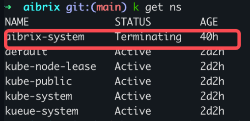
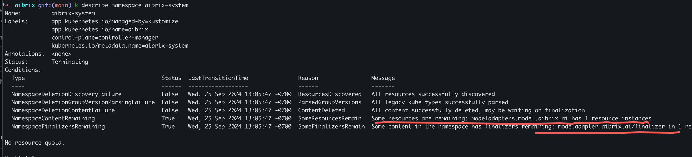
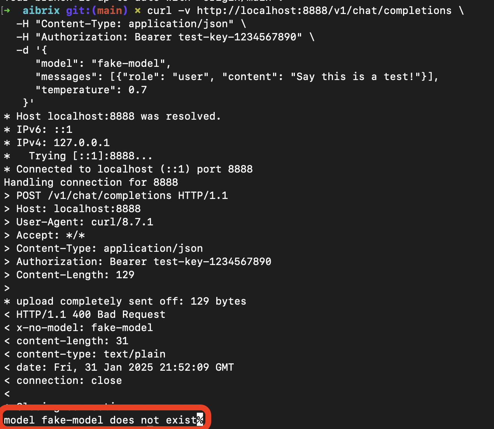

.. _faq:

===
FAQ
===

FAQ - Installation
------------------

Failed to delete the AIBrix
---------------------------

In this case, you just need to find the model adapter, edit the object, and remove the ``finalizer`` pair. the pod would be deleted automatically.

Gateway error messages
----------------------

* model does not exist

* routing strategy is incorrect

* no ready pods

Gateway ReferenceGrant Issue
---------------------------

When using multi-node inference with RayClusterFleet (as described in the :ref:`multi-node inference guide <distributed_inference>`), you might encounter a 500 error when accessing the model through the Envoy gateway, while direct access via port-forward works fine.

This issue occurs because the gateway (in aibrix-system namespace) needs explicit permission to access services in other namespaces (e.g., default namespace). To resolve this, you need to create a ReferenceGrant:

.. code-block:: yaml

    apiVersion: gateway.networking.k8s.io/v1beta1
    kind: ReferenceGrant
    metadata:
      name: allow-aibrix-gateway-to-access-services-route
      namespace: default
    spec:
      from:
      - group: gateway.networking.k8s.io
        kind: HTTPRoute
        namespace: aibrix-system
      to:
      - group: ""
        kind: Service

After applying this ReferenceGrant, the gateway should be able to properly route requests to your model service.

Note: This is typically only needed for multi-node deployments. Simple model deployments usually work without requiring this additional configuration.

Using NodePort or ClusterIP to Expose the Gateway API
-----------------------------------------------------

In the :ref:`quickstart` guide, model endpoints are typically accessed using either ``kubectl port-forward`` or through a LoadBalancer service.
However, in some environments (e.g., local clusters without external load balancers), you may prefer to expose the Envoy gateway using a ``NodePort`` service or rely on the default ``ClusterIP`` service type.

**Important:** You should not modify the ``svc/envoy-aibrix-system-aibrix-eg-903790dc`` service directly, since it is managed by the EnvoyProxy controller.
Instead, update the EnvoyProxy configuration to set the service type.

**Option 1**: NodePort (Expose Outside the Cluster)

Update the spec to ``NodePort``:

.. code-block:: yaml

    ...
    spec:
      provider:
        kubernetes:
          envoyService:
            type: NodePort
          envoyDeployment:
    ...

After applying the change, the gateway service will be updated:

.. code-block:: bash

    $ kubectl get svc envoy-aibrix-system-aibrix-eg-903790dc -n envoy-gateway-system
    NAME                                     TYPE       CLUSTER-IP        EXTERNAL-IP   PORT(S)        AGE
    envoy-aibrix-system-aibrix-eg-903790dc   NodePort   192.168.194.158   <none>        80:32432/TCP   5h21m

You can then regenerate the model endpoint:

.. code-block:: bash

    $ NODE_IP=$(kubectl get nodes -o jsonpath='{.items[0].status.addresses[?(@.type=="InternalIP")].address}' | awk '{print $1}')
    $ NODE_PORT=$(kubectl get svc envoy-aibrix-system-aibrix-eg-903790dc -n envoy-gateway-system -o=jsonpath='{.spec.ports[0].nodePort}')
    $ ENDPOINT="${NODE_IP}:${NODE_PORT}"

Your model endpoint is now accessible from outside the cluster via NodePort.

**Option 2**: ClusterIP (Internal Access Only)

By default, the Envoy gateway service type is ``ClusterIP``:

.. code-block:: yaml

    ...
    spec:
      provider:
        kubernetes:
          envoyService:
            type: ClusterIP
          envoyDeployment:
    ...

The gateway service looks like this:

.. code-block:: bash

    $ kubectl get svc envoy-aibrix-system-aibrix-eg-903790dc -n envoy-gateway-system
    NAME                                     TYPE        CLUSTER-IP        EXTERNAL-IP   PORT(S)   AGE
    envoy-aibrix-system-aibrix-eg-903790dc   ClusterIP   192.168.194.158   <none>        80/TCP    18h

You can then regenerate the model endpoint (accessible only inside the cluster):

.. code-block:: bash

    $ CLUSTER_IP=$(kubectl get svc envoy-aibrix-system-aibrix-eg-903790dc -n envoy-gateway-system -o=jsonpath='{.spec.clusterIP}')
    $ CLUSTER_PORT=$(kubectl get svc envoy-aibrix-system-aibrix-eg-903790dc -n envoy-gateway-system -o=jsonpath='{.spec.ports[0].port}')
    $ ENDPOINT="${CLUSTER_IP}:${CLUSTER_PORT}"

This endpoint works only within the Kubernetes cluster (e.g., when other services communicate with the gateway internally).

Get more configurations in the `Envoy Gateway docs <https://gateway.envoyproxy.io/latest/api/extension_types/#kubernetesservicespec>`__.
