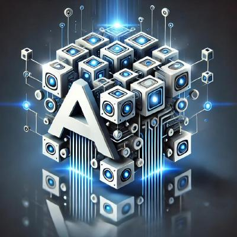

Welcome to AIBrix
=================

AIBrix is an open-source initiative designed to provide essential building blocks to construct scalable GenAI inference infrastructure. 
AIBrix delivers a cloud-native solution optimized for deploying, managing, and scaling large language model (LLM) inference, tailored specifically to enterprise needs.

Key features:

- **LLM Gateway and Routing**: Efficiently manage and direct traffic across multiple models and replicas.
- **High-Density LoRA Management**: Streamlined support for lightweight, low-rank adaptations of models.
- **Distributed Inference**: Scalable architecture to handle large workloads across multiple nodes.
- **LLM App-Tailored Autoscaler**: Dynamically scale inference resources based on real-time demand.
- **Unified AI Runtime**: A versatile sidecar enabling metric standardization, model downloading, and management.
- **Heterogeneous-GPU Inference**: Cost-effective SLO-driven LLM inference using heterogeneous GPUs.
- **GPU Hardware Failure Detection**: Proactive detection of GPU hardware issues.
- **KVCache Offloading and Cross-Engine KV Reuse**: High-Performance KVCache offloading framework supporting both naive KV offloading and cross-engine KV reuse.
- **Benchmark Tool**: A tool for measuring inference performance and resource efficiency.

Documentation
=============

.. toctree::
   :maxdepth: 1
   :caption: Getting Started

   getting_started/quickstart.rst
   getting_started/installation/installation.rst
   getting_started/faq.rst

.. toctree::
   :maxdepth: 1
   :caption: Architecture

   designs/architecture.rst
   designs/aibrix-stormservice.rst
   designs/aibrix-router.rst
   designs/aibrix-kvcache-offloading-framework.rst
   designs/aibrix-autoscaler.rst
   designs/aibrix-engine-runtime.rst

.. toctree::
   :maxdepth: 1
   :caption: User Manuals

   features/lora-dynamic-loading.rst
   features/gateway-plugins.rst
   features/multi-node-inference.rst
   features/heterogeneous-gpu.rst
   features/autoscaling/autoscaling.rst
   features/runtime.rst
   features/kvcache-offloading.rst
   features/kv-event-sync.rst
   features/benchmark-and-generator.rst
   features/multi-engine.rst

.. toctree::
   :maxdepth: 1
   :caption: Development

   development/development.rst
   development/release.rst

.. toctree::
   :maxdepth: 1
   :caption: Production Readiness

   production/observability.rst

.. toctree::
   :maxdepth: 1
   :caption: Testing

   testing/kv-event-sync-e2e.rst

.. toctree::
   :maxdepth: 1
   :caption: Community

   community/community.rst
   community/contribution.rst
   community/research.rst
