# Planner Queue Architecture

This document captures the intended async planner architecture for Console
batch jobs.

For the exact field-level request/response payloads, see
[CONTRACTS.md](./CONTRACTS.md).

## Goal

The planner should not be invoked as a synchronous extension of the Console
HTTP request path. Instead:

1. Console accepts a user `CreateJob` request.
2. Console persists its own user-facing overlay fields.
3. Console converts the request into a `planner.PlannerJob`.
4. Console enqueues that job through `planner.Planner.Enqueue`.
5. A background planner worker periodically leases queued tasks.
6. The worker submits them to MDS `/v1/batches`.
7. Console reads a merged planner + MDS view (`JobView`) via
   `Planner.GetJob` / `Planner.ListJobs`; the planner overlays a live
   `BatchClient.GetBatch` call onto the stored `PlannerTask` (no
   reconcile loop in MVP).

## Boundaries

### Console -> Planner

Console depends only on `Planner`. The interface has four methods:

- `Enqueue` accepts work and returns a queued view immediately.
- `GetJob` / `ListJobs` return merged planner + MDS state as `JobView`.
- `CancelJob` covers both pre-submit and post-submit cancellation; the
  planner routes the call to either a queue-state transition or an MDS
  `POST /v1/batches/{id}/cancel`.

Console does not know about leasing, retries, MDS submission, or workers.

### Planner internals

The internal contract is two interfaces plus one concrete struct:

- `TaskStore` is durable state plus lease coordination. It is one
  interface today, intentionally; see "Single store, for now" below.
  It exposes both an FCFS convenience path (`Lease`) and a policy-aware
  path (`ListCandidates` + `LeaseByID`); see "Scheduling Policy" below.
- `BatchClient` is the unified MDS adapter: `CreateBatch` for the
  worker's submit path, `GetBatch` / `ListBatches` for live overlay,
  `CancelBatch` for the post-submit cancel path. One interface — and
  therefore one fake — covers every MDS interaction in tests.
- The Resource Manager is consumed via a contract owned by an adjacent
  RM package, not declared here. The worker calls into it directly and
  translates the response into the in-memory `Reservation` shape this
  package defines. Reservations may legitimately fail (insufficient
  capacity, RM degraded, etc.); the worker wraps the RM's typed error
  into `ErrInsufficientResources` (or treats it as transient otherwise)
  and Nacks with backoff as part of the normal lease lifecycle.

`Worker` is the long-running loop that ties them together. It is a
concrete struct in `pkg/planner`, not an exported interface, because it
has only one production implementation; `main` constructs it directly
with the appropriate `TaskStore`, `BatchClient`, RM client, and
optional `SchedulerFunc`. The PlannerTask -> `MDSBatchSubmission`
translation and the pre-submit dedup check are private methods on the
Worker; they reach MDS only through `BatchClient`.

The MVP runs a single Worker process. Inside that process the Worker
fans work across multiple goroutines: one dispatcher loop that
acquires leased tasks (via `Lease` or `ListCandidates` + `SchedulerFunc` +
`LeaseByID`) and N task goroutines that take leased tasks off a
channel, call RM, submit to MDS, and Ack/Nack/Fail. Concurrency
control across the goroutines is in-memory; the lease in `TaskStore`
exists for crash recovery, not for in-process mutual exclusion.

### Telemetry

`QueueStatsReader` is a separate read interface for Console / ops
dashboards, returning `QueueStatsView` (queue depth, leased count,
oldest-queued-at, etc.). It is split from `Planner` so dashboard code can
depend on a narrow surface; concrete implementations are typically backed
by `TaskStore` queries.

## State Model

The package carries two state families:

### `PlannerTaskState` (internal coordination)

```mermaid
stateDiagram-v2
  [*] --> queued
  queued --> leased: Lease / LeaseByID
  leased --> submitted: Ack
  leased --> retryable_failure: Nack
  leased --> terminal_failure: Fail (non-retryable)
  leased --> cancelled: Cancel before submit
  retryable_failure --> queued: after RetryAt
  retryable_failure --> terminal_failure: after MaxAttempts
  submitted --> cancelled: Cancel after submit
  submitted --> superseded: EnqueueContinuation<br/>(provision expired; new<br/>attempt with Attempt+1)
  terminal_failure --> [*]
  cancelled --> [*]
  superseded --> [*]
```



State transitions on a single PlannerTask are forward-only. Retries
that change `Attempt` always create new rows; the prior row preserves
its `BatchID` for audit and never re-enters `queued`.

This is what the planner stores. It governs lease ownership, retries, and
crash recovery. It is not the user-facing state.

### `JobLifecycleState` (user-facing, derived)

`JobLifecycleState` is the typed enum the Console UI renders. It is
**derived** at read time and stored only as a field on `JobView`.

When no `BatchID` is set, it is derived from `PlannerTaskState`:

| `PlannerTaskState`    | `JobLifecycleState` |
| --------------------- | ------------------- |
| `queued`              | `queued`            |
| `leased`              | `dispatching`       |
| `submitted`           | `submitted`         |
| `retryable_failure`   | `queued`            |
| `terminal_failure`    | `failed`            |
| `cancelled`           | `cancelled`         |

When `BatchID` is set, MDS owns the user-visible state and
`JobLifecycleState` is derived from `BatchStatus.Status`:

| MDS `BatchStatus.Status` | `JobLifecycleState` |
| ------------------------ | ------------------- |
| `created`                | `created`           |
| `validating`             | `validating`        |
| `in_progress`            | `in_progress`       |
| `finalizing`             | `finalizing`        |
| `completed`              | `completed`         |
| `failed`                 | `failed`            |
| `expired`                | `expired`           |
| `cancelling`             | `cancelling`        |
| `cancelled`              | `cancelled`         |

The set is closed: if MDS adds a new status string, the derivation helper
must be updated and the UI agrees on a rendering. The raw MDS string is
preserved on `JobView.BatchStatus` so the UI can still display details
during a transitional period.

## Crash safety and duplicate submit

The OpenAI Batches API does not accept idempotency keys, so the planner
must defend against duplicate submissions on its own. Two failure
modes can cause the same task to be submitted to MDS twice:

1. The worker dies after MDS returns 200 but before `Ack`. On worker
   restart, the lease eventually TTLs out and the task is re-leased
   and re-submitted.
2. A network partition swallows the response; the worker times out and
   `Nack`s; the next retry creates a second batch.

(In the MVP single-worker model, "another worker leases the task while
the first is still running" is not a path: there is only one worker
process, lease TTL is sized longer than `Execute`, and there is no
in-process double-leasing because the dispatcher hands each leased
task to exactly one goroutine.)

The MVP defenses, in priority order:

1. **Pre-submit dedup check.** Before calling
   `BatchClient.CreateBatch`, the Worker calls `BatchClient.GetBatch`
   (or `ListBatches` keyed on `extra_body.aibrix.job_id` once MDS
   indexes that field). If a batch already exists for this `job_id`,
   the Worker treats it as already submitted and `Ack`s with the
   existing batch ID.
2. **MDS-side dedup (target state).** Once MDS treats `aibrix.job_id`
   as a uniqueness key on batch creation, retries become safely
   repeatable and (1) becomes a fast-path optimization rather than a
   correctness requirement.

Mid-flight lease renewal (heartbeats / `RenewLease`) is intentionally
not part of the MVP surface. Single-worker plus a generously sized
lease TTL is enough; reintroducing renewal becomes worthwhile only if
the planner scales to multiple worker processes that contend for the
same store.

## MDS correlation and dedup

The planner correlates MDS batches back to logical jobs via
`extra_body.aibrix.job_id`. For this to work in production, MDS must:

- accept `extra_body.aibrix.job_id` on `POST /v1/batches`
  (today's `AibrixExtension` is `extra: "forbid"` and rejects it);
- persist the value;
- echo it on `GET /v1/batches/{id}` and `GET /v1/batches`;
- ideally treat it as a uniqueness key so a duplicate submit returns the
  existing batch (Stripe-style idempotent `200`) rather than creating a
  second one.

This is a hard dependency, not an optional enhancement. Until it ships,
`BatchStatus.JobID` may come back empty in production and the Worker's
pre-submit dedup check (against `BatchClient.GetBatch`) is the only
defense against duplicate submissions.

## File ownership

The planner does not own file upload/download. Workers MUST NOT upload
file content before submit; they only reference file IDs. See
[CONSOLE_INTEGRATION.md §9](./CONSOLE_INTEGRATION.md) for the routing
detail.

## Scheduling Policy

Scheduling policies plug in as `SchedulerFunc` values - a function type that
takes a `TaskStore` plus a `ScheduleRequest` and returns the TaskIDs to
lease in preferred order. Workers accept a `SchedulerFunc` at construction
time; switching policies is a one-line change in `main()`.

```go
type SchedulerFunc func(ctx context.Context, store TaskStore, req *ScheduleRequest) ([]string, error)
```

The function type is defined now (in `scheduler.go`) so the team building
the Worker and the team building concrete policies can develop in
parallel against a stable contract. Concrete `SchedulerFunc` implementations
(FCFS, priority, fair-share, resource-aware, etc.) are intentionally
not shipped in this PR; they land alongside their consumers.

Wiring at the call site (once a `SchedulerFunc` is available):

```go
worker := NewWorker(WorkerConfig{
    Store:   store,
    Batches: batches,       // BatchClient
    Scheduler: myPolicy,    // any SchedulerFunc; nil = FCFS
    // ...
})
```

A `nil` SchedulerFunc means "use `TaskStore.Lease` directly" - the FCFS
convenience path. This is the shape every implementer follows; no
`TaskStore` change, no Worker-construction change, no contract change
is needed to introduce a new policy.

`PlannerJob.Priority` and `PlannerTask.Priority` are reserved on the
types so that adding priority-based ranking later does not require a
schema migration. FCFS ignores the field; priority-based policies will
consume it.

## Resource Manager

The Resource Manager contract is owned by an adjacent RM package, not
declared here. The worker calls into it directly and translates the
RM-side response into the in-memory `Reservation` shape this package
defines.

The flow inside `Worker` (per leased task, run on a per-task goroutine):

```
Lease(task)
  └─ RM.Provision(TaskID, ResourceRequirement)
        ErrInsufficientResources (and other transient errors)
          -> Nack with backoff
        (idempotent per TaskID; a re-leasing worker that calls it
         again after a prior worker died gets the same Reservation
         back rather than allocating a new slot.)

  Worker.submit(task, reservation)         (private method)
    ├─ build MDSBatchSubmission from task + reservation
    │  (Reservation.ReservationID and Reservation.Allocations fill
    │   extra_body.aibrix.planner_decision and
    │   extra_body.aibrix.resource_details)
    ├─ pre-submit dedup: BatchClient.GetBatch by aibrix.job_id
    │  (if hit, return existing BatchID without resubmitting)
    └─ BatchClient.CreateBatch(MDSBatchSubmission) -> batchID
       (errors wrapped with ErrMDSSubmitFailed)

  TaskStore.Ack on success    -> persists ReservationID + ExpiresAt;
                                  reservation NOT released here
  TaskStore.Nack on retryable -> RM.Release
  TaskStore.Fail on terminal  -> RM.Release
```

`Release` is also called from `Planner.CancelJob` for post-submit
cancels. The reservation-expiry sweeper does *not* call `Release`;
it relies on RM-side expiry to reclaim the slot.

Reservations may legitimately fail. `ErrInsufficientResources` simply
means the RM cannot satisfy the request *right now*; the worker Nacks
with backoff and retries later, the same way it would handle a transient
MDS failure.

Crash safety: the RM enforces an expiry on every reservation. If a
worker dies between the RM call and Release, the RM reclaims the slot
automatically once the deadline passes - same primitive as `TaskStore`
lease expiry.

`ReservationID` and `ReservationExpiresAt` are persisted on the
`PlannerTask` at `Ack` time. The sweeper (below) reads
`ReservationExpiresAt` to find expired attempts; no other persistence
of reservation state is needed.

### Idempotency by TaskID

The RM-side capacity-request path MUST treat `TaskID` as the
uniqueness key: duplicate calls with the same TaskID return the
existing Reservation. Without this, lost RM responses or worker
crashes between the RM call and Ack would leak reservations. Because
each continuation task gets a fresh TaskID, the dedup keys are
intentionally per-attempt — a continuation always allocates new
capacity rather than inheriting the prior attempt's reservation.

### Reservation expiry handling

In MVP the reservation TTL is sized to outlive submit and (in the
common case) the entire batch — typically the job's
`completion_window`. When that holds, the planner does nothing
extra: MDS finishes the batch, the planner observes the terminal
status and the worker (or planner-internal observer) calls `Release`.

When a reservation expires *before* MDS finishes the batch, the
planner is purely reactive:

- The RM reclaims the underlying GPU pods at expiry. This is the
  RM's contract.
- MDS observes its batch's pods are gone and marks the batch
  `failed`/`expired` on its own. The planner does not call
  `BatchClient.CancelBatch` from the expiry path.
- The planner's reservation-expiry sweeper then creates a
  continuation task so the work is retried under a fresh
  reservation:

```
for each PlannerTask where State = submitted
                      AND ReservationExpiresAt < now:
    TaskStore.EnqueueContinuation(prior.TaskID, newTask)
        // atomic: prior -> superseded; newTask inserted in queued state
        // with the same JobID and Attempt = prior.Attempt + 1.
```

Two calls. No `CancelBatch`, no `Release` — RM expiry handles the
slot, MDS handles its own batch. The sweeper itself is a `Planner`
impl detail and does not appear in the interface set.

The continuation flow uses the existing `Attempt`/`MaxAttempts`
budget: when `prior.Attempt >= prior.MaxAttempts`, the sweeper SHOULD
omit `EnqueueContinuation` and the prior attempt remains the latest
(its `superseded` state is reserved for "a continuation was created";
when no continuation is created, the row stays `submitted` with an
expired reservation and the user-facing `JobLifecycleState` is
derived from MDS — typically `failed`/`expired`). The exact
give-up path is a `Planner` impl decision and not part of the
`TaskStore` contract.

The cost of this reactive model is wasted work: a batch that runs
for hours under one reservation and gets killed at expiry has its
output discarded. The continuation starts from scratch. For batch
jobs (idempotent, restartable, latency-tolerant by design) this is
an acceptable tradeoff against the complexity of pre-emptive
reservation extension.

BatchID linkage is preserved naturally: the prior attempt's row
keeps its `BatchID` in the `superseded` state. Walking
`TaskStore.ListTasksByJobID(jobID)` returns the full chain (Attempt
1, 2, 3, ...) with each row's `BatchID` intact, which is what audit
and debug surfaces need.

The sweeper does *not* run in tests by default; the in-memory
TaskStore is sufficient for the contract checks.

`ResourceCapacityReader` is the Console / ops read-side dashboard
view: an aggregated view of the RM pool - how much capacity is
reserved, in-use, and free, broken down by cluster and accelerator
type. Concrete implementations sit alongside the same RM data source
the worker uses but are exposed read-only here so dashboard code does
not pull in the worker-side surface.

## Errors

Planner sentinel errors callers should align on:

| Sentinel                        | When                                                            |
| ------------------------------- | --------------------------------------------------------------- |
| `ErrInvalidJob`                 | `Enqueue` rejected a malformed `PlannerJob`.                    |
| `ErrJobNotFound`                | `GetJob`/`CancelJob` looked up an unknown JobID.                |
| `ErrStoreFull`                  | A bounded store reached capacity.                               |
| `ErrStoreUnavailable`           | The store backend is degraded or unreachable.                   |
| `ErrDuplicateEnqueue`           | `JobID` or `IdempotencyKey` already exists in the store.        |
| `ErrLeaseLost`                  | Ack/Nack/Fail referenced a lease the store no longer owns.      |
| `ErrMDSSubmitFailed`            | `BatchClient.CreateBatch` (called from `Worker.submit`) failed. |
| `ErrInsufficientResources`      | The RM cannot satisfy the request now; worker Nacks with backoff. The RM's typed error is wrapped with this so the planner stays decoupled from the concrete RM error vocabulary. |
| `ErrTaskAlreadyTerminal`        | Non-lease state transition (`CancelTask`/`EnqueueContinuation`) targeted a task already in a terminal state; safe to treat as no-op. |

## Expected next PRs

This list is the canonical roadmap for follow-ups; README and
CONSOLE_INTEGRATION reference it rather than repeating items.

1. In-memory `TaskStore` for tests and dev.
2. Concrete `TaskStore` for production (Postgres or MySQL).
3. Concrete `BatchClient` wrapping the openai-go SDK (`CreateBatch`,
   `GetBatch`, `CancelBatch`, `ListBatches`).
4. Concrete `Worker` struct: dispatcher loop + per-task goroutines,
   pre-submit dedup, submit, Ack/Nack/Fail, RM Provision/Release.
   (Read-time MDS overlay is a Planner concern; a reconcile-cache
   layer is a separate later optimization.)
5. Concrete `Planner` impl that delegates to the store and exposes
   `JobView`. Includes the reservation-expiry sweeper
   (`ListSubmittedWithExpiringReservation` + `EnqueueContinuation`)
   and the MDS-terminal observer that calls `Release` when a
   submitted batch reaches its terminal status.
6. MDS-side: extend `AibrixExtension` to accept `job_id`, persist it,
   echo it on read, and treat it as a uniqueness key (server-side dedup).
7. Concrete `SchedulerFunc` implementations as scheduling policies are
   needed (FCFS first, then priority/fair-share/etc. as consumers ask).
8. Switch `apps/console/api/handler/job.go` to call `Planner` instead
   of MDS directly.
