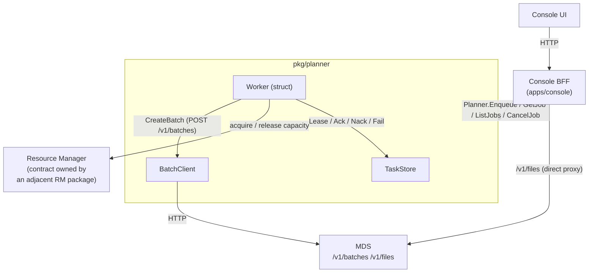

# Console <-> Planner Integration Guide

Developer-facing instruction for how the Console BFF and the planner package
interact in the queue-based architecture.

It complements:

- [ARCHITECTURE.md](./ARCHITECTURE.md) - the big picture
- [CONTRACTS.md](./CONTRACTS.md)   - field-level DTOs

If you are wiring `JobHandler.CreateJob` to the planner, implementing the
worker loop, or reviewing the merged Console read APIs, start here.

## 1. Overview

Today, `apps/console/api/handler/job.go` calls MDS synchronously through
the openai-go SDK. Every Console HTTP request becomes a blocking MDS HTTP
request.

The new design inserts a queue between Console and MDS:



Console is now a BFF that:

1. Owns Console-only fields (display name, created_by, organization, ...).
2. Enqueues a `PlannerJob` and immediately returns a queued view.
3. Exposes a merged job view (`JobView`) that combines planner state and
   MDS state on read.

The planner package owns: task storage, lease-based crash recovery, retry
and backoff, MDS submission, and the read-time MDS overlay that powers
`JobView`. File operations stay on the Console BFF — see §9.

## 2. Boundaries at a glance

| Caller          | Callee            | Interface                | Carries                                            |
| --------------- | ----------------- | ------------------------ | -------------------------------------------------- |
| Console BFF     | Planner           | `Planner`                | `Enqueue` / `GetJob` / `ListJobs` / `CancelJob`    |
| Console / ops   | Planner           | `QueueStatsReader`       | Queue depth + worker activity telemetry            |
| Console / ops   | Planner           | `ResourceCapacityReader` | Aggregated reserved / in-use / free capacity       |
| Planner         | Store             | `TaskStore`              | `Enqueue` / `GetByJobID` / `ListTasksByJobID` / `CancelTask` / `ListSubmittedWithExpiringReservation` / `EnqueueContinuation` |
| Worker (struct) | Store             | `TaskStore`              | `Lease` (FCFS) / `ListCandidates`+`LeaseByID` (custom) / `Ack` / `Nack` / `Fail` |
| Worker (struct) | Resource Manager  | (contract owned by an adjacent RM package; the planner does not declare it) | Reserve / release capacity for one task |
| Worker (struct) | MDS               | `BatchClient`            | `CreateBatch` (submit) + `GetBatch` (pre-submit dedup) |
| Planner         | MDS               | `BatchClient`            | Live MDS overlay (`GetBatch`) + post-submit cancel (`CancelBatch`) |
| Console BFF     | MDS               | direct proxy             | `/v1/files` (unchanged)                            |

The Worker is a concrete struct in `pkg/planner`; it has no exported
interface because it has only one production implementation. The
PlannerTask -> `MDSBatchSubmission` translation and the pre-submit
dedup check are private methods on the Worker; both reach MDS only
through `BatchClient`, which is therefore the single mocking seam for
MDS in tests.

## 3. End-to-end CreateJob flow

The main path. Console returns immediately; the worker submits later.

1. **Console BFF accepts `CreateJob`.**
   - Validates the proto request.
   - Generates the `JobID`.
   - Persists the Console overlay row (`store.UpsertJob` with display name,
     created_by, ...).
2. **Console builds a `PlannerJob`.**
   - `BatchPayload` (input_file_id, endpoint, completion_window, metadata).
   - `ResourceRequirement` (resource_type, accelerator type/count) from the
     wizard.
   - `ModelTemplate` from the wizard selection.
   - `IdempotencyKey` (for example `console:create-job:<job_id>`),
     `Source="console"`, `SubmittedBy=user.email`, `SubmittedAt=now()`.
3. **Console calls `Planner.Enqueue`.**
   - `EnqueueResult{TaskID, JobID, State: queued, EnqueuedAt}` returned
     immediately.
   - Failure mapping at the gRPC boundary:
     - `ErrInvalidJob` -> `codes.InvalidArgument`
     - `ErrDuplicateEnqueue` -> `codes.AlreadyExists` (idempotent retry)
     - `ErrStoreFull` -> `codes.ResourceExhausted`
     - `ErrStoreUnavailable` -> `codes.Unavailable`
4. **Console responds.**
   - Returns a `*pb.Job` populated from the overlay + the queued task.
5. **Worker dispatcher leases.** (background loop, single process,
   single dispatcher goroutine)
   - When `SchedulerFunc == nil`: `TaskStore.Lease` returns one or more
     `LeasedTask`s with a lease bound to the worker.
   - When `SchedulerFunc != nil`: `TaskStore.ListCandidates` →
     `SchedulerFunc(candidates)` → `TaskStore.LeaseByID` to atomically claim
     the selected IDs.
   - State: `queued -> leased`.
   - Each leased task is handed to one of N task goroutines via an
     internal channel.
6. **Worker submits to MDS** (private `Worker.submit` method, runs on a
   per-task goroutine).
   - Builds `MDSBatchSubmission` from the task and the in-memory
     `Reservation`. The `extra_body.aibrix` block carries `job_id`,
     `model_template`, `planner_decision`, and `resource_details`.
   - Pre-submit dedup: `BatchClient.GetBatch` keyed on
     `extra_body.aibrix.job_id` first; if a batch already exists,
     short-circuit and Ack with the existing batch ID.
   - Otherwise calls `BatchClient.CreateBatch` and uses the returned
     batch ID. Wraps transport errors with `ErrMDSSubmitFailed`.
7. **Worker acks the store.**
   - On success: `TaskStore.Ack` with the batch ID. State: `leased ->
     submitted`.
   - On retryable error: `TaskStore.Nack` with `RetryAt`. State: `leased ->
     retryable_failure -> queued` (after RetryAt).
   - On terminal error: `TaskStore.Fail`. State: `leased ->
     terminal_failure`.
8. **Read-time MDS overlay** (no reconcile goroutine in MVP)
   - `Planner.GetJob` / `ListJobs` reads the `PlannerTask` from `TaskStore`
     and, when `BatchID` is set, calls `BatchClient.GetBatch(BatchID)` and
     overlays the result into `JobView`.
   - The MVP store does not mirror MDS state. A reconcile-cache layer can
     be added later if `ListJobs` becomes a hot path.

## 4. ListJobs / GetJob (the merged read)

The UI must see queued, in-flight, and finished jobs in one list.

`Planner.GetJob(ctx, jobID)` returns a `JobView`. The UI renders
`LifecycleState` (typed enum); `BatchStatus` carries the raw MDS string
for forward compatibility.

When no `BatchID` is set:

| `PlannerState`        | `LifecycleState`  |
| --------------------- | ----------------- |
| `queued`              | `queued`          |
| `leased`              | `dispatching`     |
| `submitted`           | `submitted`       |
| `retryable_failure`   | `queued`          |
| `terminal_failure`    | `failed`          |
| `cancelled`           | `cancelled`       |

When `BatchID` is set, the MDS status string maps 1:1 to
`LifecycleState` (`validating`, `in_progress`, `finalizing`,
`completed`, `failed`, `expired`, `cancelling`, `cancelled`).

The Console BFF then layers on its overlay (display name, created_by) when
populating `*pb.Job` for the UI.

`ListJobs` is paginated by an opaque `after` cursor and supports
`SubmittedBy` filtering. Add new filter fields when there is UI surface
that consumes them.

## 5. CancelJob

`Planner.CancelJob` covers both pre-submit and post-submit cancellation.
The planner routes internally:

| Task state                       | What CancelJob does                                                                          |
| -------------------------------- | -------------------------------------------------------------------------------------------- |
| `queued`, `leased`, `retryable_failure` | `TaskStore.CancelTask`; any holding worker goroutine discovers the cancel on its next `Ack`/`Nack`/`Fail` call via `ErrLeaseLost`. |
| `submitted` (BatchID set)        | `BatchClient.CancelBatch(batchID)`, then `TaskStore.CancelTask`; subsequent `GetJob` reads overlay live MDS state. |
| terminal states                  | `TaskStore.CancelTask` is a no-op success (idempotent).                                      |

Console does not call `BatchClient` directly. The planner owns the routing.

## 6. Worker loop (reference outline)

The Worker is a single long-running struct in one process. Internally
it runs one **dispatcher goroutine** that batches tasks out of the
store, and **N task goroutines** that consume from a shared channel.
Concurrency control across goroutines is in-memory; the store-level
lease exists for crash recovery, not for in-process mutual exclusion.

```text
// Dispatcher goroutine (one per Worker).
for ctx.Err() == nil {
    // Two paths, picked by whether a SchedulerFunc is configured:
    //
    //   scheduler == nil  -> FCFS via store.Lease (the convenience path).
    //   scheduler != nil  -> custom ranking; the function returns task IDs,
    //                        the store atomically leases them.
    //
    // Switching policies is one line: scheduler = mySchedulingPolicy,
    // where mySchedulingPolicy is any SchedulerFunc.
    var leased []*LeasedTask
    if w.scheduler == nil {
        leased, _ = store.Lease(ctx, &LeaseRequest{
            WorkerID: workerID, Limit: batchSize, LeaseTTL: leaseTTL, // e.g. 10m
        })
    } else {
        candidates, _ := store.ListCandidates(ctx, &ListCandidatesRequest{
            Limit: batchSize * overscan, Now: time.Now(),
        })
        if len(candidates) == 0 { time.Sleep(pollInterval); continue }
        ids, _ := w.scheduler(ctx, store, &ScheduleRequest{
            WorkerID: workerID, Limit: batchSize, Now: time.Now(),
        })
        if len(ids) == 0 { time.Sleep(pollInterval); continue }
        leased, _ = store.LeaseByID(ctx, &LeaseByIDRequest{
            WorkerID: workerID, TaskIDs: ids, LeaseTTL: leaseTTL,
        })
    }
    if len(leased) == 0 {
        time.Sleep(pollInterval); continue
    }
    for _, item := range leased {
        workChan <- item   // hand off to a task goroutine
    }
}

// Task goroutine (one per parallelism slot; reads from workChan).
for item := range workChan {
    // 1. Acquire capacity from the RM (contract owned by an adjacent
    //    RM package; idempotent per TaskID, so a re-leasing worker
    //    after a crash gets the same handle back rather than a new
    //    slot). The worker translates the RM-side response into the
    //    in-memory planner.Reservation shape.
    reservation, err := acquireFromRM(ctx, item.Task, workerID)
    if errors.Is(err, ErrInsufficientResources) {
        store.Nack(ctx, &NackRequest{
            Lease: item.Lease, RetryAt: backoff.Next(item.Task.Attempts),
            LastError: err.Error(),
        })
        continue
    }

    // 2. Submit (private Worker.submit method).
    //    Builds MDSBatchSubmission, runs pre-submit dedup via
    //    BatchClient.GetBatch by aibrix.job_id, then calls
    //    BatchClient.CreateBatch. Returns the resulting BatchID.
    batchID, err := w.submit(ctx, item.Task, reservation)

    switch {
    case err == nil:
        // The reservation is intentionally NOT released on Ack:
        // it must outlive submit so the reservation-expiry sweeper
        // can detect an expired reservation and create a
        // continuation task. Release happens on Fail/Cancel/
        // observed MDS-terminal state. The sweeper itself does
        // not call Release; RM-side expiry handles slot reclaim.
        store.Ack(ctx, &AckRequest{
            Lease: item.Lease, BatchID: batchID, SubmittedAt: time.Now(),
            ReservationID:        reservation.ReservationID,
            ReservationExpiresAt: reservation.ExpiresAt,
        })
    case errors.Is(err, ErrMDSSubmitFailed) && retryable(err):
        store.Nack(ctx, &NackRequest{
            Lease: item.Lease, RetryAt: backoff.Next(item.Task.Attempts),
            LastError: err.Error(),
        })
        releaseFromRM(ctx, reservation.ReservationID)
    default:
        store.Fail(ctx, &FailRequest{
            Lease: item.Lease, LastError: err.Error(),
        })
        releaseFromRM(ctx, reservation.ReservationID)
    }
}
```

`Release` errors from the RM (e.g. "reservation already released or
expired") are treated as no-ops; the reservation already returned to
the pool.

`Worker.Run(ctx)` wraps the dispatcher and N task goroutines with
shutdown handling. `Worker.ProcessAvailable(ctx, now)` exposes one
dispatcher tick for tests with controlled time.

`leaseTTL` is sized longer than the expected `Worker.submit` duration
(commonly 5–15 minutes for batch submission) so a slow MDS call does
not invalidate the in-flight worker. There is no mid-flight
`RenewLease` in MVP; if the worker process dies, leased tasks are
re-leasable once their TTL expires on the next `Lease` call.

`Worker.submit` must be effectively idempotent against MDS — typically
by keying off `extra_body.aibrix.job_id` so a duplicate submit is
detectable via `BatchClient.GetBatch`. See §8.

## 7. Read-time MDS overlay

MVP does not run a reconcile goroutine. `JobView` is assembled live:

1. `Planner.GetJob(ctx, jobID)` reads the `PlannerTask` via
   `TaskStore.GetByJobID`.
2. If the task has a `BatchID` and is not in a planner-terminal state,
   the Planner calls `BatchClient.GetBatch(BatchID)` and overlays the
   `BatchStatus` fields (`InProgressAt`, `FinalizingAt`, `RequestCounts`,
   `Errors`, `Usage`, ...) into `JobView`.
3. `JobView.LifecycleState` is derived from `PlannerTaskState` (no
   `BatchID`) or from `BatchStatus.Status` (with `BatchID`).

`ListJobs` follows the same pattern; for the expected MVP scale
(single-digit K active jobs) the per-page `BatchClient.GetBatch` cost is
acceptable. A periodic reconcile that mirrors `BatchStatus` into the
store is a deferred optimization.

`BatchClient.ListBatches` is not in the MVP surface; add it back when a
catastrophic recovery path needs to walk MDS to rebuild the planner store.
When that happens, the lookup key is `extra_body.aibrix.job_id`.

## 8. Crash safety and duplicate submit

Two failure modes can cause one task to be submitted to MDS twice:

1. Worker process dies after MDS returns 200 but before `Ack`. On
   restart, the lease eventually TTLs out and the task is re-leased
   and re-submitted.
2. Network partition swallows the MDS response; the task goroutine
   times out and `Nack`s; the next retry creates a second batch.

(Single-worker plus a generously sized lease TTL means "another worker
leases the task while the first is still running" is not a path: there
is only one worker process, the dispatcher hands each leased task to
exactly one goroutine, and `submit` finishes well within TTL in the
common case.)

The MVP defenses, in order:

1. **Pre-submit dedup check inside `Worker.submit`.** Call
   `BatchClient.GetBatch` (or, eventually, a `ListBatches` filtered by
   `aibrix.job_id`) before calling `BatchClient.CreateBatch`. If a
   batch already exists for the same `job_id`, return its batch ID
   without resubmitting.
2. **MDS-side dedup (target).** When MDS treats
   `extra_body.aibrix.job_id` as a uniqueness key, retries become safe
   by construction and (1) becomes a fast-path optimization. Until
   then, (1) is required.

Mid-flight lease renewal (heartbeats) is intentionally not part of the
MVP surface; reintroducing `RenewLease` becomes worthwhile only if the
planner scales to multiple worker processes that contend for the same
store.

## 9. Files

File operations remain on the Console BFF as a direct passthrough:

- `POST /api/v1/files/upload`            -> `POST {mds}/v1/files`
- `GET  /api/v1/files`                   -> `GET  {mds}/v1/files`
- `GET  /api/v1/files/{file_id}`         -> `GET  {mds}/v1/files/{file_id}`
- `GET  /api/v1/files/{file_id}/content` -> the same on MDS

The planner only consumes `input_file_id` strings and surfaces
`output_file_id`/`error_file_id` strings in `BatchStatus` and `JobView`.
Workers MUST NOT upload file content before submit.

## 10. Identity and correlation keys

| Key                       | Owner   | Used for                                              |
| ------------------------- | ------- | ----------------------------------------------------- |
| `JobID`                   | Console | User-facing identity, primary correlation key         |
| `TaskID`                  | Planner | Lease ownership, retry chain                          |
| `IdempotencyKey`          | Console | Duplicate-enqueue detection in the store              |
| `BatchID`                 | MDS     | MDS batch identity, file IDs                          |
| `extra_body.aibrix.job_id`| Planner | MDS round trip (planner ↔ MDS correlation)            |

`IdempotencyKey` rides into `PlannerTask` so the store can enforce
`ErrDuplicateEnqueue` end to end.

## 11. Error code translation

| Planner sentinel       | gRPC code                | UI behavior                                  |
| ---------------------- | ------------------------ | -------------------------------------------- |
| `ErrInvalidJob`        | `InvalidArgument`        | Show validation message                      |
| `ErrJobNotFound`       | `NotFound`               | UI 404                                       |
| `ErrDuplicateEnqueue`  | `AlreadyExists`          | Treat as success on retry                    |
| `ErrStoreFull`         | `ResourceExhausted`      | "System busy, retry shortly"                 |
| `ErrStoreUnavailable`  | `Unavailable`            | Backend down banner                          |
| `ErrLeaseLost`         | (worker-internal)        | Worker goroutine drops in-flight work; not user-facing |
| `ErrMDSSubmitFailed`   | (chain underlying status)| Reuse `mapSDKError` shape; wraps `BatchClient.CreateBatch` failures |

## 12. MDS dependency

The planner depends on MDS persisting and echoing
`extra_body.aibrix.job_id`. See
[ARCHITECTURE.md "MDS correlation and dedup"](./ARCHITECTURE.md#mds-correlation-and-dedup)
for the full requirement and the impact while the change is pending.

## 13. Migration plan

See [ARCHITECTURE.md "Expected next PRs"](./ARCHITECTURE.md#expected-next-prs)
for the canonical roadmap. The cutover step (`JobHandler` switch from
MDS to `Planner`) must preserve the existing `*pb.Job` shape so the UI
sees no breaking change.

## 14. References

- `apps/console/api/handler/job.go` - current synchronous BFF
- `apps/console/api/handler/file.go` - file proxy (unchanged)
- `python/aibrix/aibrix/metadata/api/v1/batch.py` - MDS batch endpoints
- `pkg/planner/interfaces.go` - Go interface signatures
- `pkg/planner/contracts.go` - request/response DTOs
- `pkg/planner/types.go` - `PlannerJob` / `PlannerTask` / state
- `pkg/planner/CONTRACTS.md` - field-level wire docs
- `pkg/planner/ARCHITECTURE.md` - design rationale
