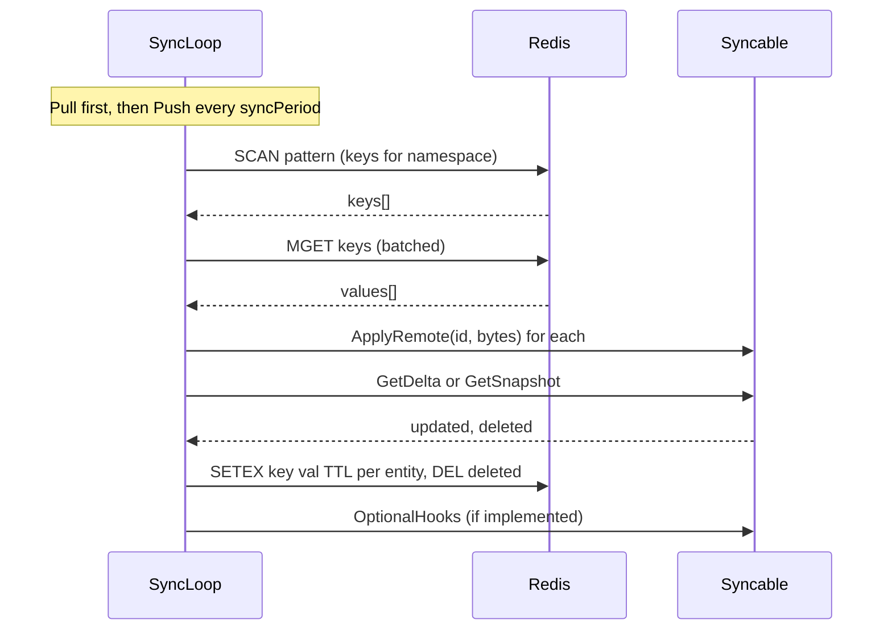

# statesync

Generic Redis-backed state sync for multiple gateway (or other) replicas. Uses **per-entity keys** with `SETEX` (per-record TTL), `MGET` (batched), and `SCAN` (enumeration). Keys are namespaced via a hash tag (`aibrix:{namespace}:e:{id}`). No PUB/SUB.

- **Periodic sync**: Each replica runs **Pull first** (load from Redis), then **Push** (delta or full) every sync period.
- **Optional write-through**: After local updates you may call `Put`/`Delete` directly. The default gateway wiring uses periodic delta push only.
- **Deletions/tombstones**: If a Syncable implements `TombstoneSupport`, deletions are written as tombstone payloads so peers can remove the local entry on the next pull; otherwise `DEL` is used.
- **Jitter and backoff**: Random initial startup delay (up to half `syncPeriod`); per-cycle jitter is roughly ±10% of `syncPeriod` (see `syncLoop` in `redissync.go`); exponential backoff (capped at 1 min) on errors.
- **Lifecycle**: Register all Syncables **before** `Start()`; registrations after `Start()` are silently ignored.

**Per-record TTL:** Each entity is stored as its own key with `SETEX` and a default TTL of 2 minutes. A record expires if it is not rewritten within that window. The TTL of one record does not affect others.

Redis key format: `aibrix:{namespace}:e:{entityId}` — `{namespace}` is the hash tag. Namespace must be non-empty.

### Prefix cache (gateway default wiring)

With `AIBRIX_STATESYNC_ENABLED=true`, `cmd/plugins/main.go`:

1. Calls `table.EnableDeltaSync()` to activate dirty tracking on `PrefixHashTable` (no-op cost when disabled).
2. Registers `PrefixHashTableSyncable` with the manager.
3. Relies on **periodic delta push + pull** — `Put` is not called on every `AddPrefix`.

This gives eventual consistency with staleness bounded by the sync interval and per-key TTL. For faster cross-replica visibility you can call `syncManager.Put(ctx, "prefixcache", blockIDStr, data)` on the `*statesync.RedisSync` using bytes from `EncodeBlockForSync` after each `AddPrefix` (higher Redis write load trade-off).

### Delta sync and LRU eviction

`EnableDeltaSync()` must be called on `PrefixHashTable` before it is registered with `*statesync.RedisSync`; without it, dirty tracking is inactive and `GetDeltaForSync` always returns an empty delta. If a block is marked dirty then **evicted locally** before the next successful push, `GetDeltaForSync` skips it silently. The corresponding Redis key remains until the per-entity TTL expires. Strong delete propagation is not guaranteed for evicted entries.

## Diagrams

### Technical Flow



---

## Adopting statesync in a new component

Changes live **only in the package that owns the state**. The `statesync` package stays generic and never imports component types.

### 1. Implement `syncable.Syncable`

Depend on `github.com/vllm-project/aibrix/pkg/utils/syncable` and implement:

| Method | Purpose |
|--------|---------|
| `Namespace() string` | Stable name for this state (e.g. `"mytracker"`). Used in the Redis key. |
| `GetSnapshot(ctx) (map[string][]byte, error)` | Return current local state as **entity id → serialized bytes**. |
| `ApplyRemote(ctx, id string, data []byte) error` | Apply one entity from Redis into local state (merge or overwrite). |

Optional interfaces:

| Interface | Purpose |
|-----------|---------|
| `DeltaSyncable` | Add `GetDelta` / `ClearDirty` to push only changed entities instead of the full snapshot. |
| `OptionalHooks` | `OnSyncStart` / `OnSyncEnd` called around each **Pull** for that Syncable (not around Push). |
| `StalePolicy` | `IsStale` — if true, the sync layer deletes the remote key and skips applying. |
| `TombstoneSupport` | `MakeTombstone` / `IsTombstone` / `DeleteLocal` — propagate deletes as payloads instead of DEL. |

### 2. Add serialization

- **Encode**: turn your struct into `[]byte` (e.g. JSON). Use a stable format all replicas can decode.
- **Decode**: in `ApplyRemote`, unmarshal `data` and merge into or replace local state.

### 3. Expose a constructor returning `syncable.Syncable`

Return an adapter that holds a pointer to your state and implements the interface. Callers pass it to `(*statesync.RedisSync).Register(...)`.

### 4. Wire in the process entry point

```go
rs := statesync.New(redisClient,
    statesync.WithSyncPeriod(30*time.Second), // optional; default 10s
    statesync.WithOpTimeout(15*time.Second),  // optional; default 30s
    statesync.WithKeyPrefix("myapp"),         // optional; default "aibrix"
)
// Register all Syncables before Start.
rs.Register(mypkg.NewMyStateSyncable(myState))
rs.Start()

// On shutdown:
rs.Stop() // blocks until the sync loop exits or stop-wait timeout (default 90s)
```

Available `statesync.New` options:

| Option | Default | Description |
|--------|---------|-------------|
| `WithSyncPeriod(d)` | 10s | Interval between sync cycles (jitter applied). |
| `WithOpTimeout(d)` | 30s | Per-operation context timeout for Pull/Push. |
| `WithKeyPrefix(s)` | `"aibrix"` | Prefix for all Redis keys. |
| `WithRecordTTL(d)` | 2m | Per-entity `SETEX` TTL; values ≤0 are ignored. |
| `WithStopWaitTimeout(d)` | 90s | Max time `Stop()` waits for the background loop to exit. |
| `WithSetexChunkSize(n)` | 25 | Pipeline chunk size for SETEX writes. |
| `WithMGetBatchSize(n)` | 200 | Batch size for MGET during Pull. |

### Redis client

The Redis client is provided by the caller (e.g. `utils.GetRedisClient()`). Configure TLS and auth in the client options for production (see `pkg/utils/redis.go`).

---

## Example: a new component "TokenTracker"

A component that keeps `tokenID → lastUsedTime` and should sync across gateway replicas.

### Step 1 – Implement Syncable in the component package

```go
// pkg/plugins/gateway/algorithms/vtc/token_tracker_sync.go

import (
    "context"
    "encoding/json"
    "strconv"
    "time"

    "github.com/vllm-project/aibrix/pkg/utils/syncable"
)

const tokenTrackerNamespace = "token_tracker"

// TokenTrackerSyncable adapts TokenTracker for statesync.
type TokenTrackerSyncable struct {
    Tracker *TokenTracker
}

func NewTokenTrackerSyncable(t *TokenTracker) syncable.Syncable {
    return &TokenTrackerSyncable{Tracker: t}
}

func (s *TokenTrackerSyncable) Namespace() string { return tokenTrackerNamespace }

func (s *TokenTrackerSyncable) GetSnapshot(ctx context.Context) (map[string][]byte, error) {
    s.Tracker.mu.RLock()
    defer s.Tracker.mu.RUnlock()
    out := make(map[string][]byte, len(s.Tracker.entries))
    for id, t := range s.Tracker.entries {
        b, _ := json.Marshal(t.UnixNano())
        out[strconv.FormatInt(id, 10)] = b
    }
    return out, nil
}

func (s *TokenTrackerSyncable) ApplyRemote(ctx context.Context, id string, data []byte) error {
    var nano int64
    if err := json.Unmarshal(data, &nano); err != nil {
        return err
    }
    parsed, _ := strconv.ParseInt(id, 10, 64)
    remote := time.Unix(0, nano)
    s.Tracker.mu.Lock()
    defer s.Tracker.mu.Unlock()
    if existing, ok := s.Tracker.entries[parsed]; !ok || remote.After(existing) {
        s.Tracker.entries[parsed] = remote
    }
    return nil
}
```

### Step 2 – Wire in the entry point

```go
rs := statesync.New(redisClient, statesync.WithSyncPeriod(30*time.Second))
rs.Register(prefixcacheindexer.NewPrefixHashTableSyncable(prefixHashTable))
rs.Register(vtc.NewTokenTrackerSyncable(tokenTracker))
rs.Start()
defer rs.Stop()
```

### Step 3 – Optional write-through

If you want other replicas to see a change before the next periodic push:

```go
func (t *TokenTracker) RecordUse(ctx context.Context, id int64, rs *statesync.RedisSync) {
    t.mu.Lock()
    t.entries[id] = time.Now()
    t.mu.Unlock()
    if rs != nil {
        data, _ := json.Marshal(time.Now().UnixNano())
        _ = rs.Put(ctx, tokenTrackerNamespace, strconv.FormatInt(id, 10), data)
    }
}
```

---

## Reference implementation

See `pkg/utils/prefixcacheindexer/sync.go`:
- `PrefixHashTableSyncable` and `NewPrefixHashTableSyncable(table)` — full `DeltaSyncable` implementation.
- `GetSnapshotForSync` / `GetDeltaForSync` / `ClearDirtyForSync` / `ApplyRemoteForSync` / `EncodeBlockForSync` on `PrefixHashTable`.
- Remember to call `table.EnableDeltaSync()` before registering if you want delta push (not required for snapshot-only sync).
